# 电网运维 RAG 智能问答系统

基于大模型 + RAG 的电网自主运维智能问答系统:**自然语言提问 → 智能路由 → 混合检索 → 三级缓存 → CRAG 自纠错 → 可信答案生成**,覆盖变电、配电、输电三大场景,为一线运维提供可直接落地的故障处理方案。

> 前端 Vue 3 · 后端 FastAPI · 三家云大模型(DeepSeek/阿里百炼/火山方舟)可切换 · 智能路由 · 三级缓存(Redis→MySQL→Semantic)· 双 Embedding 并查 · GraphRAG(Neo4j 多跳)· Corrective RAG 自纠错 · 知识自进化闭环 · RBAC + 文档级 ACL · Prometheus/Grafana 全链路可观测

---

## 📑 目录

- [一、项目架构](#一项目架构)
- [二、业务架构](#二业务架构)
- [三、RAG 核心·检索 Retrieval](#三rag-核心检索-retrieval)
- [四、RAG 核心·增强 Augmentation](#四rag-核心增强-augmentation)
- [五、RAG 核心·生成 Generation](#五rag-核心生成-generation)
- [六、横切能力](#六横切能力)
- [七、数据存储职责](#七数据存储职责)
- [八、技术栈](#八技术栈)
- [九、目录结构](#九目录结构)
- [十、快速开始](#十快速开始)
- [十一、配置说明](#十一配置说明)
- [十二、API 接口](#十二api-接口)
- [十三、质量保障与评测](#十三质量保障与评测)
- [十四、部署](#十四部署)
- [十五、FAQ](#十五faq)
- [十六、开发进度](#十六开发进度)

---

## 一、项目架构

系统采用**六层分层架构**:从接入层(前端+nginx)到基础设施层(Docker Compose 编排),RAG 引擎层是核心,围绕**检索 / 增强 / 生成**三大能力组织。

### 1.1 分层架构图

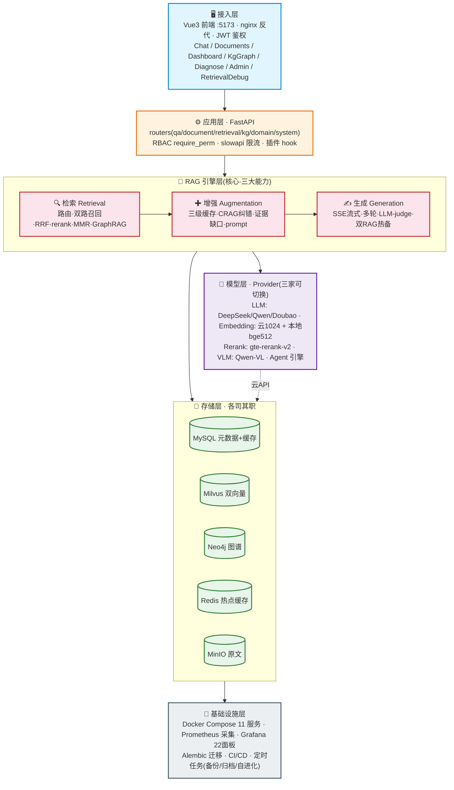

### 1.2 容器与服务拓扑

`docker-compose.deploy.yml` 编排 11 个服务,所有 named volume 改为 `./data/` bind mount(数据随包携带)。容器间以 service name 通信。

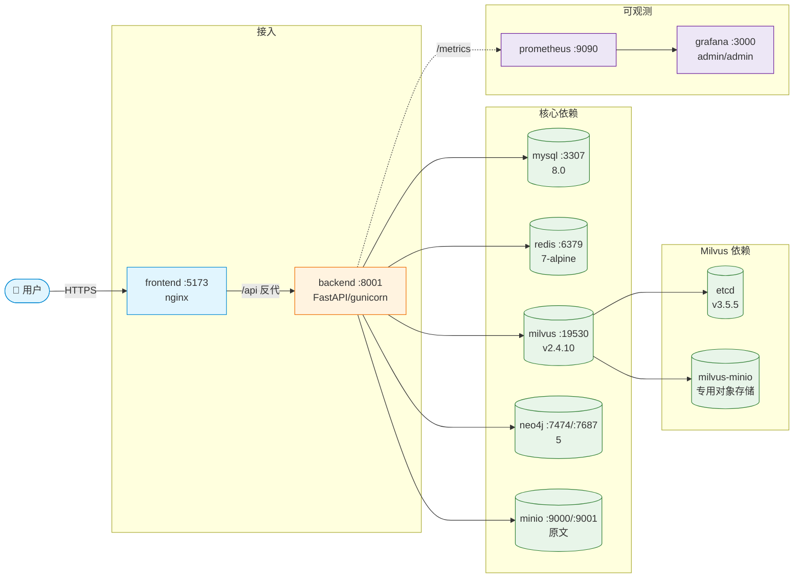

> **端口约定**:MySQL **3307**(避让本机)、后端 **8001**、Milvus 19530、MinIO 9000/9001、Redis 6379、Neo4j 7474/7687、Grafana 3000、Prometheus 9090。

### 1.3 端到端全链路(用户提问 → 答案 → 闭环)

> 这张图把**检索 / 增强 / 生成**三大功能串成一条完整链路。先看全景,再到第三/四/五章看各模块细节。
> 核心分两段:**① 主链路(同步)**——从用户提问到答案返回;**② 闭环(异步)**——答案返回后,反馈与"答得不好"的 case 转化为知识库增长,让下次检索更准。

#### ① 主链路:一次提问的完整时序

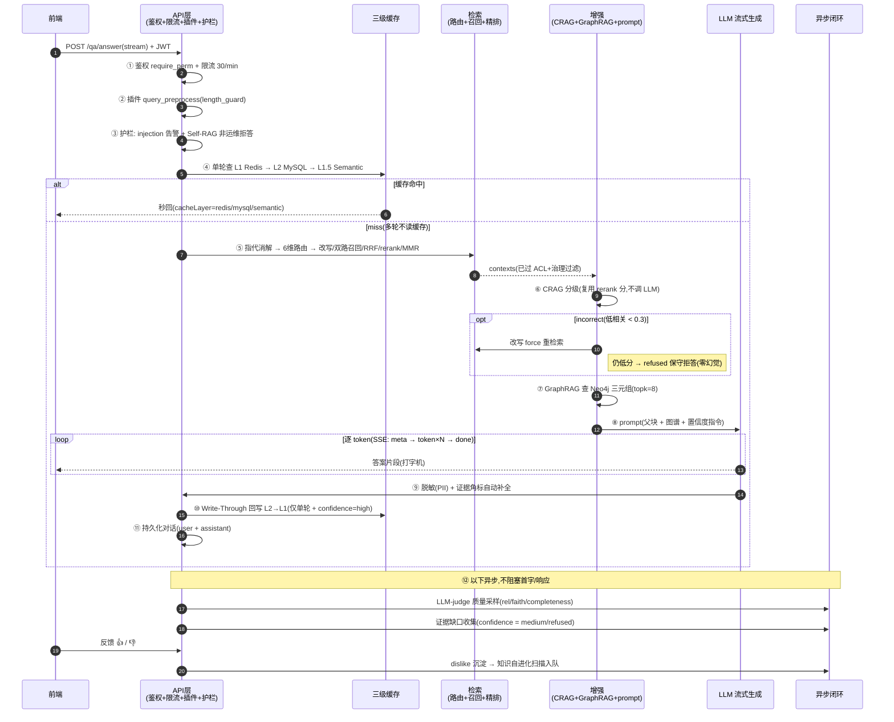

#### ② 闭环:答案返回后,系统如何自我改进

答案返回**不是终点**。每一次"答得不好"(用户 👎、或 CRAG 判 medium/refused)都会进入两条回流闭环,把缺口补回知识库,下次同类问题即可命中:

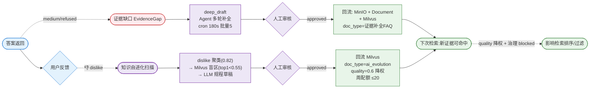

> **闭环的底层逻辑**:主链路是"消费知识",闭环是"生产知识"。CRAG 的 `medium/refused` 和用户的 `dislike` 不是丢掉,而是**标注出知识库的盲区** → Agent 自动补全 → 人工审核兜底 → 回流时**降权 + 配额**防 AI 草稿污染(详见 [6.2 知识自进化](#62-知识自进化闭环-s16)与 [4.3 证据缺口](#43-证据缺口evidence-gap补全闭环))。

---

## 二、业务架构

### 2.1 角色与权限(RBAC 4 角色 + 文档级 ACL)

权限模型为字符串权限 `资源:动作`(17 个权限常量,`permissions.py:12-34`),4 角色映射 + DB 覆盖表 + 文档级 ACL 三层叠加。**后端为真相之源,前端仅提前隐藏**(`perm.js:4-5` 注释明确)。

| 角色 | 定位 | 权限范围 |
|---|---|---|
| **admin** | 系统管理员 | 全权通配 `*`(含用户管理/配置/备份/审核) |
| **editor** | 知识编辑 | 文档增删改 + 向量化 + 图谱抽取 |
| **operator** | 一线运维 | 问答 + 诊断 + 两票 + 反馈(只读文档) |
| **auditor** | 审计员 | 日志 + 统计 + 健康只读 |

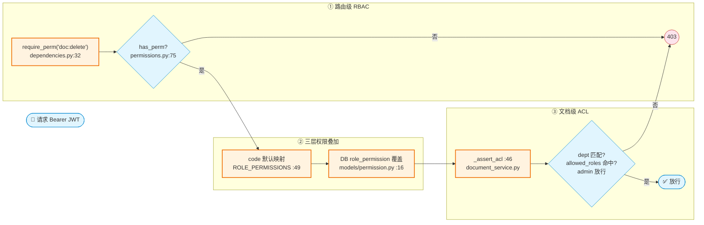

**关键设计**:admin 在 ACL 层也显式放行(`_assert_acl:52-57`);前端 `utils/perm.js:37 hasPerm` 镜像同一权限矩阵做按钮级提前隐藏,但**不构成安全边界**。

### 2.2 业务域与角色矩阵

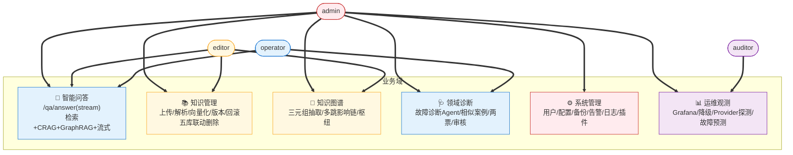

### 2.3 前端能力(7 页面)

| 页面 | 路由 | 核心能力 |
|---|---|---|
| **Login** | `/login` | 登录注册 + JWT |
| **Chat** | `/` | Markdown高亮 · 流式打字机 · 引用溯源 · 对话管理 · 智能推荐追问 · 🔗图谱N标签 · 置信度标签(高🟢/中🟡/拒🔴) · 暗/亮主题 |
| **Documents** | `/documents` | 拖拽上传+进度 · 批量勾选 · 在线预览 · 版本回滚 |
| **Dashboard** | `/dashboard` | echarts 统计 + 故障趋势看板 |
| **KgGraph** | `/kg` | 关系图谱(力导向) · 多跳影响链 · 枢纽出度 |
| **Diagnose** | `/diagnose` | 诊断 Agent · 相似案例 · 两票生成/审核 |
| **Admin** | `/admin` | 操作日志 · 配置 · 反馈看板 · 告警 · 插件 · 备份 · 健康探测 |
| **RetrievalDebug** | `/retrieval-debug` | 检索全链路 trace + 分数归因(admin) |

---

## 三、RAG 核心·检索 Retrieval

> **检索的底层逻辑**:把用户自然语言问题,从海量异构知识(规程/案例/图谱)中精准捞出最相关的证据,喂给生成阶段。本系统检索是一套**可路由、可纠错、可解释**的精排漏斗。

### 3.0 检索总览

端到端检索流位于 `qa_service.answer()` 与 `retrieval_service.mixed_search()`:

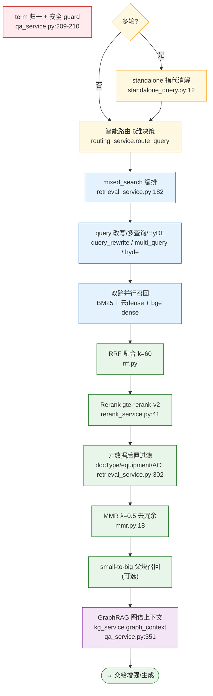

> ⚠️ **GraphRAG 位置**:在 `mixed_search` 文档检索**之后**、CRAG 纠错**之后**,由 `qa_service.answer:351` 单独调用,与文档分块**并列**进 prompt,不是检索内部步骤。

### 3.1 智能路由(6 维特征决策树)

> 用 6 维查询特征(<1ms)自动选检索路径,**60%+ 查询跳过冗余分支,p95 检索延迟降 30-50%**。低于 `min_confidence=0.6` 自动升级 hybrid 保召回。

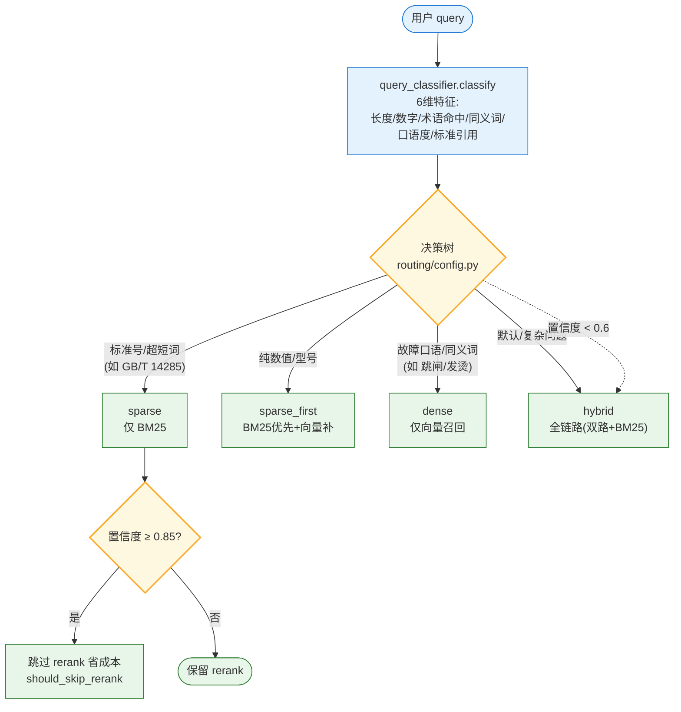

**开关**:`ROUTING_ENABLE=True`(关闭则全部走 hybrid 全链路)。路由结果携带 `routeReason` 透传到前端 done 段。

### 3.2 查询增强(改写 / 多查询 / HyDE / 指代消解)

> 在召回前优化 query 表达,解决「问得模糊/口语/有代词」导致召回不准的问题。各能力带独立开关,**默认按收益取舍**。

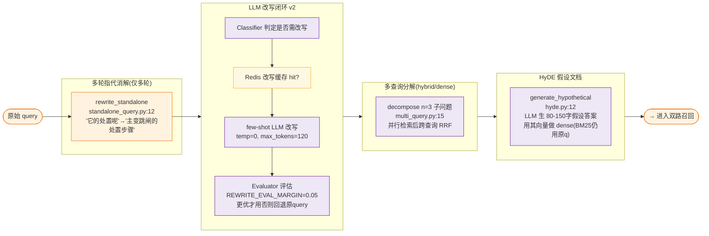

**开关默认值**:`STANDALONE_REWRITE_ENABLE=True` · `QUERY_REWRITE_ENABLE=False` · `HYDE_ENABLE=False` · `MULTI_QUERY_ENABLE=False` · `REWRITE_EVAL_ENABLE=True`。CRAG 纠错时 `rewrite_query(force=True)`(`query_rewrite.py:12`)强制改写绕过开关。

### 3.3 双路召回(BM25 稀疏 + 双 Embedding 稠密 + HNSW)

> **双 Embedding 是「云 + 本地 bge」双 collection 并查**(不是二选一路由):写入时按文档大小路由到不同 collection,检索时 `asyncio.gather` 同时查两个 collection 融合,既绕开云 API 限流,又覆盖不同向量空间。

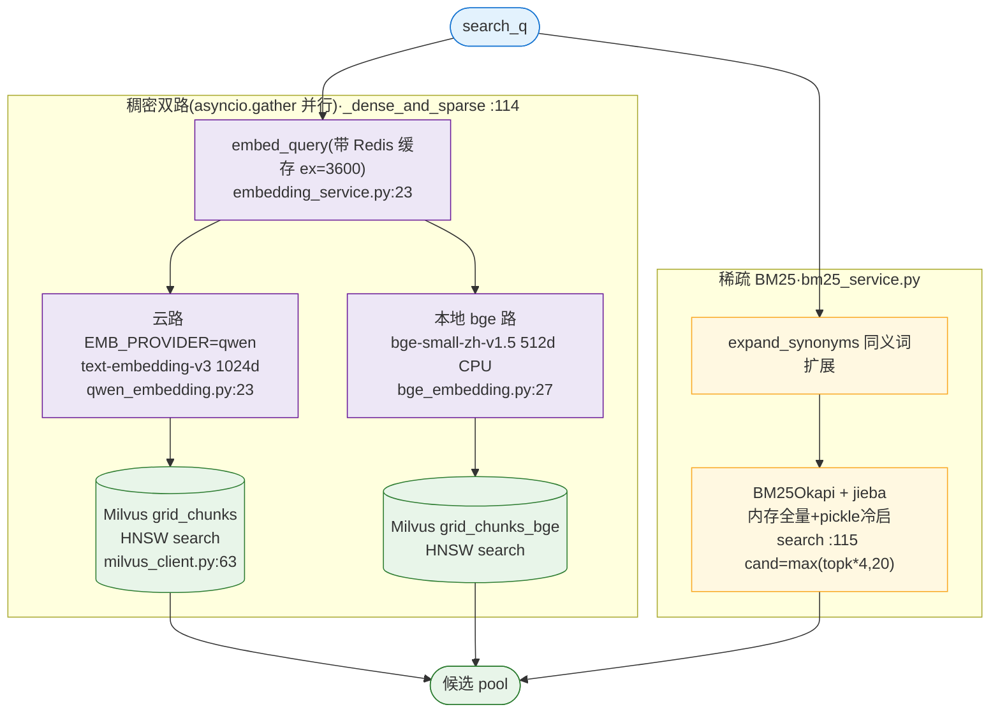

**HNSW 参数**(`milvus_client.py:39-41`):`M=16` · `efConstruction=200` · `metric=COSINE` · `ef=64`(运行时 `/system/config/milvus` 可热改,`config_service.rt_ef()`)。检索时 `ef = max(rt_ef, cand)` 保证 ef ≥ 召回窗口。

### 3.4 RRF 融合 + Rerank 精排漏斗

> RRF 把多路召回等权融合;Rerank 用**阿里百炼 `gte-rerank-v2`**(云 HTTP 原生 API,**非本地 bge-reranker**)做交叉注意力精排,失败降级回退 RRF。

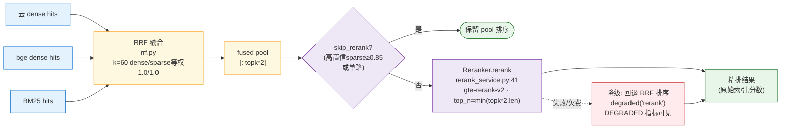

**连接池复用**:`rerank_service.py` 模块级共享 `httpx.AsyncClient`(timeout=30, max_connections=20),lifespan shutdown 调 `close_client()` 释放——rerank 是链路最慢一环,避免每次 TLS 握手。

### 3.5 元数据后置过滤 + MMR + small-to-big

> **docType 是检索后置过滤**(查 MySQL `Document` 表),不是 Milvus 标量过滤——先 RRF+rerank 出 pool,再按元数据过滤,docType 无条件补全到每条(来源卡片用)。

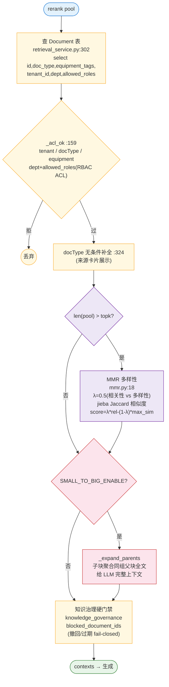

> **纠偏**:`MMR_LAMBDA` 实际值 **0.5**(`config.py:103`),`debug_search` 里的 `0.6` 仅是 fallback 不生效。

### 3.6 GraphRAG(Neo4j 多跳知识图谱)

> GraphRAG 把**结构化图谱上下文**(设备-故障-处置因果链)与文档分块**并列**喂给 LLM,补足纯文本检索做不到的因果传播推理。

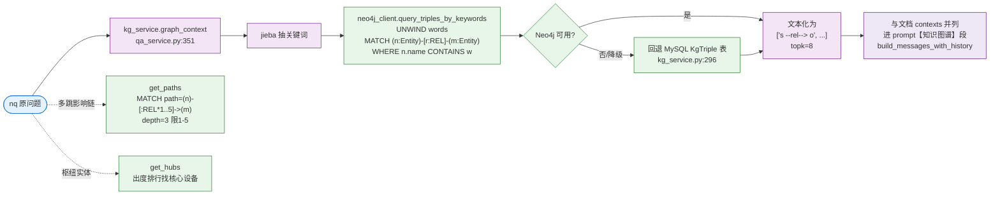

**图谱写入**:`extract_triples`(`kg_service.py:162`)LLm 抽三元组(6 块/批),schema 约束 13 关系白名单 + 实体归一(`#1主变/1号主变→主变压器`)+ MERGE 幂等双写 MySQL + Neo4j。节点 `:Entity{name,type}`(Equipment/Fault/Action),统一有向关系 `:REL{type,doc_id}`。

---

## 四、RAG 核心·增强 Augmentation

> **增强的底层逻辑**:在「检索到结果」和「交给 LLM 生成」之间,插入**缓存复用 + 自纠错 + 证据缺口闭环 + prompt 工程**,把"一次性管道"升级为"可信、高效、自进化"的闭环。

### 4.1 三级缓存(L1 Redis → L2 MySQL → L1.5 Semantic)

> 三级缓存命中率 ~75%(原 ~20%),加权延迟 ~10s→~3s。**查询顺序:L1 Redis → L2 MySQL → L1.5 Semantic**(MySQL 精确匹配先于语义模糊匹配);**仅单轮读/写缓存,多轮不缓存**(防跨对话脏命中)。

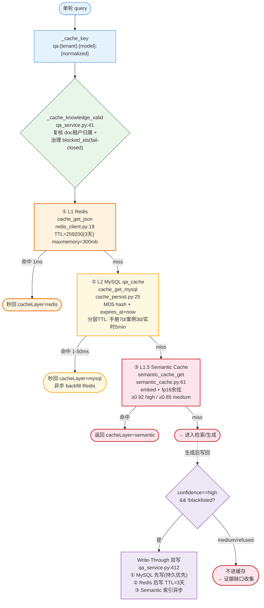

**关键设计**:
- **L1.5 Semantic** 默认关(`SEMANTIC_CACHE_ENABLE=False`),索引上限 5000 条 LRU 淘汰,fp16 压缩 + `asyncio.Lock` 串行化读改写。
- **L2 分层 TTL**(`ttl_for_query` `qa_cache.py:53`):实时类 5min / 规程手册 7d / 案例默认 3d,`CACHE_TIERED_TTL_ENABLE=True`。
- **清理**:MySQL Event 每日 3:00 主力 + 应用层每 `CACHE_PERSIST_CLEANUP_HOURS=6` 兜底(过期/3天未命中/软删>7天)。

### 4.2 Corrective RAG 自纠错分级闭环(核心)

> 2026 RAG 趋势的核心:**检索后分级 + 纠错闭环**,把"事后 LLM-judge"升级为"实时前置护栏",无关问题保守拒答零幻觉。**信号源复用 rerank 分,不额外调评估 LLM**(省钱低延迟)。

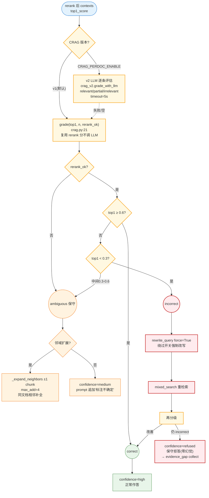

**阈值**(`config.py:120-127`):`CRAG_HIGH=0.6` · `CRAG_LOW=0.3` · `CRAG_PERDOC_ENABLE=False` · `CRAG_TIMEOUT=5.0s` · `CRAG_NEIGHBOR_EXPAND_ENABLE=False`。答案透传 `confidence`(high/medium/refused)+ `cragAction`(normal/rewritten/refused),前端显示置信度标签。

### 4.3 证据缺口(Evidence Gap)补全闭环

> CRAG 判定 `medium/refused` 的问题不是丢掉,而是**自动收集 → AI 深度补全 → 人工确认 → 回流知识库**,形成"知识自增长"闭环。

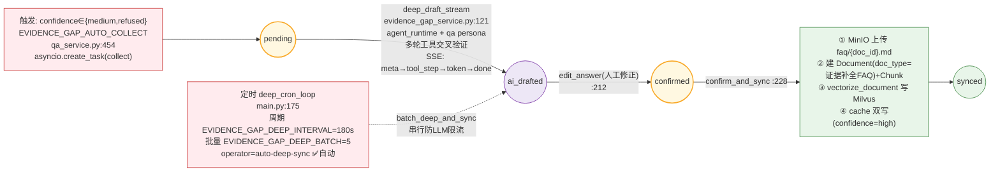

**状态机**:`pending → ai_drafted → confirmed → synced`(另有 `auto-deep-sync` 标识全自动补全)。`topk` 放宽 `5 × EVIDENCE_GAP_DRAFT_TOPK_MULT(2) = 10` 扩大召回。路由 `/evidence-gap/{id}/deep-draft`(SSE)、`/evidence-gap/{id}/edit`(`system.py:668/685`)。

### 4.4 Prompt 模板管理(Code 默认 + Redis 热覆盖)

> 系统 prompt 双层:**Code 默认 7 条规则** + **Redis `config:prompt` 运行时覆盖**,改完即生效无需重启;内存热读零 Redis 往返。

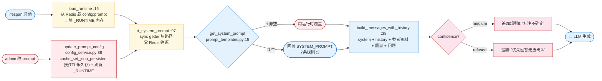

同模式热读:`rt_temperature()`(生成温度)、`rt_ef()`(HNSW ef)、`rt_max_tokens()` —— 均可运行时 `/system/config/milvus|model` 即改即生效。

---

## 五、RAG 核心·生成 Generation

> **生成的底层逻辑**:把检索+增强得到的证据,用 LLM 流式产出**可信、安全、可溯源**的答案,并配套质量评估、限流防护、插件扩展、热备容灾。

### 5.1 SSE 流式生成(事件协议)

> 逐 token 打字机输出,首字延迟低。事件协议 4 类 chunk:`meta`(引用来源)→ `token`×N → `tool_step`(Agent)→ `done`(置信度/延迟/缓存层)。

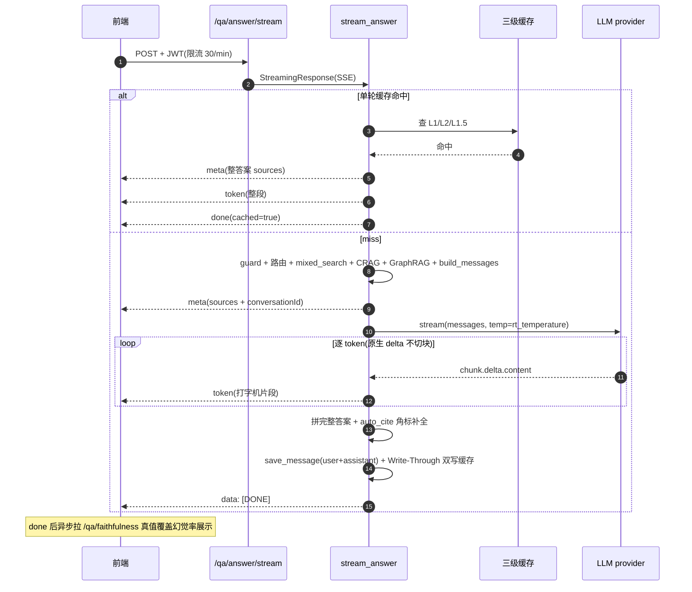

**事件来源**:`meta`(`qa_service.py:787`)、`token`(`:803`)、`tool_step`(`:542`,仅 agent)、`done`(末尾)。token 来自 `get_llm_provider(model_type).stream()`(`:801`),三家 provider 透传 OpenAI SDK `stream=True`。WebSocket 增强版 `/qa/answer/ws`(`qa.py:304`,双向 `?token=JWT` 鉴权)。

### 5.2 多轮对话与指代消解(多轮不缓存)

> 多轮带上下文追问,但**检索用消解后的独立 query,喂 LLM 用原问题**;多轮不写缓存(仅高置信时读 Redis 热点),防跨对话脏命中。

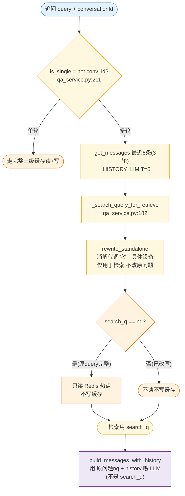

**会话服务**(`conversation_service.py`):`create_conversation:8` / `get_messages:31` / `save_message:44` / 软删 + 归属校验(仅本人) / 批量删上限 `_MAX_BATCH=200`。

### 5.3 LLM-judge 四维质量评估

> 答案质量**采样异步评估,不阻塞响应**。四维:Faithfulness(忠实度)+ Context Relevance(相关)+ Answerability(可答)+ Completeness(完整),综合分加权。

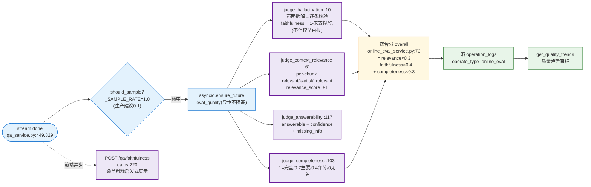

Judge 原语温度恒为 0(`judge.py:39,91,143`),解析失败返回 None 不假报。

### 5.4 限流策略(slowapi · 按 IP 梯度阈值)

> 按请求成本设梯度阈值:**重计算/Agent(4-6)> 写库/重建(3-10)> 普通问答(30)> 反馈(60)**,防成本攻击。按客户端 IP,不读 .env(避中文 GBK 解码错)。

```mermaid
flowchart LR
    classDef heavy fill:#ffebee,stroke:#c62828
    classDef write fill:#fff3e0,stroke:#ef6c00
    classDef normal fill:#e3f2fd,stroke:#1976d2
    classDef light fill:#e8f5e9,stroke:#2e7d32

    REQ([请求]):::normal
    REQ --> LIM["slowapi Limiter<br/>key=get_remote_address<br/>core/limiter.py:8"]:::normal
    LIM --> CHK{"@limiter.limit"}:::normal
    CHK -- "检索调参 /system/retrieval/tune" --> H1["1/min 最严<br/>(参数扫描极重)"]:::heavy
    CHK -- "BM25重建 /bm25/rebuild" --> H2["3/min"]:::heavy
    CHK -- "图谱抽取 /kg/extract" --> H3["5/min"]:::heavy
    CHK -- "多Agent辩论 /diagnose-debate" --> H4["4/min"]:::heavy
    CHK -- "诊断Agent /diagnose-agent" --> H5["6/min"]:::heavy
    CHK -- "文档 上传/解析/向量化" --> W1["10/min"]:::write
    CHK -- "问答 /qa/answer(stream)" --> N1["30/min"]:::normal
    CHK -- "反馈 /qa/feedback" --> L1["60/min 最高<br/>(轻量)"]:::light
```

> 注:`main.py:390` 的 `metrics_middleware` 对每请求打 Prometheus 延迟直方图 + 5xx 计数 + 注入 `X-Cache-Hit` 头,无独立慢日志阈值过滤。

### 5.5 插件框架(3 hook 串行链式)

> 三个扩展点 hook:`query_preprocess`(入站)→ `retrieval_filter`(检索中,预留)→ `answer_postprocess`(出站)。插件**串行链式执行,异常降级不中断主链路**。

```mermaid
flowchart LR
    classDef hook fill:#fff8e1,stroke:#f9a825,stroke-width:2px
    classDef plugin fill:#ede7f6,stroke:#6a1b9a
    classDef main fill:#e3f2fd,stroke:#1976d2

    IN([body.query]):::main
    IN --> H1["hook: query_preprocess<br/>qa.py:45"]:::hook
    H1 --> P1["length_guard<br/>plugin_registry.py:84<br/>len>500 截断"]:::plugin
    P1 --> CORE(["qa_service.answer / 双RAG<br/>检索+增强+生成"]):::main
    CORE --> H2["hook: retrieval_filter<br/>(预留扩展点)"]:::hook
    H2 --> H3["hook: answer_postprocess<br/>qa.py:62"]:::hook
    H3 --> P3["safety_banner :74<br/>含'停电/接地/倒闸/带电/放电'等<br/>→ 追加⚠安全提示<br/>(已有则不重复)"]:::plugin
    P3 --> OUT([返回答案]):::main

    H1 -. "插件异常" .-> DEG["degraded('plugin_*')<br/>不中断主链路"]:::plugin
    H3 -. "插件异常" .-> DEG
```

**管理**:`GET /system/plugins` 列表、`POST /system/plugins/{name}/toggle` 启停(`system.py:1019`)。⚠️ 流式 `/qa/answer/stream` **未接入插件**(仅非流式接入)。

### 5.6 双 RAG 热备(主路异常切副路)

> opt-in 容灾:主路(Milvus+rerank+CRAG 全链路)任意异常 → 自动切副路(BM25+LLM,**只依赖 MySQL**,完全不碰 Milvus/embedding/rerank),返回标 `failover=True`。

```mermaid
flowchart TD
    classDef in fill:#e3f2fd,stroke:#1976d2
    classDef main fill:#e8f5e9,stroke:#2e7d32,stroke-width:2px
    classDef sec fill:#fff3e0,stroke:#ef6c00,stroke-width:2px
    classDef warn fill:#ffebee,stroke:#c62828

    REQ([POST /qa/answer]):::in
    REQ --> SW{"DUAL_RAG_ENABLE?<br/>(opt-in 默认关<br/>不在 config,getattr)"}:::in
    SW -- 否 --> DIRECT["直接 qa_service.answer"]:::main
    SW -- 是 --> AR["answer_redundant<br/>rag_router.py:35"]:::main

    AR --> TRY{"TRY 主路<br/>qa_service.answer"}:::main
    TRY -- 成功 --> OK([返回主路结果]):::main

    TRY -- "任意异常<br/>(Milvus挂/embed失败)" --> EXC["EXCEPT<br/>degraded('rag_failover_to_secondary')"]:::warn
    EXC --> SEC["_secondary_bm25_llm<br/>rag_router.py:47<br/>① bm25 ensure_built+search topk=8<br/>② build_messages + llm.chat<br/>(只依赖 MySQL)"]:::sec
    SEC --> SECO([返回 failover=True<br/>framework=secondary_bm25_llm]):::sec

    HEALTH["GET /system/rag/health<br/>system.py:979<br/>探 milvus num_entities<br/>n≥0 = available"]:::in
    HEALTH -. "运维查看" .-> TRY
```

**关键点**:副路是纯异常兜底(无超时/健康分双重判定);**流式 `/answer/stream` 不走双 RAG**;`DUAL_RAG_ENABLE` 不在 `config.py`,全走 `getattr(settings, "DUAL_RAG_ENABLE", False)` 默认关。

---

## 六、横切能力

> 围绕 RAG 主链路的工程地基:安全、自进化、Agent、可观测、备份、归档、预测、用户治理。所有定时任务统一以 `lifespan` 启动 + cron loop 范式。

### 6.1 RBAC + 文档级 ACL(三层叠加)

详见 [2.1](#21-角色与权限rbac-4-角色--文档级-acl)。核心:code 默认映射(`permissions.py:49`)+ DB 覆盖表(`models/permission.py:16`)+ 文档级 `_assert_acl`(`document_service.py:46`)三层叠加,后端为真相之源。

### 6.2 知识自进化闭环 S16

> 从用户 👎 反馈反推知识盲区:**dislike 聚类 → Milvus 盲区识别 → LLM 规程草稿 → 人工审核 → 回流知识库(降权+配额)**,复用审核留痕范式零新底座。

```mermaid
flowchart LR
    classDef src fill:#ffebee,stroke:#c62828
    classDef cluster fill:#fff8e1,stroke:#f9a825
    classDef blind fill:#fff3e0,stroke:#ef6c00
    classDef ai fill:#ede7f6,stroke:#6a1b9a
    classDef review fill:#e3f2fd,stroke:#1976d2
    classDef sync fill:#e8f5e9,stroke:#2e7d32

    SRC["数据源: dislike 反馈<br/>+ EvidenceGap medium/refused"]:::src
    SRC --> CL["cluster<br/>knowledge_evolution_service.py:46<br/>零依赖贪心近邻聚类<br/>threshold=0.82, min_size=3<br/>选最接近centroid的query当代表"]:::cluster
    CL --> EM["embed 代表 query"]:::cluster
    EM --> BL["Milvus 盲区识别<br/>top1 &lt; BLIND_TOP1_THRESHOLD=0.55<br/>→ 判为知识盲区"]:::blind
    BL -- 是盲区 --> GEN["_generate_draft :131<br/>LLM + 最近规程上下文<br/>生成 FAQ 草稿"]:::ai
    GEN --> D((draft)):::review

    D -- review_draft approve --> A((approved)):::review
    A --> RF["reflow_to_kb :300<br/>① 检查每周配额 ≤20<br/>② 写 Milvus doc_type=ai_evolution<br/>③ quality_score=0.6 降权"]:::sync
    RF --> I((indexed)):::sync
    D -- reject --> REJ((rejected)):::review
    I -- withdraw_draft --> WD["按 Milvus pk 删单条向量<br/>(AI草稿共享doc_id<br/>不能用delete_by_doc)"]:::sync
    WD --> WD2((withdrawn)):::review

    CRON["evolution_cron_loop<br/>main.py:168<br/>KNOWLEDGE_EVOLUTION_CRON_HOURS=24"]:::src
    CRON -. "enqueue_evolution_scan<br/>idempotency_key 5min" .-> CL
```

**防回环污染三道闸**:① `AI_QUALITY_SCORE=0.6` < 人工 1.0(检索降权);② `_weekly_indexed_count` 每周配额 ≤20(满额抛错);③ `withdraw_draft` 按 Milvus pk 删单条。状态机 `draft→approved→indexed|rejected`,`indexed→withdrawn` 可逆。路由 7 端点(`routers/knowledge_evolution.py`)。

### 6.3 通用 Agent 引擎(Persona 复用)

> 方案 C 拆解的 ReAct 通用引擎:LLM 自主多轮调工具(`max_iter` 兜底),**Persona 是"场景配置"而非新引擎**——任何新场景声明一个 `Persona` 即可,无需改 `run_agent`。diagnose 仅是 `persona=diagnose` 的入口。

```mermaid
flowchart TD
    classDef persona fill:#fff8e1,stroke:#f9a825
    classDef engine fill:#ede7f6,stroke:#6a1b9a,stroke-width:2px
    classDef tool fill:#e3f2fd,stroke:#1976d2
    classDef out fill:#e8f5e9,stroke:#2e7d32

    subgraph PERSONAS["Persona(agent_personas.py)"]
        P1["DIAGNOSE_PERSONA<br/>max_iter=6<br/>诊断工具子集"]:::persona
        P2["QA_PERSONA<br/>问答工具子集"]:::persona
        P3["ALERT_PERSONA<br/>告警处置工具子集"]:::persona
    end

    P1 & P2 & P3 --> RA["run_agent<br/>agent_runtime.py:179<br/>ReAct 循环: LLM决策→调工具→观察→再决策"]:::engine

    RA --> TR["ToolRegistry.run :62<br/>① per-tool 异常隔离(不中断)<br/>② 权限校验<br/>③ 审计留痕"]:::tool
    TR --> TOOLS["DEFAULT_REGISTRY<br/>agent_tools.py<br/>检索/图谱/案例/两票工具"]:::tool

    RA -->|"超 max_iter / 异常"| FB["_fallback :277<br/>调 persona.fallback<br/>degraded(...) 全记指标"]:::out
    TR --> RES["AgentResult<br/>(结构化输出)"]:::out

    DA["diagnose_agent_service.py:11<br/>适配层<br/>run_agent(DIAGNOSE_PERSONA)"]:::persona
    DA -. 映射既有schema .-> RA
```

**关键设计**:① 失败不抛,`ToolRegistry.run` 捕获返回 `(result, error=True)`;② 全部记 `degraded` 指标降级可见;③ ctx=None 时跳过权限/审计/记忆,保证老链路零回归。

### 6.4 可观测与降级(Prometheus + Grafana + DEGRADED)

> **降级可观测是 owner 底线**:把 `except: pass` 改为显式 `metrics.DEGRADED{tag}.inc()` + loguru warning,`obs.degraded`(`obs.py:18`)被 193 处调用,盲降级不再被吞。

```mermaid
flowchart LR
    classDef src fill:#ffebee,stroke:#c62828
    classDef metric fill:#fff8e1,stroke:#f9a825
    classDef panel fill:#e3f2fd,stroke:#1976d2
    classDef health fill:#e8f5e9,stroke:#2e7d32

    subgraph SRC["埋点源 ~30 指标(metrics.py)"]
        DEG["DEGRADED{tag} :63<br/>(rerank/neo4j/cache挂)"]:::src
        CH["COMPONENT_HEALTH{component} :69<br/>1=up/0=down"]:::src
        CRAG["CRAG_GRADE/ACTION/CONFIDENCE :65"]:::src
        CACHE["CACHE_HIT/FAIL :89-92"]:::src
        AGENT["AGENT_TOOL_CALLS :83"]:::src
        RT["ROUTING_DECISION :98"]:::src
    end

    SRC --> OBS["obs.degraded(tag, exc) :18<br/>193处统一入口<br/>except→计数+warning"]:::metric
    SRC --> MTRACE["metrics_loop 30s<br/>main.py:123"]:::metric
    OBS -.-> CH
    CH --> PROBE["_refresh_component_health_loop 30s<br/>main.py:294<br/>后台探活 DB/MinIO/Milvus/Redis<br/>→ 同步 Gauge"]:::health
    PROBE --> ENDPOINT["/metrics(Prometheus 抓取)<br/>/health(配置态快照) :308"]:::health
    ENDPOINT2["/health/providers :198<br/>admin 主动 ping LLM+embed<br/>(消耗少量token 抓欠费/配额)"]:::health

    ENDPOINT --> PROM["Prometheus :9090"]:::panel
    PROM --> GRAFANA["Grafana :3000<br/>22面板 + cache-monitor + agent-monitor"]:::panel
```

**配置态 vs 运行态分离**:`/health` 只看 key 是否配置(廉价),`/health/providers` 主动 ping(抓配置发现不了的运行态故障)。Grafana 面板空载=系统健康。

### 6.5 数据备份恢复(纯 Python 无外部依赖)

> 不依赖 `mysqldump` 二进制,直接 `SHOW TABLES → SHOW CREATE TABLE → SELECT *` 手工转义生成 SQL,容器内即可跑。

```mermaid
flowchart LR
    classDef trig fill:#fff8e1,stroke:#f9a825
    classDef dump fill:#e3f2fd,stroke:#1976d2
    classDef safe fill:#ffebee,stroke:#c62828
    classDef out fill:#e8f5e9,stroke:#2e7d32

    T1([手动 /backup<br/>system.py:829 admin]):::trig
    T2([backup_all_loop<br/>main.py:150 每3h]):::trig

    T1 & T2 --> BA["backup_all :262<br/>三合一 + manifest"]:::dump
    BA --> BM["backup_mysql :56<br/>SHOW CREATE TABLE<br/>+ INSERT _sql_val转义<br/>(NULL/bytes/int/str)"]:::dump
    BA --> BR["backup_redis :108"]:::dump
    BA --> BMI["backup_milvus :190"]:::dump
    BM & BR & BMI --> FILE["data/backups/{ts}.sql/.json<br/>_safe_filename :41<br/>拒 ../  防穿越"]:::safe

    FILE -- restore_all :284 --> RS["按顺序 Milvus→MySQL→Redis<br/>(drop重建最重先做)"]:::out
```

`_safe_filename:41` 拒绝 `..`/`/`/`\` 及非 `.sql`/`.json` 后缀,防备份目录穿越;`backup_all_loop` 首次延迟 60s。

### 6.6 日志自动归档

> 超 `LOG_ARCHIVE_DAYS`(默认 90 天)的 `operation_logs` **先导出 jsonl 留底,再批量删除**释放空间,不可逆前留底。

```mermaid
flowchart LR
    classDef loop fill:#fff8e1,stroke:#f9a825
    classDef export fill:#e3f2fd,stroke:#1976d2
    classDef del fill:#ffebee,stroke:#c62828

    LOOP["archive_loop 每24h<br/>main.py:143<br/>LOG_ARCHIVE_DAYS=90"]:::loop
    LOOP --> AO["archive_old_logs :70"]:::export
    AO --> Q1["① 查 operate_time &lt; cutoff"]:::export
    Q1 --> Q2["② 写 data/log_archive/logs_{ts}.jsonl<br/>(id/user/type/content/time)"]:::export
    Q2 --> Q3["③ 按主键 IN 批量 DELETE<br/>(删除前文件已落盘)"]:::del
    Q3 --> PERS["落 backend 持久卷 /app/data<br/>容器重建不丢"]:::export

    AO -. 失败 .-> DEG["degraded('log_archive')<br/>不中断"]:::del
    STATS["archive_stats :46<br/>pendingArchive 超期待归档数<br/>手动触发 /logs/archive"]:::loop
```

### 6.7 故障预测(零模型可解释)

> 纯统计 + 规则,不依赖 ML 模型,零额外成本可解释:聚合告警频次 + 趋势 + 严重度权重算风险分。

```mermaid
flowchart LR
    classDef src fill:#fff8e1,stroke:#f9a825
    classDef calc fill:#e3f2fd,stroke:#1976d2
    classDef out fill:#e8f5e9,stroke:#2e7d32

    SRC["operation_logs<br/>operate_type=告警"]:::src
    SRC --> PAR["_parse_alert :27<br/>_ALERT_RE 正则<br/>抽 [critical] 标题：..."]:::src
    PAR --> AGG["按标题聚合频次<br/>近7天 vs 上7天判趋势"]:::calc
    AGG --> SC["predict :56<br/>score = count × severity_weight<br/>+ (上升?2:0)"]:::calc
    SC --> JOIN["join tickets 总数<br/>+ feedbacks dislike 数<br/>(风险语境上下文)"]:::calc
    JOIN --> LV["_risk_level :41<br/>高/中/低"]:::out
    LV --> OUT["按风险降序 Top20<br/>+ _suggestion 处置建议<br/>GET /fault-prediction"]:::out
```

### 6.8 用户管理(双重防锁死)

> 改角色/禁用/删除/重置密码 + 用户自助改密改部门。**双重防锁死**:不能操作自己 + 不能禁用/删除最后一个 admin。

```mermaid
flowchart TD
    classDef admin fill:#fff8e1,stroke:#f9a825
    classDef guard fill:#ffebee,stroke:#c62828,stroke-width:2px
    classDef self fill:#e3f2fd,stroke:#1976d2
    classDef ok fill:#e8f5e9,stroke:#2e7d32

    OP([admin 操作]):::admin
    OP --> G1{"user_id == actor_id?<br/>(不能操作自己)"}:::guard
    G1 -- 是 --> BLK((403 拒绝)):::guard
    G1 -- 否 --> G2{"是 admin 且<br/>active数 ≤1?<br/>_count_active_admins :87"}:::guard
    G2 -- 是 --> BLK2((拒绝<br/>不能动最后admin)):::guard
    G2 -- 否 --> OK([允许]):::ok

    OP2([用户自助]):::self
    OP2 --> CP["change_password :157<br/>verify_password 校验旧密码"]:::self
    OP2 --> UP["update_profile :146<br/>只能改 dept(影响ACL)<br/>角色/租户由admin管"]:::self

    ADMINR["update_user_role :71<br/>role in VALID_ROLES<br/>4角色外拒绝"]:::admin
```

`reset_password`(admin 发起)不校验旧密码但限 min 6 位;`set_user_status`/`delete_user` 均双重防锁死(`auth_service.py:94,110`)。

### 6.9 定时任务总表

| 任务 | 周期 | 注册 | 作用 |
|---|---|---|---|
| `config_service.load_runtime` | 启动一次 | main.py:109 | 载入 Redis 运行时配置 |
| `component_health` 探活轮询 | 30s | main.py:113/294 | 同步 COMPONENT_HEALTH Gauge |
| `cache_cleanup` | 每 6h | main.py:120 | 清过期/长期未命中/软删缓存 |
| `metrics_loop` | 30s | main.py:123 | 衍生指标刷新 |
| `archive_loop`(日志归档) | 每 24h | main.py:143 | 导出+删 90 天前日志 |
| `backup_all_loop` | 每 3h | main.py:150 | 全量三合一备份 |
| `evolution_cron_loop` | 24h | main.py:168 | 知识自进化扫描入队 |
| `deep_cron_loop`(证据缺口) | 180s | main.py:175 | 批量深度补全+回流 |

---

## 七、数据存储职责

```mermaid
flowchart LR
    classDef mysql fill:#fff8e1,stroke:#f9a825
    classDef milvus fill:#ede7f6,stroke:#6a1b9a
    classDef neo4j fill:#fce4ec,stroke:#c62828
    classDef redis fill:#ffebee,stroke:#e91e63
    classDef minio fill:#e3f2fd,stroke:#1976d2

    MYSQL[("MySQL 8 :3307<br/>结构化元数据<br/>user/document/chunks(父子)<br/>conversation/feedback/kg_triple<br/>★qa_cache L2冷备<br/>operation_logs/evidence_gap<br/>knowledge_evolution_draft")]:::mysql

    MILVUS[("Milvus 2.4 :19530<br/>双 collection 向量<br/>grid_chunks(云1024d)<br/>grid_chunks_bge(bge512d)<br/>HNSW M=16/efC=200/COSINE")]:::milvus

    NEO4J[("Neo4j 5 :7687<br/>知识图谱<br/>:Entity{name,type}<br/>-[:REL{type,doc_id}]-><br/>设备-故障-处置多跳")]:::neo4j

    REDIS[("Redis 7 :6379<br/>★三级缓存 L1<br/>热点问答(TTL3天 maxmem300mb)<br/>+ L1.5 Semantic 索引<br/>+ query向量缓存<br/>+ 运行时配置(config:prompt<br/>无TTL永久)")]:::redis

    MINIO[("MinIO :9000<br/>原文对象存储<br/>上传源文档<br/>+ faq/ AI补全FAQ")]:::minio

    BE([FastAPI backend])
    BE --> MYSQL & MILVUS & NEO4J & REDIS & MINIO
```

---

## 八、技术栈

| 层 | 选型 |
|---|---|
| 前端 | Vue 3 + Vite + Pinia + Vue Router + Axios + echarts |
| 后端 | Python 3.11+ · FastAPI · Uvicorn/Gunicorn · SQLAlchemy 2.0(async) |
| LLM(云,可切换) | DeepSeek `deepseek-chat` / 百炼 `qwen-plus` / 火山豆包(endpoint_id) |
| Embedding(云) | 百炼 `text-embedding-v3`(1024维)/ 火山豆包 |
| Embedding(本地) | `bge-small-zh-v1.5`(512维)· sentence-transformers |
| Rerank | **百炼 `gte-rerank-v2`**(DashScope 原生 HTTP) |
| 文档解析 | pdfplumber / python-docx / PyMuPDF + rapidocr-onnxruntime(PP-OCR 模型) + openpyxl(Excel) |
| 向量库 | Milvus 2.4(HNSW + COSINE,双 collection) |
| 对象存储 | MinIO(源文档 + AI 补全 FAQ) |
| 元数据 | MySQL 8(用户/文档/chunks/对话/三元组/缓存/日志) |
| 缓存 | Redis 7(热点问答 + 语义缓存 + 配置 + query 向量) |
| **知识图谱** | **Neo4j 5(设备-故障-处置多跳推理)** |
| 检索 | HNSW 稠密 + rank-bm25 + RRF(k=60) + gte-rerank-v2 + MMR(λ=0.5) + CRAG 自纠错 |
| Agent | 通用 ReAct 引擎(Persona:diagnose/qa/alert) |
| 监控 | Prometheus + Grafana(22+ 面板 + DEGRADED 降级) |
| 编排 | Docker Compose(11 服务) |

---

## 九、目录结构

```
.
├── backend/                      # FastAPI 后端
│   ├── app/
│   │   ├── main.py               # 入口(lifespan/cron 注册/CORS/health/metrics)
│   │   ├── config.py             # .env 配置(53 字段)
│   │   ├── core/
│   │   │   ├── permissions.py    # ★ RBAC 17权限 + 4角色映射
│   │   │   ├── obs.py            # ★ degraded 降级统一入口(193处)
│   │   │   ├── metrics.py        # Prometheus ~30指标(含 DEGRADED/CRAG/COMPONENT_HEALTH)
│   │   │   ├── limiter.py        # slowapi 限流
│   │   │   └── security/response # JWT+bcrypt / 统一响应
│   │   ├── dependencies.py       # require_perm 路由级鉴权工厂
│   │   ├── routers/              # qa/document/retrieval/kg/domain/system/knowledge_evolution
│   │   ├── services/
│   │   │   ├── qa_service        # ★问答主链路(缓存/多轮/CRAG/prompt+图谱/生成)
│   │   │   ├── retrieval_service # 双路召回+RRF+rerank+MMR+元数据过滤
│   │   │   ├── routing_service   # ★智能路由 6维决策
│   │   │   ├── kg_service        # 三元组抽取/多跳/GraphRAG上下文
│   │   │   ├── cache_persist     # L2 MySQL 缓存
│   │   │   ├── evidence_gap_service      # ★证据缺口闭环
│   │   │   ├── knowledge_evolution_service # ★知识自进化闭环
│   │   │   ├── agent_runtime     # ★通用 Agent 引擎(Tool/Persona/run_agent)
│   │   │   ├── backup_service / log_archive_service / fault_prediction_service
│   │   │   ├── bm25 / rerank / embedding / standalone_query / multi_query / hyde / query_rewrite
│   │   │   ├── plugin_registry / rag_router(双RAG) / online_eval_service / config_service
│   │   ├── rag/
│   │   │   ├── crag / crag_v2    # ★ Corrective RAG 分级器
│   │   │   ├── semantic_cache    # ★ L1.5 语义缓存
│   │   │   ├── prompt_templates / rrf / mmr / citation / judge
│   │   ├── providers/            # 三家 LLM + 云/bge Embedding + 健康探测
│   │   ├── clients/              # minio/milvus(双collection)/redis/neo4j
│   │   ├── models/               # user/document/chunk/conversation/qa_cache/evidence_gap/knowledge_evolution/...
│   │   └── data/{grid_terms.json,golden_qa.json}
│   ├── migrations/               # Alembic
│   ├── Dockerfile
│   └── requirements.txt
├── frontend/                     # Vue 3 前端(7 view + utils/perm.js)
├── scripts/                      # 评测/压测/建库/打包(pack_release.sh)
├── tests/                        # pytest(69 用例)
├── grafana/provisioning/         # 22 面板 dashboard + alerting
├── docker-compose.yml            # 开发版编排
├── docker-compose.deploy.yml     # ★部署版(bind mount 数据卷)
├── install.sh                    # ★接收方一键引导
└── README.md
```

---

## 十、快速开始

### 前置
- Docker Desktop + Docker Compose v2
- 三家云 API Key(DeepSeek / 阿里百炼 / 火山方舟)

### 一键启动(推荐)
```bash
cp .env.example .env          # 填三家 API Key
docker compose up -d          # 全栈(首次拉镜像+构建)
```

### 本地开发
```bash
# 基础设施
docker compose up -d mysql minio redis milvus neo4j

# 后端
python -m venv venv && source venv/Scripts/activate   # Windows Git Bash
pip install -r backend/requirements.txt -i https://pypi.tuna.tsinghua.edu.cn/simple
uvicorn app.main:app --reload --host 127.0.0.1 --port 8001 --app-dir backend

# 前端
npm --prefix frontend install --registry https://registry.npmmirror.com
npm --prefix frontend run dev
```

### 访问
- 前端:http://localhost:5173(admin / admin123)
- 接口文档:http://localhost:8001/docs
- 健康检查:http://localhost:8001/health
- Grafana:http://localhost:3000(admin/admin)

---

## 十一、配置说明

复制 `.env.example` 为 `.env`(53 字段与 `config.py` 一一对应,均有默认值,仅 API Key 必填):

| 配置 | 说明 | 默认 |
|---|---|---|
| `DEEPSEEK_API_KEY` / `DASHSCOPE_API_KEY` / `ARK_API_KEY` | 三家云 API Key(必填) | — |
| `LLM_PROVIDER` / `EMB_PROVIDER` | 默认 LLM / 云 Embedding | deepseek / qwen |
| `BGE_MODEL` / `BGE_DIM` / `DOC_SIZE_THRESHOLD` | 本地 bge + 文档大小路由阈值 | bge-small-zh / 512 / 5000 |
| `MILVUS_COLLECTION` / `MILVUS_COLLECTION_BGE` | 双 collection | grid_chunks / grid_chunks_bge |
| `RERANK_ENABLE` / `RERANK_MODEL` | 重排开关 / gte-rerank-v2 | true |
| `MMR_ENABLE` / `MMR_LAMBDA` | MMR 多样性 / **λ=0.5** | true / 0.5 |
| `ROUTING_ENABLE` | 智能路由(关=全 hybrid) | true |
| `CRAG_ENABLE` / `CRAG_HIGH` / `CRAG_LOW` | CRAG 自纠错 + 阈值 | true / 0.6 / 0.3 |
| `KG_RAG_ENABLE` | GraphRAG 开关 | true |
| `CACHE_PERSIST_ENABLE` / `SEMANTIC_CACHE_ENABLE` | L2 MySQL / L1.5 语义缓存 | true / false |
| `QA_CACHE_TTL` / `CACHE_TIERED_TTL_ENABLE` | L1 TTL 72h / 分层 TTL | 259200 / true |
| `DUAL_RAG_ENABLE` | 双 RAG 热备(opt-in) | false |
| `JWT_SECRET` / `ADMIN_PASSWORD` | 鉴权密钥 / 管理员密码 | — |
| `LOG_ARCHIVE_DAYS` / `KNOWLEDGE_EVOLUTION_CRON_HOURS` | 日志归档 / 自进化周期 | 90 / 24 |

> ⚠️ 真实 API Key 只放 `.env`(已被 .gitignore 忽略),切勿提交。

---

## 十二、API 接口

统一响应:`{"code": 200, "message": "...", "data": {...}}`;除登录/健康外需 `Authorization: Bearer <token>`。

### 系统
| 方法 | 路径 | 说明 |
|---|---|---|
| POST | `/api/system/login` | 登录 |
| POST | `/api/system/register` | 注册(admin) |
| GET | `/api/system/logs` | 操作日志(含 /logs/archive) |
| POST/GET | `/api/system/config/{milvus,model}` | 运行时配置(热生效) |
| GET | `/api/system/health/providers` | Provider 主动探测(admin) |
| GET | `/api/system/rag/health` | 双 RAG 主路探活 |
| POST/GET | `/api/system/{backup,restore,backups}` | 数据备份恢复(admin) |
| GET | `/api/system/fault-prediction` | 故障预测 |
| GET/POST | `/api/system/plugins` | 插件管理 |

### 文档
| 方法 | 路径 | 说明 |
|---|---|---|
| POST | `/api/document/upload` | 上传(PDF/Word/Excel/图片,批量≤5/单≤100M) |
| POST | `/api/document/parse` | 结构感知分块 + OCR + VLM |
| POST | `/api/document/vector/generate` | 向量化(按大小路由云/bge) |
| DELETE | `/api/document/delete` | 五库联动删除 |
| GET/POST | `/api/document/{id}/versions` `/rollback` | 版本管理+回滚 |

### 检索与问答
| 方法 | 路径 | 说明 |
|---|---|---|
| POST | `/api/retrieval/mixed` | 混合检索(双路+BM25+RRF+rerank) |
| POST | `/api/retrieval/debug` | 检索全链路 trace + 分数归因(admin) |
| POST | `/api/retrieval/bm25/rebuild` | BM25 重建兜底 |
| POST | `/api/qa/answer` | 智能问答(缓存+CRAG+GraphRAG+置信度) |
| POST | `/api/qa/answer/stream` | 流式问答(SSE) |
| WS | `/api/qa/answer/ws` | WebSocket 流式 |
| POST | `/api/qa/faithfulness` | 真 faithfulness(LLM-judge) |
| POST | `/api/qa/related` | 智能推荐 3 追问 |
| POST | `/api/qa/feedback` | 👍/👎 反馈 |
| POST | `/api/qa/export` `/export-xlsx` | 导出 Word/Excel |

### 知识图谱
| 方法 | 路径 | 说明 |
|---|---|---|
| POST | `/api/kg/extract` | LLM 抽三元组(双写 MySQL+Neo4j) |
| GET | `/api/kg/graph` `/path` `/influence` `/stats` | 关系图谱/多跳影响链/枢纽/统计 |

### 领域
| 方法 | 路径 | 说明 |
|---|---|---|
| POST | `/api/domain/diagnose` `/diagnose-agent` `/diagnose-debate` | 故障诊断(Agent/多Agent辩论) |
| POST | `/api/domain/similar-case` | 相似历史案例 |
| POST | `/api/domain/ticket` `/ticket/audit` | 两票生成/审核 |

### 知识自进化
| 方法 | 路径 | 说明 |
|---|---|---|
| POST/GET | `/api/knowledge-evolution/scan` `/scan/{id}` | 扫描任务 |
| GET/POST | `/api/knowledge-evolution/drafts` `/drafts/{id}/review` `/drafts/{id}/withdraw` | 草稿审核/撤回 |
| GET | `/api/knowledge-evolution/stats` | 统计 |

### 证据缺口
| 方法 | 路径 | 说明 |
|---|---|---|
| POST | `/api/qa/evidence-gap/report` | 上报缺口 |
| GET/POST | `/api/evidence-gap/{id}/deep-draft`(SSE) `/edit` | 深度补全/编辑 |

---

## 十三、质量保障与评测

| 指标 | 结果 | 目标 |
|---|---|---|
| 检索召回率 recall@5 | **100%** (12/12) | ≥92% |
| MRR | **0.944** | — |
| 单请求检索延迟 | **0.95s** | ≤1.5s |
| 50 并发检索成功率 | **100%** | 不崩 |
| LLM-as-judge 幻觉率 | **0%** | ≤5% |
| ★ 三级缓存命中率 | **~75%**(原 ~20%) | — |
| ★ 加权平均延迟 | **~3s**(原 ~10s) | — |
| ★ 智能路由覆盖 | **60%+ 走精简路径** | — |

- **单元测试 69 用例**:`pytest tests/ -v`
- **golden 回归集**(`backend/data/golden_qa.json` 30 条):`eval_retrieval.py` recall/MRR + CI 门禁(recall<92% 退出码 1)
- **生成质量门禁**:`eval_generation.py` faithfulness(`FAITHFULNESS_GATE=0.85`)
- **CI**:main push/PR 触发 golden 校验 + 单测

---

## 十四、部署

### Docker Compose(开发)
```bash
cp .env.example .env && docker compose up -d --build   # 11 服务
```

### 完整发行包(远端开箱即用)
```bash
bash scripts/pack_release.sh          # 本地打包(含数据+bge缓存)
# 接收方:
tar -xzf grid-qa-release-*.tar.gz && cd grid-qa-release-*
cp .env.template .env && vim .env     # 填 API Key
./install.sh up                       # 一键(含 grid_qa.sql 自动导入)
```

`install.sh` 子命令:`up | stop | restart | status | logs [svc] | reset-data`(自动生成 JWT_SECRET/ADMIN_PASSWORD、校验 API Key、等待 MySQL 健康、同步 admin 密码)。

### 生产(多 worker)
```bash
gunicorn app.main:app -k uvicorn.workers.UvicornWorker -w 4 -b 0.0.0.0:8001 --app-dir backend
```

---

## 十五、FAQ

**Q: Rerank 用的是什么?**
A: 阿里百炼 DashScope `gte-rerank-v2`(原生 HTTP API),非本地 bge-reranker。失败降级回退 RRF,`DEGRADED{tag=rerank}` 可观测。

**Q: 双 Embedding 是二选一吗?**
A: 不是。写入时按文档字数(>5000 走云 1024d / ≤5000 走 bge 512d)路由到不同 collection;**检索时 `asyncio.gather` 并查两个 collection** 融合,既绕云限流又覆盖不同向量空间。

**Q: docType 过滤在哪做?**
A: 检索**后置过滤**——先 RRF+rerank 出 pool,再查 MySQL Document 表按 tenant/docType/equipment/ACL 过滤(非 Milvus 标量过滤),docType 无条件补全到每条用于来源卡片。

**Q: GraphRAG 在检索哪一步?**
A: 在 `mixed_search` 文档检索**之后**、CRAG 纠错**之后**,由 `qa_service.answer:351` 单独调用 `kg_service.graph_context`,结果与文档分块**并列**进 prompt。Neo4j 不可用时回退 MySQL KgTriple 表。

**Q: 多轮问答为什么有时不命中缓存?**
A: 多轮**不写缓存**(仅高置信时读 Redis 热点),防跨对话脏命中;且检索用 standalone 消解后的 query,消解后 `search_q != nq` 时不读。

**Q: pymilvus 为什么用 2.4?**
A: 2.3 的 grpcio 在 Python 3.13 Windows 无预编译 wheel。另需 `setuptools<81`(pymilvus 用 pkg_resources,≥81 已移除)。

**Q: PaddleOCR 为什么用 rapidocr-onnxruntime?**
A: paddlepaddle 3.3.1 在 Windows 有 onednn PIR bug。rapidocr 用 PP-OCR 官方模型 + onnxruntime 后端,效果等同、规避 bug。

**Q: bge 模型下载失败?**
A: 设 `HF_ENDPOINT=https://hf-mirror.com` 或 `HTTPS_PROXY`,或预下到 HF 缓存(发行包已含 `data/hf-cache` 零下载)。

---

## 十六、开发进度

**基础链路 S1–S11**:地基→认证→文档上传→解析+OCR→Embedding+Milvus→混合检索→RAG问答→配置+日志→前端联调→评测+性能→镜像化 ✅

**优化 O1–O10**:Redis缓存→rerank→分块语义→HNSW→流式SSE→多轮→LLM-judge→可观测→pytest→生产化 ✅

**双 Embedding P1–P3**:本地bge→双collection→检索双查融合 ✅

**性能质量 Q1–Q10**:双embed并行→query向量缓存→限流→MMR→query改写→docType过滤→Alembic→CI→CD/Prometheus→反馈 ✅

**健壮性地基 P0–P2**:盲降级显式化(DEGRADED+22面板)→.env 53字段对齐→Provider健康探测→测试+限流→golden回归门禁 ✅

**2026 RAG 前沿**:Corrective RAG 自纠错 · 三级缓存 · 智能路由 · Self-RAG · HyDE · 多查询分解 · CRAG v2 per-doc · 知识自进化闭环(S16) · 完整发行包 ✅

**方案 C Agent 引擎**:通用 ReAct 引擎(Tool/ToolRegistry/Persona/run_agent)· diagnose/qa/alert 三 persona 复用 ✅

**企业级**:RBAC+文档级ACL · 多租户 · 版本管理+回滚 · 双RAG热备 · 纯Python备份恢复 · 日志归档 · 故障预测 · 告警闭环 · WebSocket · 多模态VLM ✅

---

## 📄 许可

本项目采用 **CC BY-NC 4.0**(署名-非商业性使用 4.0 国际,详见 [LICENSE](LICENSE)):

- ✅ **允许**使用、修改、分发(学习 / 研究 / 内部部署),须**署名原作者 zhyese** 并保留许可链接
- 🚫 **禁止商业使用**——禁止销售、付费服务、商业产品内置、付费培训、商业 SaaS 等任何营利场景
- 衍生作品须以相同或兼容的 CC BY-NC 许可发布
- 云模型 API(DeepSeek / 阿里百炼 / 火山方舟)使用遵循各自服务条款,不在本许可范围
- 所引用第三方库/模型(bge / rapidocr / Milvus 等)保留其各自原始许可证

完整法律条款见 [creativecommons.org/licenses/by-nc/4.0](https://creativecommons.org/licenses/by-nc/4.0/legalcode)。如需商业授权,请联系作者。
