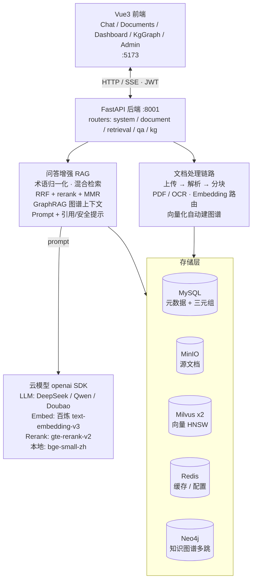
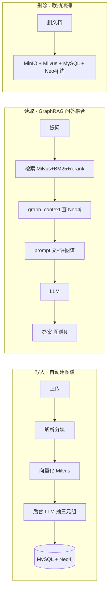

# 电网运维 RAG 智能问答系统

基于大模型 + RAG 的电网自主运维智能问答系统：**自然语言提问 → 混合检索 → 可信答案生成**，覆盖变电、配电、输电三大场景，为一线运维提供可直接落地的故障处理方案。

> 前端 Vue 3 · 后端 FastAPI · 三家云大模型（DeepSeek/阿里百炼/火山方舟）可切换 · 双 Embedding 路由（云 + 本地 bge）· Milvus + MinIO + MySQL + Redis

---

## ✨ 核心特性

- **三家云大模型可切换**：DeepSeek / 通义千问 / 豆包，均兼容 OpenAI 协议，配置即切；`/qa/answer` 的 `modelType` 支持按请求切换
- **双 Embedding 路由**：文档大走云、小走本地 bge（双 collection，向量空间隔离），检索双查融合
- **混合检索**：HNSW 稠密 + BM25 稀疏 + RRF 融合 + 百炼 gte-rerank 重排
- **文档解析**：数字文档（PDF/Word/TXT）+ 扫描件/图片 OCR（PaddleOCR PP-OCR 模型）
- **热点问答缓存**：高频问题 Redis 秒回（6.5s → 0.002s）
- **流式问答**：SSE 逐 token 输出
- **多轮对话**：历史持久化，追问带上下文
- **可信答案**：引用标注 + 安全提示 + LLM-as-judge 幻觉评估（评测集 0%）
- **🧠 知识图谱（Neo4j）**：LLM 抽取设备-故障-处置三元组，多跳影响链推理 + 枢纽实体分析（MySQL 做不到的多跳因果）
- **🔗 GraphRAG**：问答融合知识图谱结构化上下文；向量化自动建图谱，读+写+删三链路打通，不再孤岛
- **💡 智能推荐**：答完推 3 个相关追问，引导深挖
- **📊 Grafana 监控**：17 面板（请求/延迟/LLM/Embedding/缓存/幻觉/反馈/知识库…）
- **完整管理**：JWT 鉴权、角色权限、操作日志、Milvus/模型参数配置、健康探活、结构化日志
- **生产就绪**：Docker Compose 一键全栈（9 服务）、gunicorn 多 worker、pytest 测试

---

## 🏗️ 系统架构



### GraphRAG 数据链路（Neo4j 与原系统打通，不再孤岛）



---

## 🛠️ 技术栈

| 层 | 选型 |
|---|---|
| 前端 | Vue 3 + Vite + Pinia + Vue Router + Axios |
| 后端 | Python 3.11+ · FastAPI · Uvicorn · SQLAlchemy 2.0(async) |
| LLM（云，可切换） | DeepSeek `deepseek-chat` / 百炼 `qwen-plus` / 火山豆包(endpoint_id) |
| Embedding（云） | 百炼 `text-embedding-v3`（1024维）/ 火山豆包 |
| Embedding（本地） | `bge-small-zh-v1.5`（512维，可换 large）· sentence-transformers |
| Rerank | 百炼 `gte-rerank-v2` |
| 文档解析 | pdfplumber / python-docx / PyMuPDF + rapidocr-onnxruntime（PaddleOCR 模型） |
| 向量库 | Milvus 2.4（HNSW + COSINE，双 collection） |
| 对象存储 | MinIO（源文档） |
| 元数据 | MySQL 8（用户/文档/chunks/日志/对话） |
| 缓存 | Redis 7（热点问答 + 配置持久化） |
| **知识图谱** | **Neo4j 5（设备-故障-处置多跳推理，:Entity-[:REL]）** |
| 检索 | HNSW 稠密 + rank-bm25 + RRF + rerank + MMR |
| 监控 | Prometheus + Grafana（17 面板） |
| 编排 | Docker Compose（9 服务） |

---

## 📁 目录结构

```
.
├── backend/                      # FastAPI 后端
│   ├── app/
│   │   ├── main.py               # 入口（lifespan/CORS/health/异常）
│   │   ├── config.py             # .env 配置
│   │   ├── core/                 # 响应/安全(JWT+bcrypt)/日志(loguru)/异常
│   │   ├── db/                   # 异步会话/建表
│   │   ├── models/               # user/document/chunk/conversation/operation_log
│   │   ├── schemas/              # Pydantic 请求/响应
│   │   ├── routers/              # system/document/retrieval/qa/kg
│   │   ├── services/             # 业务编排
│   │   │   ├── document_service  # 上传/解析/向量化(路由)/删除/★自动建图谱
│   │   │   ├── retrieval_service # 双查+RRF+rerank+MMR
│   │   │   ├── qa_service        # 缓存/多轮/prompt+图谱/LLM/智能推荐
│   │   │   ├── kg_service        # ★ 三元组抽取/多跳推理/GraphRAG上下文
│   │   │   ├── bm25/rerank/embedding/conversation/term/config/log
│   │   ├── providers/            # ★ 模型抽象(三家LLM + 云/bge Embedding)
│   │   ├── clients/              # minio/milvus(双collection)/redis/★neo4j
│   │   ├── rag/                  # prompt/rrf/citation/judge
│   │   └── data/grid_terms.json  # 电网术语词表
│   ├── Dockerfile
│   └── requirements.txt
├── frontend/                     # Vue 3 前端
│   ├── src/{views,api,stores,router}
│   ├── Dockerfile + nginx.conf
│   └── package.json
├── scripts/                      # 评测/压测/建库
│   ├── seed_demo.py  eval_retrieval.py  eval_qa.py  benchmark.py
├── tests/                        # pytest（11 用例）
├── docker-compose.yml            # 全栈编排（8 服务）
├── .env.example                  # 配置模板
└── README.md
```

---

## 🚀 快速开始（本地开发）

### 前置
- Docker Desktop（跑基础设施）
- Python 3.11+、Node 20+
- 三家云服务的 API Key（DeepSeek / 阿里百炼 / 火山方舟）

### 1. 启动基础设施

```bash
cp .env.example .env          # 填入三家 API Key
docker compose up -d mysql minio redis milvus   # 先起依赖（首次会拉镜像）
docker compose ps             # 确认 healthy
```

> 端口约定：MySQL 映射 **3307**（避开本机 MySQL）、后端 **8001**（避开占用 8000 的进程）、Milvus 19530、MinIO 9000/9001、Redis 6379。

### 2. 启动后端

```bash
python -m venv venv
source venv/Scripts/activate                      # Windows Git Bash
pip install -r backend/requirements.txt -i https://pypi.tuna.tsinghua.edu.cn/simple
uvicorn app.main:app --reload --host 127.0.0.1 --port 8001 --app-dir backend
```

### 3. 启动前端

```bash
npm --prefix frontend install --registry https://registry.npmmirror.com
npm --prefix frontend run dev
```

### 4. 访问

- 前端：http://localhost:5173 （admin / admin123）
- 接口文档：http://localhost:8001/docs
- 健康检查：http://localhost:8001/health
- MinIO 控制台：http://localhost:9001 （minioadmin/minioadmin）

---

## ⚙️ 配置说明（.env）

复制 `.env.example` 为 `.env` 并填入：

| 配置 | 说明 |
|---|---|
| `DEEPSEEK_API_KEY` / `DASHSCOPE_API_KEY` / `ARK_API_KEY` | 三家云 API Key |
| `DOUBAO_LLM_ENDPOINT_ID` | 火山豆包推理接入点 id（`ep-xxxx`，非模型名） |
| `LLM_PROVIDER` | 默认 LLM：`deepseek` / `qwen` / `doubao` |
| `EMB_PROVIDER` | 默认云 Embedding：`qwen` / `doubao` |
| `EMBEDDING_DIM` | 云向量维度，固定 1024 |
| `BGE_MODEL` / `BGE_DIM` | 本地 bge 模型与维度（默认 bge-small-zh-v1.5 / 512） |
| `DOC_SIZE_THRESHOLD` | 文档字数阈值（默认 5000），超过走云 Embedding |
| `RERANK_ENABLE` / `RERANK_MODEL` | 重排开关 / 百炼 gte-rerank-v2 |
| `JWT_SECRET` / `ADMIN_PASSWORD` | 鉴权密钥 / 默认管理员密码 |
| `REDIS_URL` / `QA_CACHE_TTL` | Redis 地址 / 问答缓存秒数 |

> ⚠️ 真实 API Key 只放 `.env`（已被 .gitignore 忽略），切勿提交。`.env.example` 保持空值模板。

---

## 🔌 API 接口

统一响应：`{"code": 200, "message": "...", "data": {...}}`；除登录/注册/健康检查外，需 `Authorization: Bearer <token>`。

### 系统
| 方法 | 路径 | 说明 |
|---|---|---|
| POST | `/api/system/login` | 登录，返回 token |
| POST | `/api/system/register` | 注册用户（仅 admin） |
| GET | `/api/system/logs` | 操作日志（admin 全部 / operator 仅自己，支持时间过滤） |
| POST/GET | `/api/system/config/milvus` | Milvus 索引参数配置（仅 admin，Redis 持久化） |
| POST/GET | `/api/system/config/model` | 模型参数配置（仅 admin） |

### 文档
| 方法 | 路径 | 说明 |
|---|---|---|
| POST | `/api/document/upload` | 上传（form-data，PDF/Word/TXT/图片，批量≤5/单≤100M） |
| GET | `/api/document/list` | 文档列表（分页 page/size + 关键字） |
| POST | `/api/document/parse` | 解析分块（数字文档 + OCR + 术语归一化） |
| POST | `/api/document/vector/generate` | 向量化（按文档大小路由云/bge，返回 embeddingRoute） |
| DELETE | `/api/document/delete` | 删除（联动 MinIO + Milvus 双 collection + MySQL） |

### 检索与问答
| 方法 | 路径 | 说明 |
|---|---|---|
| POST | `/api/retrieval/mixed` | 混合检索（双 collection + BM25 + RRF + rerank） |
| POST | `/api/qa/answer` | 智能问答（热点缓存 + 多轮上下文 + 引用/安全提示） |
| POST | `/api/qa/answer/stream` | 流式问答（SSE 逐 token） |
| GET | `/api/qa/conversations` | 对话列表 |
| GET | `/api/qa/history` | 对话历史消息 |
| POST | `/api/qa/term/normalize` | 术语归一化 |
| POST | `/api/qa/related` | 智能推荐 3 个相关追问（独立接口，不拖慢流式） |
| POST | `/api/qa/feedback` | 问答反馈（👍/👎 沉淀坏 case） |
| GET | `/health` | 健康检查（探活 MySQL/MinIO/Milvus/Redis/Neo4j） |

### 知识图谱（Neo4j 多跳推理）
| 方法 | 路径 | 说明 |
|---|---|---|
| POST | `/api/kg/extract` | LLM 抽取文档三元组（双写 MySQL+Neo4j） |
| GET | `/api/kg/graph?entity=` | 关系图谱（Cypher 邻居，Neo4j 不可用回退 MySQL） |
| GET | `/api/kg/path?entity=&depth=` | **多跳影响链**（设备→故障→处置因果传播，MySQL 做不到） |
| GET | `/api/kg/influence` | 枢纽实体（出度排行，找核心设备） |
| GET | `/api/kg/stats` | 图谱统计（三元组/实体/关系数 + 文档分布） |

---

## 🧠 双 Embedding 路由

不同 Embedding 模型向量空间不兼容，必须分 collection：

```
向量化：文档字数 > DOC_SIZE_THRESHOLD(5000) → 云(1024维) → grid_chunks
       文档字数 ≤ 阈值                       → 本地 bge(512维) → grid_chunks_bge

检索：query 双路 embedding → 两 collection 各查 → RRF 融合 → rerank
```

- 本地 bge 解决云 API 并发限流瓶颈（小文档无限流）
- bge 模型首次下载需访问 HuggingFace：设 `HF_ENDPOINT=https://hf-mirror.com` 或代理或预下到 HF 缓存
- 换 bge-large：`BGE_MODEL=BAAI/bge-large-zh-v1.5` + `BGE_DIM=1024`

---

## 📊 评测结果（6 文档 demo 库）

| 指标 | 结果 | 目标 |
|---|---|---|
| 检索召回率 recall@5 | **100%** (8/8) | ≥92% |
| 单请求检索延迟 | **0.95s** | ≤1.5s |
| 50 并发检索成功率 | **100%** (50/50) | 不崩 |
| LLM-as-judge 幻觉率 | **0%** (6 问) | ≤5% |
| 热点缓存命中 | **6.5s → 0.002s** | — |

评测脚本：
```bash
python scripts/seed_demo.py        # 建 6 文档知识库
python scripts/eval_retrieval.py   # 检索召回
python scripts/eval_qa.py          # LLM-as-judge 幻觉率
python scripts/benchmark.py 50     # 并发压测
```

> 高并发 P50 ~20s 的瓶颈在云 Embedding API 限流（非 Milvus/系统）。小文档走本地 bge 后本地路并发大幅提升；进一步降延迟可全量本地 bge + gunicorn 多 worker。

---

## 🐳 一键部署（Docker Compose）

```bash
cp .env.example .env
docker compose up -d --build      # 9 服务：mysql/minio/redis/etcd/milvus-minio/milvus/neo4j/backend/frontend
```

容器间用 service name 通信：backend 连 `mysql:3306` / `minio:9000` / `milvus:19530` / `redis:6379`（由 compose `environment` 覆盖 `.env` 中的 localhost，API Key 仍由 `.env` 注入）。

---

## 🏭 生产部署（多 worker）

开发用 `uvicorn --reload`（单进程）；Linux/Docker 生产用 gunicorn 多 worker 提并发：

```bash
pip install gunicorn
gunicorn app.main:app -k uvicorn.workers.UvicornWorker -w 4 -b 0.0.0.0:8001 --app-dir backend
```

> Windows 不支持 gunicorn 的 fork，Windows 上仍用 `uvicorn` 单进程；多 worker 部署在 Linux/Docker 环境。

---

## 💻 开发指南

### 切换 LLM
改 `.env` 的 `LLM_PROVIDER`（`deepseek`/`qwen`/`doubao`），或请求时传 `modelType` 按需切换。

### 添加术语归一化
编辑 `backend/app/data/grid_terms.json`：`"别名": "标准术语"`（重启生效）。

### 跑测试
```bash
venv/Scripts/python -m pytest tests/ -v   # 11 用例（含集成）
```

### 看日志
`data/logs/app.log`（loguru，50MB 轮转 / 10 天保留）。

---

## ❓ FAQ

**Q: PaddleOCR 为什么用 rapidocr-onnxruntime？**
A: paddlepaddle 3.3.1 在 Windows 有 onednn PIR 引擎 bug（关 oneDNN/PIR/monkey-patch 均无效）。rapidocr 用的是 PaddleOCR 官方 PP-OCR 模型 + onnxruntime 后端，识别效果等同、规避引擎 bug。生产 Linux 可切回原生 paddleocr。

**Q: pymilvus 为什么用 2.4？**
A: 2.3 的 grpcio 在 Python 3.13 Windows 无预编译 wheel。2.4 兼容且支持 py3.13。另需 `setuptools<81`（pymilvus 用 pkg_resources，setuptools≥81 已移除）。

**Q: 向量化后检索不到？**
A: 确认文档已 `parse`（chunks 表有数据）再 `vector/generate`；HNSW 切换需重建 collection（drop 后重新向量化）。

**Q: bge 模型下载失败？**
A: 设 `HF_ENDPOINT=https://hf-mirror.com` 或 `HTTPS_PROXY`，或预下模型到 HF 缓存目录。

---

## 📋 功能复盘（全量功能清单）

**47 次增量提交**｜5 存储（MySQL/MinIO/Milvus/Redis/Neo4j）｜后端 5 router·14 service·7 表｜前端 6 页面｜Grafana 17 面板｜三家云模型 + 本地 bge

### 🧠 核心 RAG 问答链路
| 功能 | 技术细节 |
|---|---|
| 智能问答 `/qa/answer` | term 归一化→检索→prompt→LLM→引用+安全提示+计时 |
| 热点缓存 | Redis 缓存单轮答案，6.5s → 0.002s |
| 流式问答 SSE | stream_answer 三段事件(meta/token/done) + 前端 fetch+ReadableStream |
| 多轮对话 | conversations/messages 表，近 3 轮上下文 |
| 幻觉评估 | LLM-as-judge 启发式，评测集 0% |
| **★ GraphRAG** | graph_context 查 Neo4j 三元组拼 prompt【知识图谱】段，答案带 🔗图谱N |

### 🔍 检索引擎
| 功能 | 技术细节 |
|---|---|
| 混合检索 | Milvus 稠密 Top20 + BM25 稀疏 Top20 + RRF 融合(k=60) |
| HNSW 索引 | COSINE + M16/efConstruction200 |
| Rerank 重排 | 百炼 gte-rerank-v2，失败兜底 RRF |
| MMR 多样性 | λ=0.6 相关性 vs 多样性 |
| Query 改写 / docType 过滤 | LLM 改写(可选) + 文档类型元数据过滤 |

### 🧩 知识图谱 + GraphRAG（Neo4j）
| 功能 | 技术细节 |
|---|---|
| 三元组抽取 `/kg/extract` | LLM 分块抽(6块/批)，JSON 容错解析，双写 MySQL+Neo4j |
| 关系图谱 `/kg/graph` | Cypher 查邻居（Neo4j 不可用回退 MySQL） |
| **★ 多跳影响链 `/kg/path`** | `MATCH path=(n)-[:REL*1..N]->(m)`，故障因果传播（MySQL 做不到） |
| 枢纽实体 `/kg/influence` | 出度排行找核心设备 |
| GraphRAG 数据链路 | 读(问答融合)+写(向量化自动建)+删(联动清) 三链路打通 |

### 💻 前端能力（6 页面）
| 页面 | 功能 |
|---|---|
| **Chat** | Markdown+代码高亮 / 流式打字机 / 引用溯源点击定位+复制 / 对话管理(增删改查搜索) / 智能推荐追问 / 🔗图谱N标签 / 暗色 / 移动端响应式 |
| **Documents** | 拖拽上传 + 进度条 + 类型状态筛选 + 批量勾选 + 骨架屏 |
| **Dashboard** | echarts 统计仪表盘（饼图+柱图+卡片） |
| **KgGraph** | 关系图谱(echarts力导向) / 多跳影响链(chain→rels箭头) / 枢纽出度 三 tab |
| **Admin** | 操作日志 + Milvus/模型配置 |
| **Login** | 登录注册 + JWT |

### 📊 可观测与运维
Grafana 17 面板 · Prometheus 17 指标 · 健康检查(5 依赖) · loguru 结构化日志 · CI/CD(ci-cd 分支) · Alembic 迁移 · slowapi 限流 · pytest(11) · gunicorn 多 worker

---

## 🗺️ 开发进度

**基础链路 S1–S11**：地基→认证→文档上传→解析+OCR→Embedding+Milvus→混合检索→RAG问答→配置+日志→前端联调→评测+性能→镜像化 ✅

**优化 O1–O10**：Redis缓存→rerank→分块语义→HNSW→流式SSE→多轮对话→LLM-judge→可观测→pytest→生产化 ✅

**双 Embedding P1–P3**：本地bge→双collection路由→检索双查融合 ✅

**性能质量 Q1–Q10**：双embed并行→query向量缓存→限流→MMR→query改写→docType过滤→Alembic→CI→CD/Prometheus→问答反馈 ✅

**前端 F1–F8**：Markdown高亮→流式打字机→引用溯源→对话管理→文档增强→统计仪表盘→暗色模式→体验优化 ✅

**Grafana 监控**：流式埋点修复 + 9 新指标，dashboard 9→17 面板 ✅

**跨端高级功能**：
- ✅ 知识图谱（MySQL → Neo4j 多跳推理）
- ✅ 智能推荐（答完推 3 个相关追问）
- ✅ GraphRAG 数据链路（Neo4j 融入问答，读+写+删三链路）
- ⬜ 语音问答（砍掉：百炼 TTS 不兼容 OpenAI 协议、收益有限）

---

## 📄 许可

本项目用于电网运维智能问答学习与内部部署。云模型 API 使用遵循各自服务条款。
