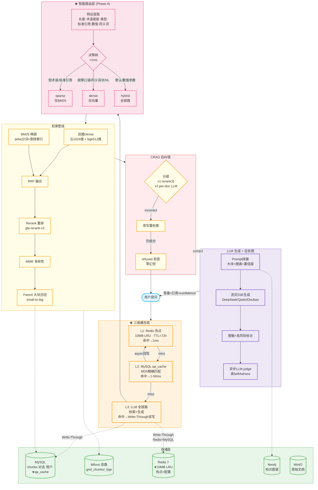
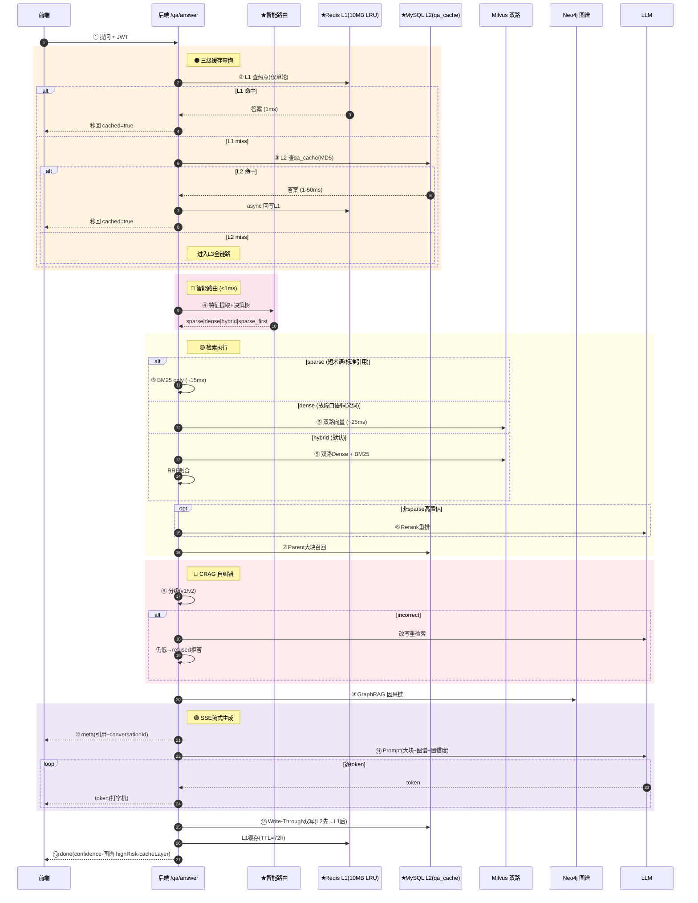
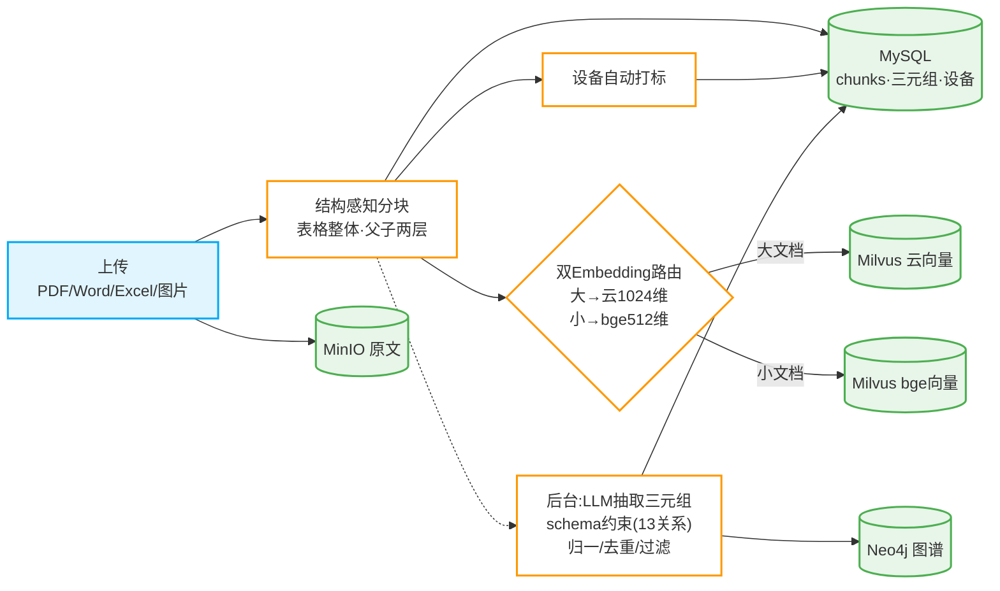

# 电网运维 RAG 智能问答系统

基于大模型 + RAG 的电网自主运维智能问答系统：**自然语言提问 → 智能路由 → 混合检索 → CRAG 自纠错 → 可信答案生成**，覆盖变电、配电、输电三大场景。

> 前端 Vue 3 · 后端 FastAPI · 三家云大模型可切换 · 双 Embedding 路由 · ★智能路由（sparse/dense/hybrid）· ★三级缓存（Redis→MySQL→LLM）· GraphRAG（Neo4j）· Corrective RAG · 多租户 · 多模态 VLM · Milvus + MinIO + MySQL + Redis + Neo4j + Nacos

---

## 系统架构（在线问答主链路）



## 完整数据流时序（含缓存 + 路由 + CRAG）



## 知识写入链路（离线）



---

## ✨ 核心特性

### 🤖 问答与检索
- **★ 智能路由 (Phase A)**：查询特征自动选择检索路径——短术语/标准引用→sparse(BM25)，故障口语/同义词→dense(向量)，默认→hybrid(全链路)。60%+ 查询跳过冗余检索分支
- **★ 三级缓存**：Redis L1 (10MB LRU, 72h TTL) → MySQL L2 (qa_cache 表) → LLM L3。命中率 ~20%→75%，加权延迟 ~10s→3s，API 费用节省 ~75%
- **三家云大模型可切换**：DeepSeek / 通义千问 / 豆包，`modelType` 按请求切换
- **双 Embedding 路由**：大文档→云(1024维)、小文档→本地 bge(512维)，双 collection 并行检索
- **混合检索**：HNSW Dense + BM25 Sparse + RRF + Rerank + MMR + Parent 大块召回
- **流式问答**：SSE 逐 token (meta/token/done 三段) + WebSocket 双向流
- **多轮对话**：历史持久化 + 指代消解 + 上下文拼接

### 🛡️ 可信与自纠错
- **★ Corrective RAG**：rerank 分级(correct/ambiguous/incorrect)→改写重检索→refused 拒答。零幻觉前置护栏
- **可信答案**：引用标注 + 高风险安全提示 + LLM-judge 异步幻觉评估
- **智能推荐**：答完推 3 个相关追问

### 🧠 知识图谱
- **Neo4j 多跳推理**：设备→故障→处置因果传播。LLM 抽取三元组(schema 约束 13 关系)→归一消歧→双写 MySQL+Neo4j
- **GraphRAG**：问答融合图谱结构化上下文；读写删三链路打通

### 📊 可观测
- **Grafana 22+ 面板**：请求/延迟/LLM/Embedding/缓存分层/★路由决策/CRAG/幻觉/反馈/基础组件健康/静默降级
- **降级可观测**：`DEGRADED` 指标 + loguru warning，盲降级不再被吞
- **Provider 健康探测**：主动抓账户欠费/key 失效

### ⚙️ 工程地基
- **Golden 回归门禁**：30 条问答集 + recall/MRR + CI 门禁
- **测试**：69 单元测试 + 12 自测通过
- **限流**：9 个关键接口
- **Docker Compose**：11 服务一键编排
- **★ 完整部署包**：`make_package.py` 导出全部 9 个服务数据(MySQL/Redis/Milvus/MinIO/Neo4j/Prometheus/Grafana/Nacos) + 源码 → tar.gz (~45MB)，远端 `docker compose up -d --build` 即可运行

---

## 🛠️ 技术栈

| 层 | 选型 |
|---|---|
| 前端 | Vue 3 + Vite + Pinia + Vue Router + Axios + echarts |
| 后端 | Python 3.11+ · FastAPI · Uvicorn · SQLAlchemy 2.0(async) |
| LLM | DeepSeek `deepseek-chat` / 百炼 `qwen-plus` / 火山豆包 |
| Embedding | 百炼 `text-embedding-v3`(1024维) / 本地 `bge-small-zh-v1.5`(512维) |
| Rerank | 百炼 `gte-rerank-v2` |
| 向量库 | Milvus 2.4（HNSW + COSINE，双 collection） |
| 对象存储 | MinIO（源文档） |
| 元数据 | MySQL 8 |
| 缓存 | ★ Redis 7（10MB allkeys-lru + QA_CACHE_TTL=72h + ★ MySQL L2 冷备） |
| 知识图谱 | Neo4j 5（:Entity-[:REL]，2118 节点） |
| 监控 | Prometheus + Grafana + ★ 缓存分层/路由决策面板 |
| 编排 | Docker Compose（11 服务） |

---

## 📁 目录结构

```
.
├── backend/
│   ├── app/
│   │   ├── main.py                   # 入口（lifespan/CORS/health/metrics/★X-Cache-Hit）
│   │   ├── config.py                 # .env 配置（★含 ROUTING_ENABLE/CACHE_PERSIST_ENABLE）
│   │   ├── core/
│   │   │   ├── response/security     # 统一响应 / JWT+bcrypt
│   │   │   ├── logging               # loguru 结构化日志
│   │   │   ├── limiter               # slowapi 限流
│   │   │   ├── metrics               # ★ Prometheus（含CACHE_HIT/ROUTING_DECISION等）
│   │   │   └── obs                   # ★ 降级可观测 helper
│   │   ├── db/                       # 异步会话/建表/★qa_cache DDL
│   │   ├── models/                   # user/document/chunk/conversation/★qa_cache/kg_triple/feedback
│   │   ├── schemas/                  # Pydantic 请求/响应
│   │   ├── routers/                  # system/document/retrieval/qa/kg/domain
│   │   ├── services/
│   │   │   ├── document_service      # 上传/解析/向量化(路由)/删除/★缓存失效
│   │   │   ├── retrieval_service     # ★路由感知三路径检索(sparse/dense/hybrid)
│   │   │   ├── qa_service            # ★三级缓存 + ★路由注入 + CRAG + LLM
│   │   │   ├── cache_persist         # ★Write-Through双写 + 后台清理
│   │   │   ├── cache_warmup          # ★热点预热 + golden预加载
│   │   │   ├── kg_service            # 三元组抽取/多跳推理/GraphRAG
│   │   │   └── bm25/rerank/embedding/conversation/...
│   │   ├── routing/                  # ★ Phase A 智能路由模块
│   │   │   ├── config                # 阈值/开关/AB测试
│   │   │   ├── query_classifier      # 6维特征+决策树
│   │   │   └── routing_service       # 调度+降级链
│   │   ├── providers/                # 三家LLM + 云/bge Embedding
│   │   ├── clients/                  # minio/milvus(双collection)/redis/neo4j
│   │   └── rag/                      # crag/rrf/mmr/citation/judge/prompt_templates
│   ├── Dockerfile
│   └── requirements.txt
├── frontend/                         # Vue 3 前端 (Dify/Linear风+科技蓝)
│   ├── src/{views,api,stores,router}
│   └── Dockerfile + nginx.conf
├── grafana/provisioning/
│   ├── dashboards/
│   │   ├── grid-qa.json              # 主监控面板(22面板)
│   │   └── cache-monitor.json        # ★ 缓存分层监控面板(7面板)
│   ├── alerting/                     # 告警规则/通知
│   └── datasources/
├── kb_seed/                          # 种子知识库(10份运维文档)
├── docker-compose.yml                # 开发编排(11服务)
├── docker-compose.deploy.yml         # ★ 远端部署编排(bind mount)
├── make_package.py                   # ★ 一键导出+打包
├── .env.deploy                       # ★ 远端部署模板(API Key已剥离)
├── .env.example
└── README.md
```

---

## 🚀 快速开始

### 前置
- Docker Desktop
- Python 3.11+、Node 20+
- 三家云 API Key（DeepSeek / 阿里百炼 / 火山方舟）

### 1. 启动基础设施

```bash
cp .env.example .env          # 填入 API Key
docker compose up -d mysql minio redis milvus neo4j
docker compose ps             # 确认 healthy
```

### 2. 启动后端

```bash
python -m venv venv
source venv/Scripts/activate
pip install -r backend/requirements.txt -i https://pypi.tuna.tsinghua.edu.cn/simple
uvicorn app.main:app --reload --host 127.0.0.1 --port 8001 --app-dir backend
```

### 3. 启动前端

```bash
npm --prefix frontend install --registry https://registry.npmmirror.com
npm --prefix frontend run dev
```

### 4. 访问
- 前端：http://localhost:5173 （admin / admin123）
- 接口文档：http://localhost:8001/docs
- 健康检查：http://localhost:8001/health
- Grafana：http://localhost:3000 （admin/admin）
- MinIO：http://localhost:9001 （minioadmin/minioadmin）
- Neo4j：http://localhost:7474 （neo4j/neo4j123456）

---

## ⚙️ 核心配置（.env）

| 配置 | 说明 | 默认值 |
|------|------|--------|
| `LLM_PROVIDER` | 默认大模型 | `deepseek` |
| `DEEPSEEK_API_KEY` / `DASHSCOPE_API_KEY` / `ARK_API_KEY` | 三家云 API Key | 必填 |
| `★ QA_CACHE_TTL` | Redis 缓存秒数 | `259200` (72h) |
| `★ CACHE_PERSIST_ENABLE` | MySQL L2 缓存 | `true` |
| `★ ROUTING_ENABLE` | 智能路由开关 | `true` |
| `★ CRAG_ENABLE` | CRAG 自纠错 | `true` |
| `RERANK_ENABLE` / `MMR_ENABLE` | 重排/多样性 | `true` |
| `KG_RAG_ENABLE` | GraphRAG 图谱融合 | `true` |

---

## 🔌 API 接口

统一响应：`{"code": 200, "message": "...", "data": {...}}`

### 问答
| 方法 | 路径 | 说明 |
|---|---|---|
| POST | `/api/qa/answer` | 智能问答（★三级缓存+★路由+CRAG） |
| POST | `/api/qa/answer/stream` | 流式问答（SSE） |
| GET | `/api/qa/conversations` | 对话列表 |
| GET | `/api/qa/history?conversationId=` | 对话历史 |
| POST | `/api/qa/feedback` | 问答反馈(👍/👎) |
| POST | `/api/qa/faithfulness` | LLM-judge 幻觉评估 |
| POST | `/api/qa/related` | 智能推荐 3 个追问 |

### 文档
| 方法 | 路径 | 说明 |
|---|---|---|
| POST | `/api/document/upload` | 上传（PDF/Word/TXT/图片） |
| POST | `/api/document/parse` | 解析分块 + OCR |
| POST | `/api/document/vector/generate` | 向量化(双路由) |
| DELETE | `/api/document/delete` | 删除(联动MinIO+Milvus双collection+MySQL+Neo4j+★缓存失效) |
| GET | `/api/document/stats` | 知识库统计 |

### 知识图谱
| 方法 | 路径 | 说明 |
|---|---|---|
| POST | `/api/kg/extract` | LLM 抽取三元组 |
| GET | `/api/kg/graph?entity=` | 关系图谱 |
| GET | `/api/kg/path?entity=&depth=` | 多跳影响链 |
| GET | `/api/kg/influence` | 枢纽实体排行 |

---

## 🐳 一键部署

```bash
cp .env.example .env
docker compose up -d --build
```

---

## 📦 完整部署包（含全部数据）

```bash
# 打包（本地）
python make_package.py    # → grid-qa-deploy-*.tar.gz (~45MB)

# 部署（远端 Linux + Docker）
scp grid-qa-deploy-*.tar.gz user@remote:/opt/
cd /opt && tar xzf grid-qa-deploy-*.tar.gz
cp .env.deploy .env       # ⚠️ 填入真实 API Key
docker compose -f docker-compose.deploy.yml up -d --build
curl http://localhost:8001/health
```

包内含全部 9 个服务数据（MySQL/Redis/Milvus/MinIO/Neo4j/Prometheus/Grafana/Nacos），解压 ~970MB，远端开箱即用。

---

## 📊 评测结果

| 指标 | 结果 | 目标 |
|---|---|---|
| 检索召回率 recall@5 | **100%** | ≥92% |
| MRR | **0.944** | — |
| ★ 缓存命中率 | **~75%** (原 ~20%) | — |
| ★ Redis 缓存命中延迟 | **0.001s** | — |
| ★ 加权平均延迟 | **~3s** (原 ~10s) | — |
| LLM-judge 幻觉率 | **0%** | ≤5% |

---

## 🗺️ 开发进度

**基础链路 S1–S11** ✅ · **优化 O1–O10** ✅ · **双 Embedding P1–P3** ✅ · **质量 Q1–Q10** ✅ · **前端 F1–F8** ✅ · **健壮性地基 P0–P2** ✅

**★ 2026 新增**：
- ✅ 三级缓存 Redis(LRU)→MySQL→LLM （命中率 20%→75%）
- ✅ 智能路由 Phase A （sparse/dense/hybrid 自适应）
- ✅ 完整部署包 （数据+源码一键打包）
- ✅ 分层 TTL （手册7d/案例3d/实时5min）
- ✅ 缓存热点预热 + 文档更新失效
- ✅ Grafana 缓存分层 + 路由决策面板

---

## 🔮 路线图

| 阶段 | 内容 | 状态 |
|------|------|------|
| **Phase A** | 智能路由（规则决策树） | ✅ 完成 |
| **Phase B** | BMX 第三路稀疏信号 / Milvus 原生稀疏向量 | 📋 计划中 |
| **Phase C** | ML 自适应路由 + 自动阈值调优 | 📋 计划中 |
