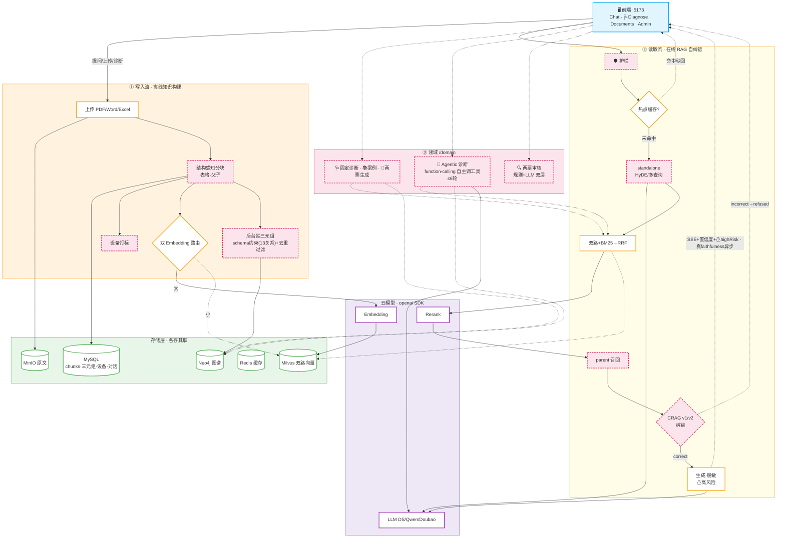
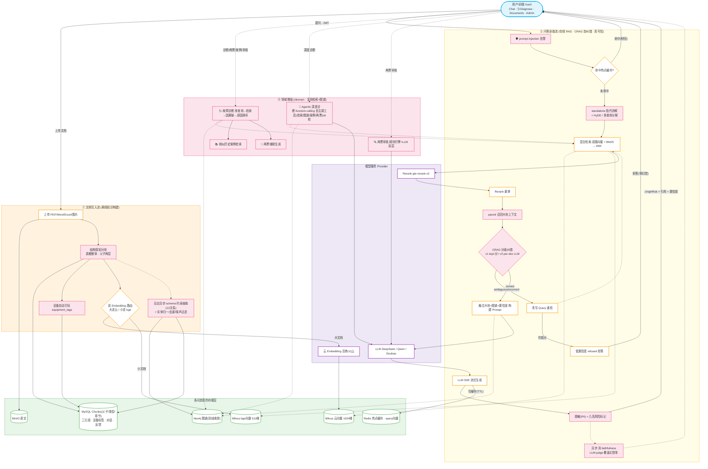
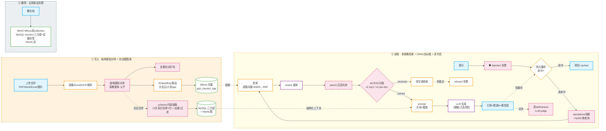
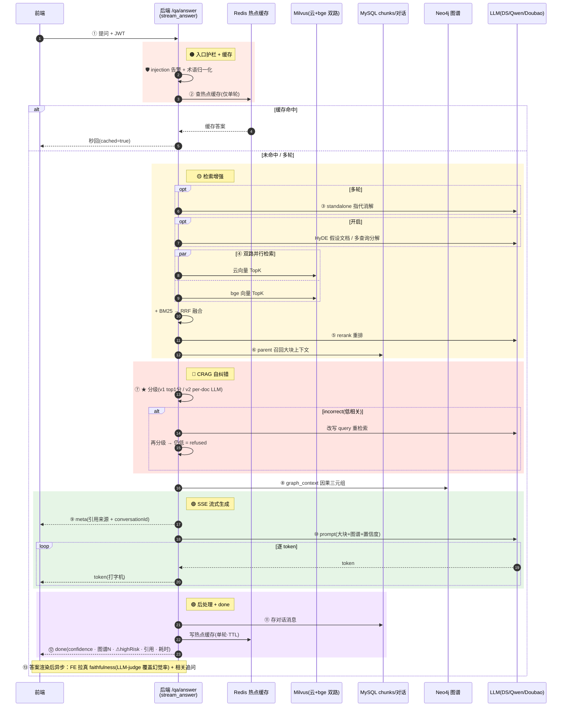
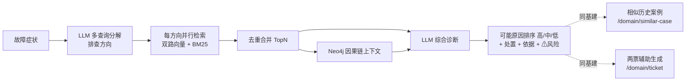

# 电网运维 RAG 智能问答系统

基于大模型 + RAG 的电网自主运维智能问答系统：**自然语言提问 → 混合检索 → 自纠错 → 可信答案生成**，覆盖变电、配电、输电三大场景，为一线运维提供可直接落地的故障处理方案。

> 前端 Vue 3（Dify/Linear 风）· 后端 FastAPI · 三家云大模型（DeepSeek/阿里百炼/火山方舟）可切换 · 双 Embedding 路由（云 + 本地 bge）· GraphRAG（Neo4j 多跳）· Corrective RAG 自纠错 · 多租户 · 多模态 VLM · Milvus + MinIO + MySQL + Redis + Nacos

---

## ✨ 核心特性

### 🤖 问答与检索
- **三家云大模型可切换**：DeepSeek / 通义千问 / 豆包，均兼容 OpenAI 协议，配置即切；`/qa/answer` 的 `modelType` 支持按请求切换
- **双 Embedding 路由**：文档大走云、小走本地 bge（双 collection，向量空间隔离），检索双查融合
- **混合检索**：HNSW 稠密 + BM25 稀疏 + RRF 融合 + 百炼 gte-rerank 重排 + MMR 多样性
- **热点问答缓存**：高频问题 Redis 秒回（6.5s → 0.002s）
- **流式问答**：SSE 逐 token 输出（meta/token/done 三段事件）
- **多轮对话**：历史持久化，追问带上下文

### 🛡️ 可信与自纠错（2026 RAG 趋势）
- **★ Corrective RAG 自纠错**：检索后用 rerank 分数分级（correct/ambiguous/incorrect），低相关触发 query 改写重检索，仍无强相关则 **refused 保守拒答**（零幻觉），把事后 LLM-judge 升级为实时前置护栏
- **可信答案**：引用标注 + 高风险操作安全提示 + LLM-as-judge 幻觉评估（评测集 0%）
- **💡 智能推荐**：答完推 3 个相关追问，引导深挖

### 🧠 知识图谱
- **Neo4j 多跳推理**：LLM 抽取设备-故障-处置三元组，多跳影响链 + 枢纽实体分析（MySQL 做不到的因果传播）
- **🔗 GraphRAG**：问答融合知识图谱结构化上下文；向量化自动建图谱，读+写+删三链路打通，不再孤岛

### 📊 可观测与运维
- **Grafana 监控（22 面板）**：请求/延迟/LLM/Embedding/缓存/幻觉/反馈/知识库/CRAG/安全事件/领域调用/基础组件健康/静默降级…
- **★ 降级可观测**：业务/IO 失败统一 `DEGRADED` 指标 + 日志，盲降级不再被吞（Neo4j 挂/rerank 挂/缓存挂一目了然）
- **★ Provider 健康检查**：`/system/health/providers` 主动探测抓账户欠费/key 失效；`/health` 配置态快照
- **基础组件健康指标**：MySQL/Milvus/Redis/MinIO 探活结果进 Prometheus，Grafana 可监控可告警

### ⚙️ 工程地基
- **★ 检索质量回归门禁**：golden 问答集（30 条）+ recall/MRR + faithfulness 评测 + CI 门禁（recall<92% / faithfulness<0.85 退出码 1），把"感觉还行"变"数据说话"
- **配置全对齐**：`.env.example` 与 `config.py` 字段一一对应（含 v2 全部开关），新部署不踩坑
- **完整管理**：JWT 鉴权、角色权限、操作日志、Milvus/模型参数配置、健康探活、结构化日志
- **限流防护**：9 个关键接口限流（问答/检索/上传/解析/向量化/反馈/推荐/图谱抽取），防成本攻击
- **测试覆盖**：69 个单元测试（chunk/term/rrf/obs/kg/document/crag/parse/eval/crag_v2/safety/kg_normalize/self_rag/multimodal）
- **生产就绪**：Docker Compose 一键全栈（10 服务，含 Nacos）、gunicorn 多 worker、Alembic 迁移、CI/CD

---

## 🏗️ 系统架构


## 系统架构 竖版



### GraphRAG 数据链路（Neo4j 与原系统打通，不再孤岛）



### 单次问答数据流时序（含 CRAG 自纠错）



---

## 🛡️ Corrective RAG 自纠错（核心卖点）

2026 RAG 趋势（Self-RAG / CRAG / Adaptive RAG）的核心是**自纠错降幻觉**。传统 RAG「检索→生成」一次性管道，检索到垃圾还硬生成；本系统在中间插入分级 + 纠错闭环：

```
检索(rerank已给相关性分) → 分级:
  correct    top1 ≥ 0.6  → 证据充分，高置信正常作答
  ambiguous  中间         → 证据有限，prompt 追加"标注不确定"
  incorrect  top1 < 0.3   → 触发 query 改写重检索(force 绕过开关)
                          → 仍低分 → refused 保守拒答，LLM 不硬编造
```

- **信号源复用 rerank 分数**，不额外调评估 LLM（省钱 + 低延迟），与离线 `judge.py` 互补为实时前置护栏
- **rerank 未启用** → 降级 ambiguous（不误触发纠错）
- 答案透传 `confidence`（high/medium/refused）+ `cragAction`（normal/rewritten/refused），前端显示置信度标签（🟢高/🟡有限/🔴不足）
- Grafana「CRAG 检索分级」面板可观测分级分布

**实测**：覆盖 query → correct/高置信正常作答；无关 query（如"量子纠缠原理"）→ refused，改写重检索后保守拒答零幻觉。

---

## 🛠️ 技术栈

| 层 | 选型 |
|---|---|
| 前端 | Vue 3 + Vite + Pinia + Vue Router + Axios + echarts |
| 后端 | Python 3.11+ · FastAPI · Uvicorn · SQLAlchemy 2.0(async) |
| LLM（云，可切换） | DeepSeek `deepseek-chat` / 百炼 `qwen-plus` / 火山豆包(endpoint_id) |
| Embedding（云） | 百炼 `text-embedding-v3`（1024维）/ 火山豆包 |
| Embedding（本地） | `bge-small-zh-v1.5`（512维，可换 large）· sentence-transformers |
| Rerank | 百炼 `gte-rerank-v2` |
| 文档解析 | pdfplumber / python-docx / PyMuPDF + rapidocr-onnxruntime（PaddleOCR 模型） |
| 向量库 | Milvus 2.4（HNSW + COSINE，双 collection） |
| 对象存储 | MinIO（源文档） |
| 元数据 | MySQL 8（用户/文档/chunks/日志/对话/三元组） |
| 缓存 | Redis 7（热点问答 + 配置持久化 + query 向量缓存） |
| **知识图谱** | **Neo4j 5（设备-故障-处置多跳推理，:Entity-[:REL]）** |
| 检索 | HNSW 稠密 + rank-bm25 + RRF + rerank + MMR + ★ CRAG 自纠错 |
| 监控 | Prometheus + Grafana（**22 面板**） |
| 编排 | Docker Compose（10 服务） |

---

## 📁 目录结构

```
.
├── backend/                      # FastAPI 后端
│   ├── app/
│   │   ├── main.py               # 入口（lifespan/CORS/health+providers/异常/metrics）
│   │   ├── config.py             # .env 配置（53 字段）
│   │   ├── core/
│   │   │   ├── response/security # 统一响应 / JWT+bcrypt
│   │   │   ├── logging           # loguru 结构化日志
│   │   │   ├── limiter           # slowapi 限流
│   │   │   ├── metrics           # Prometheus 指标（含 DEGRADED/CRAG/COMPONENT_HEALTH）
│   │   │   └── obs               # ★ 降级可观测 helper（degraded 日志+计数）
│   │   ├── db/                   # 异步会话/建表
│   │   ├── models/               # user/document/chunk/conversation/operation_log/kg_triple/feedback
│   │   ├── schemas/              # Pydantic 请求/响应
│   │   ├── routers/              # system/document/retrieval/qa/kg
│   │   ├── services/
│   │   │   ├── document_service  # 上传/解析/向量化(路由)/删除/★自动建图谱
│   │   │   ├── retrieval_service # 双查+RRF+rerank+MMR
│   │   │   ├── qa_service        # 缓存/多轮/CRAG分级纠错/prompt+图谱/LLM/智能推荐
│   │   │   ├── kg_service        # 三元组抽取/多跳推理/GraphRAG上下文
│   │   │   ├── bm25/rerank/embedding/conversation/term/config/log/query_rewrite/feedback
│   │   ├── providers/            # 模型抽象(三家LLM + 云/bge Embedding + 健康探测)
│   │   ├── clients/              # minio/milvus(双collection)/redis/neo4j
│   │   ├── rag/
│   │   │   ├── prompt_templates  # 系统 prompt（含低置信作答指令）
│   │   │   ├── crag              # ★ Corrective RAG 分级器(grade/confidence_of)
│   │   │   ├── rrf/mmr/citation/judge
│   │   └── data/{grid_terms.json,golden_qa.json}  # 术语词表 + ★检索回归基准
│   ├── Dockerfile
│   └── requirements.txt
├── frontend/                     # Vue 3 前端
│   ├── src/{views,api,stores,router}
│   ├── Dockerfile + nginx.conf
│   └── package.json
├── scripts/                      # 评测/压测/建库/造数
│   ├── seed_demo.py              # 建 demo 知识库
│   ├── seed_extra.py             # ★ 补缺失主题文档(电容器/避雷器/电缆)
│   ├── eval_retrieval.py         # ★ 检索召回(recall/MRR/分类/报告/门禁)
│   ├── eval_qa.py                # LLM-as-judge 幻觉率
│   ├── validate_golden.py        # ★ golden 集 CI 格式校验
│   ├── benchmark.py              # 并发压测
│   └── gen_traffic.py            # ★ 造流量喂饱 Grafana 面板
├── tests/                        # pytest（69 用例）
├── grafana/provisioning/         # Grafana 数据源 + 22 面板 dashboard（自动 provisioning）
├── .github/workflows/test.yml    # ★ CI（golden 校验 + 单元测试）
├── docker-compose.yml            # 全栈编排（10 服务）
├── .env.example                  # 配置模板（53 字段全对齐）
└── README.md
```

---

## 🚀 快速开始（本地开发）

### 前置
- Docker Desktop（跑基础设施）
- Python 3.11+、Node 20+
- 三家云服务的 API Key（DeepSeek / 阿里百炼 / 火山方舟）

### 1. 启动基础设施

```bash
cp .env.example .env          # 填入三家 API Key
docker compose up -d mysql minio redis milvus neo4j   # 先起依赖（首次会拉镜像）
docker compose ps             # 确认 healthy
```

> 端口约定：MySQL 映射 **3307**（避开本机 MySQL）、后端 **8001**（避开占用 8000 的进程）、Milvus 19530、MinIO 9000/9001、Redis 6379、Neo4j 7474/7687、Grafana 3000、Prometheus 9090。

### 2. 启动后端

```bash
python -m venv venv
source venv/Scripts/activate                      # Windows Git Bash
pip install -r backend/requirements.txt -i https://pypi.tuna.tsinghua.edu.cn/simple
uvicorn app.main:app --reload --host 127.0.0.1 --port 8001 --app-dir backend
```

### 3. 启动前端

```bash
npm --prefix frontend install --registry https://registry.npmmirror.com
npm --prefix frontend run dev
```

### 4. 访问
- 前端：http://localhost:5173 （admin / admin123）
- 接口文档：http://localhost:8001/docs
- 健康检查：http://localhost:8001/health
- Grafana：http://localhost:3000 （admin/admin）
- MinIO 控制台：http://localhost:9001 （minioadmin/minioadmin）
- Neo4j Browser：http://localhost:7474 （neo4j/neo4j123456）

---

## ⚙️ 配置说明（.env）

复制 `.env.example` 为 `.env` 并填入（53 字段与 `config.py` 一一对应，均有默认值，仅 API Key 必填）：

| 配置 | 说明 |
|---|---|
| `DEEPSEEK_API_KEY` / `DASHSCOPE_API_KEY` / `ARK_API_KEY` | 三家云 API Key（必填，留空则该 provider 不可用） |
| `DOUBAO_LLM_ENDPOINT_ID` | 火山豆包推理接入点 id（`ep-xxxx`，非模型名） |
| `LLM_PROVIDER` / `EMB_PROVIDER` | 默认 LLM / 云 Embedding（`deepseek`/`qwen`/`doubao`） |
| `EMBEDDING_DIM` | 云向量维度，固定 1024 |
| `BGE_MODEL` / `BGE_DIM` / `DOC_SIZE_THRESHOLD` | 本地 bge 模型/维度 + 文档大小路由阈值（默认 5000） |
| `MILVUS_COLLECTION` / `MILVUS_COLLECTION_BGE` | 双 collection（云 1024 / bge 512） |
| `RERANK_ENABLE` / `RERANK_MODEL` | 重排开关 / 百炼 gte-rerank-v2 |
| `MMR_ENABLE` / `MMR_LAMBDA` / `QUERY_REWRITE_ENABLE` | MMR 多样性 / query 改写开关 |
| `NEO4J_URI` / `NEO4J_USER` / `NEO4J_PASSWORD` / `KG_RAG_ENABLE` | 知识图谱连接 + GraphRAG 开关 |
| `★ CRAG_ENABLE` / `CRAG_HIGH` / `CRAG_LOW` | Corrective RAG 开关 + 分级阈值（0.6/0.3） |
| `JWT_SECRET` / `ADMIN_PASSWORD` | 鉴权密钥 / 默认管理员密码 |
| `REDIS_URL` / `QA_CACHE_TTL` | Redis 地址 / 问答缓存秒数 |

> ⚠️ 真实 API Key 只放 `.env`（已被 .gitignore 忽略），切勿提交。`.env.example` 保持空值模板。

---

## 🔌 API 接口

统一响应：`{"code": 200, "message": "...", "data": {...}}`；除登录/注册/健康检查外，需 `Authorization: Bearer <token>`。

### 系统
| 方法 | 路径 | 说明 |
|---|---|---|
| POST | `/api/system/login` | 登录，返回 token |
| POST | `/api/system/register` | 注册用户（仅 admin） |
| GET | `/api/system/logs` | 操作日志（admin 全部 / operator 仅自己，时间过滤） |
| POST/GET | `/api/system/config/milvus` | Milvus 索引参数配置（仅 admin，Redis 持久化） |
| POST/GET | `/api/system/config/model` | 模型参数配置（仅 admin） |
| GET | `/api/system/health/providers` | ★ Provider 主动探测（抓欠费/key失效，仅 admin） |

### 文档
| 方法 | 路径 | 说明 |
|---|---|---|
| POST | `/api/document/upload` | 上传（form-data，PDF/Word/TXT/图片，批量≤5/单≤100M） |
| GET | `/api/document/list` | 文档列表（分页 + 关键字） |
| GET | `/api/document/stats` | 知识库统计（文档/分块/向量 + 状态/类型分布） |
| POST | `/api/document/parse` | 解析分块（数字文档 + OCR + 术语归一化） |
| POST | `/api/document/vector/generate` | 向量化（按文档大小路由云/bge，返回 embeddingRoute） |
| DELETE | `/api/document/delete` | 删除（联动 MinIO + Milvus 双 collection + MySQL + Neo4j） |

### 检索与问答
| 方法 | 路径 | 说明 |
|---|---|---|
| POST | `/api/retrieval/mixed` | 混合检索（双 collection + BM25 + RRF + rerank） |
| POST | `/api/qa/answer` | 智能问答（缓存 + 多轮 + CRAG 自纠错 + 引用/安全提示/confidence） |
| POST | `/api/qa/answer/stream` | 流式问答（SSE 逐 token） |
| GET | `/api/qa/conversations` | 对话列表 |
| PUT/DELETE | `/api/qa/conversations/{id}` | 重命名 / 删除对话 |
| GET | `/api/qa/history` | 对话历史消息 |
| POST | `/api/qa/term/normalize` | 术语归一化 |
| POST | `/api/qa/related` | 智能推荐 3 个相关追问（独立接口，不拖慢流式） |
| POST | `/api/qa/feedback` | 问答反馈（👍/👎 沉淀坏 case） |

### 知识图谱（Neo4j 多跳推理）
| 方法 | 路径 | 说明 |
|---|---|---|
| POST | `/api/kg/extract` | LLM 抽取文档三元组（双写 MySQL+Neo4j） |
| GET | `/api/kg/graph?entity=` | 关系图谱（Cypher 邻居，Neo4j 不可用回退 MySQL） |
| GET | `/api/kg/path?entity=&depth=` | **多跳影响链**（设备→故障→处置因果传播） |
| GET | `/api/kg/influence` | 枢纽实体（出度排行，找核心设备） |
| GET | `/api/kg/stats` | 图谱统计（三元组/实体/关系数 + 文档分布） |

### 系统/健康
| 方法 | 路径 | 说明 |
|---|---|---|
| GET | `/health` | 健康检查（探活 MySQL/MinIO/Milvus/Redis + ★ provider 配置快照） |
| GET | `/metrics` | Prometheus 指标 |

---

## 🧠 双 Embedding 路由

不同 Embedding 模型向量空间不兼容，必须分 collection：

```
向量化：文档字数 > DOC_SIZE_THRESHOLD(5000) → 云(1024维) → grid_chunks
       文档字数 ≤ 阈值                       → 本地 bge(512维) → grid_chunks_bge

检索：query 双路 embedding → 两 collection 各查 → RRF 融合 → rerank
```

- 本地 bge 解决云 API 并发限流瓶颈（小文档无限流）
- bge 模型首次下载需访问 HuggingFace：设 `HF_ENDPOINT=https://hf-mirror.com` 或代理或预下到 HF 缓存
- 换 bge-large：`BGE_MODEL=BAAI/bge-large-zh-v1.5` + `BGE_DIM=1024`

---

## 📊 可观测性（Prometheus + Grafana 22 面板）

`docker compose up -d` 包含 Prometheus（:9090）+ Grafana（:3000），dashboard 自动 provisioning（uid=`grid-qa`）。

**22 面板分组**：
- **流量**：HTTP 请求速率 / 延迟 P95 / 系统错误率
- **问答**：问答总数(按模型) / 缓存命中 / 缓存命中率(%) / 答案幻觉率 / 用户反馈(👍/👎)
- **模型**：LLM 调用次数+延迟 / Embedding 调用+延迟 / Rerank 调用+延迟 / 检索延迟
- **知识**：知识库规模(文档/分块/向量) / 向量化路由(云/bge)
- **★ 自纠错**：CRAG 检索分级（correct/ambiguous/incorrect）
- **★ 健康**：基础组件健康（MySQL/Milvus/Redis/MinIO，1=up/0=down）/ 静默降级（按原因 tag）

> 降级面板（`grid_degraded_total`）由 `app/core/obs.degraded()` 统一上报：业务/IO 失败被兜底时计数 + loguru warning，Neo4j 挂 / rerank 挂(百炼欠费) / 缓存挂一目了然。面板空载 = 系统健康。

造数喂面板：`python scripts/gen_traffic.py`（并发问答 + 缓存命中 + 反馈 + 检索，覆盖各面板）。

---

## ✅ 质量保障

### 单元测试（69 用例）
```bash
venv/Scripts/python -m pytest tests/ -v   # chunk/term/rrf/obs/kg/document/crag
```

### 检索质量回归门禁（golden 集）
`backend/data/golden_qa.json` 30 条电网运维典型问题（变电/配电/输电三大场景），作为检索召回回归基准：
```bash
python scripts/seed_demo.py && python scripts/seed_extra.py   # 建库(含缺失主题)
python scripts/eval_retrieval.py --topk 5 --threshold 0.92    # recall/MRR/分类/报告 + 门禁
```
- 输出 recall@K / MRR / 无结果率 / 分类召回 / 失败 case 明细 + markdown 报告（`reports/`）
- recall < 阈值退出码 1，可作 CI/定时门禁

### CI（`.github/workflows/test.yml`）
main 分支 push/PR 触发：装依赖（排除 torch）→ golden 集格式校验 → 单元测试。真实召回评测需服务，本地/定时跑。

---

## 📈 评测结果

| 指标 | 结果 | 目标 |
|---|---|---|
| 检索召回率 recall@5 | **100%** (12/12) | ≥92% |
| MRR | **0.944**（11/12 命中 Top1） | — |
| 单请求检索延迟 | **0.95s** | ≤1.5s |
| 50 并发检索成功率 | **100%** (50/50) | 不崩 |
| LLM-as-judge 幻觉率 | **0%** (6 问) | ≤5% |
| 热点缓存命中 | **6.5s → 0.002s** | — |

> 数据驱动闭环：补库前 recall 75%（电容器/避雷器/电缆未覆盖）→ 诊断根因为知识库广度（非算法，MRR 0.694 高）→ 补 3 份文档 → recall 100%。

---

## 🐳 一键部署（Docker Compose）

```bash
cp .env.example .env
docker compose up -d --build      # 10 服务：mysql/minio/redis/etcd/milvus-minio/milvus/neo4j/nacos/backend/frontend
```

容器间用 service name 通信：backend 连 `mysql:3306` / `minio:9000` / `milvus:19530` / `redis:6379` / `neo4j:7687`（由 compose `environment` 覆盖 `.env` 中的 localhost，API Key 仍由 `.env` 注入）。

---

## 📦 完整部署包（含全部数据，远端开箱即用）

> 导出 MySQL/Redis/Milvus/MinIO/Neo4j/Prometheus/Grafana 全部数据，
> 与源码一起打包为单个 `tar.gz`，远端 `docker compose up -d --build` 即可运行。

### 打包（本地）

```bash
# 1. 导出全部 Docker 卷数据到 ./data/
python export_data.py      # 已在 make_package.py 中自动执行

# 2. 打包源码 + 数据 → grid-qa-deploy-YYYYMMDD-HHMMSS.tar.gz (~45 MB)
python make_package.py
```

### 部署（远端 Linux + Docker）

```bash
# 1. 传到远端
scp grid-qa-deploy-*.tar.gz user@remote:/opt/

# 2. 解包
cd /opt && tar xzf grid-qa-deploy-*.tar.gz

# 3. ⚠️ 填写 API Key（必做！）
cp .env.deploy .env
vim .env   # 把 <CHANGE_ME> 替换为真实的 API Key

# 4. 一键启动（含全部预填充数据）
docker compose -f docker-compose.deploy.yml up -d --build

# 5. 验证
curl http://localhost:8001/health          # 健康检查
curl http://localhost:8001/api/qa/answer   # 问答接口
```

### 部署包内容

```
grid-qa-deploy-*.tar.gz  (~45 MB, 解压 ~970 MB)
├── data/                          # 全部服务数据
│   ├── mysql/        (215 MB)     # 用户/文档/对话/反馈/缓存表
│   ├── neo4j/        (517 MB)     # 知识图谱 2118 节点
│   ├── etcd/         (123 MB)     # Milvus 元数据
│   ├── grafana/       (50 MB)     # 监控面板 + 用户
│   ├── nacos/         (28 MB)     # 配置中心（可选）
│   ├── prometheus/    (23 MB)     # 指标历史
│   ├── redis/        (7.6 MB)     # 热点问答缓存 + query 向量
│   ├── minio/        (4.1 MB)     # 上传的原始文档
│   └── milvus-minio/ (0.3 MB)     # 60 条向量
├── backend/                       # 后端源码
├── frontend/                      # 前端源码
├── grafana/provisioning/          # 监控面板配置（含缓存监控面板）
├── kb_seed/                       # 种子知识库
├── docker-compose.deploy.yml      # ★ 部署编排（bind mount 数据卷）
├── docker-compose.yml             # 开发版编排（参考）
├── prometheus.yml                 # Prometheus 采集配置
├── .env.deploy                    # ★ 环境变量模板（API Key 已剥离，<CHANGE_ME>）
└── .env.example                   # 本地开发参考
```

### 敏感信息确认

| 内容 | 状态 |
|------|------|
| DeepSeek / 百炼 / 火山 API Key | ❌ 已剥离 → `<CHANGE_ME>` |
| JWT Secret / Admin 密码 | ❌ 已剥离 → `<CHANGE_ME>` |
| MySQL / MinIO 内部密码 | ✅ 保留（容器内网，不对外暴露） |
| 全部业务数据（文档/向量/图谱/对话） | ✅ 完整保留 |

> ⚠️ `.env.deploy` 不含真实 API Key。部署前必须 `cp .env.deploy .env` 并填入真实值，否则大模型调用会失败。

---

## 🏭 生产部署（多 worker）

开发用 `uvicorn --reload`（单进程）；Linux/Docker 生产用 gunicorn 多 worker 提并发：

```bash
pip install gunicorn
gunicorn app.main:app -k uvicorn.workers.UvicornWorker -w 4 -b 0.0.0.0:8001 --app-dir backend
```

> Windows 不支持 gunicorn 的 fork，Windows 上仍用 `uvicorn` 单进程；多 worker 部署在 Linux/Docker 环境。

---

## 💻 开发指南

### 切换 LLM
改 `.env` 的 `LLM_PROVIDER`（`deepseek`/`qwen`/`doubao`），或请求时传 `modelType` 按需切换。

### 添加术语归一化
编辑 `backend/app/data/grid_terms.json`：`"别名": "标准术语"`（重启生效）。

### 看日志
`data/logs/app.log`（loguru，50MB 轮转 / 10 天保留）；降级 warning 统一 `[降级:tag]` 前缀。

### 数据库迁移
Alembic（`backend/migrations`）：`alembic upgrade head`。env.py 从 settings 读 DB 连接。

---

## ❓ FAQ

**Q: PaddleOCR 为什么用 rapidocr-onnxruntime？**
A: paddlepaddle 3.3.1 在 Windows 有 onednn PIR 引擎 bug（关 oneDNN/PIR/monkey-patch 均无效）。rapidocr 用的是 PaddleOCR 官方 PP-OCR 模型 + onnxruntime 后端，识别效果等同、规避引擎 bug。生产 Linux 可切回原生 paddleocr。

**Q: pymilvus 为什么用 2.4？**
A: 2.3 的 grpcio 在 Python 3.13 Windows 无预编译 wheel。2.4 兼容且支持 py3.13。另需 `setuptools<81`（pymilvus 用 pkg_resources，setuptools≥81 已移除）。

**Q: 向量化后检索不到？**
A: 确认文档已 `parse`（chunks 表有数据）再 `vector/generate`；HNSW 切换需重建 collection（drop 后重新向量化）。

**Q: bge 模型下载失败？**
A: 设 `HF_ENDPOINT=https://hf-mirror.com` 或 `HTTPS_PROXY`，或预下模型到 HF 缓存目录。

**Q: 阿里百炼账户欠费怎么办？**
A: 欠费致 qwen LLM + text-embedding-v3 + gte-rerank 失败 → 检索降级（rerank 失败回退 RRF）。`/system/health/providers` 主动探测可抓欠费；Grafana「静默降级」面板看 rerank/embed 降级计数。恢复需充值百炼（不能简单切 `EMB_PROVIDER=bge` 救急——双 collection 维度不同）。

---

## 📋 功能复盘（全量功能清单）

**55+ 次增量提交**｜6 存储（MySQL/MinIO/Milvus×2/Redis/Neo4j）｜后端 5 router·15 service·7 表｜前端 7 页面｜Grafana 22 面板｜三家云模型 + 本地 bge｜69 单元测试

### 🤖 核心 RAG 问答链路
| 功能 | 技术细节 |
|---|---|
| 智能问答 `/qa/answer` | term 归一化→检索→★CRAG 分级纠错→prompt→LLM→引用+安全提示+confidence |
| 热点缓存 | Redis 缓存单轮答案，6.5s → 0.002s |
| 流式问答 SSE | stream_answer 三段事件(meta/token/done) + 前端 fetch+ReadableStream |
| 多轮对话 | conversations/messages 表，近 3 轮上下文 |
| 幻觉评估 | LLM-as-judge 启发式，评测集 0% |
| **★ Corrective RAG** | rerank 分级 + incorrect 改写重检索 + refused 拒答，实时护栏 |
| **★ GraphRAG** | graph_context 查 Neo4j 三元组拼 prompt【知识图谱】段，答案带 🔗图谱N |

### 🔍 检索引擎
| 功能 | 技术细节 |
|---|---|
| 混合检索 | Milvus 稠密 Top20 + BM25 稀疏 Top20 + RRF 融合(k=60) |
| HNSW 索引 | COSINE + M16/efConstruction200 |
| Rerank 重排 | 百炼 gte-rerank-v2，失败兜底 RRF（降级可观测） |
| MMR 多样性 | λ=0.6 相关性 vs 多样性 |
| Query 改写 / docType 过滤 | LLM 改写(可选，CRAG 纠错 force 调用) + 文档类型元数据过滤 |

### 🧩 知识图谱 + GraphRAG（Neo4j）
| 功能 | 技术细节 |
|---|---|
| 三元组抽取 `/kg/extract` | LLM 分块抽(6块/批)，JSON 容错解析，双写 MySQL+Neo4j |
| 关系图谱 `/kg/graph` | Cypher 查邻居（Neo4j 不可用回退 MySQL） |
| **★ 多跳影响链 `/kg/path`** | `MATCH path=(n)-[:REL*1..N]->(m)`，故障因果传播（MySQL 做不到） |
| 枢纽实体 `/kg/influence` | 出度排行找核心设备 |
| GraphRAG 数据链路 | 读(问答融合)+写(向量化自动建)+删(联动清) 三链路打通 |

### 💻 前端能力（6 页面）
| 页面 | 功能 |
|---|---|
| **Chat** | Markdown+代码高亮 / 流式打字机 / 引用溯源点击定位+复制 / 对话管理(增删改查搜索) / 智能推荐追问 / 🔗图谱N标签 / ★置信度标签(高绿/中黄/拒红) / 暗色 / 移动端响应式 |
| **Documents** | 拖拽上传 + 进度条 + 类型状态筛选 + 批量勾选 + 骨架屏 |
| **Dashboard** | echarts 统计仪表盘（饼图+柱图+卡片） |
| **KgGraph** | 关系图谱(echarts力导向) / 多跳影响链(chain→rels箭头) / 枢纽出度 三 tab |
| **Admin** | 操作日志 + Milvus/模型配置 |
| **Login** | 登录注册 + JWT |

### 📊 可观测与运维
Grafana **22 面板** · Prometheus 指标 · ★降级可观测(DEGRADED) · ★CRAG 分级 · ★基础组件健康 · ★Provider 探测 · 健康检查 · loguru 结构化日志 · CI/CD(ci-cd+main 分支) · Alembic 迁移 · slowapi 限流(9 接口) · pytest(69) · gunicorn 多 worker · ★检索回归门禁(golden+CI)

---

## 🗺️ 开发进度

**基础链路 S1–S11**：地基→认证→文档上传→解析+OCR→Embedding+Milvus→混合检索→RAG问答→配置+日志→前端联调→评测+性能→镜像化 ✅

**优化 O1–O10**：Redis缓存→rerank→分块语义→HNSW→流式SSE→多轮对话→LLM-judge→可观测→pytest→生产化 ✅

**双 Embedding P1–P3**：本地bge→双collection路由→检索双查融合 ✅

**性能质量 Q1–Q10**：双embed并行→query向量缓存→限流→MMR→query改写→docType过滤→Alembic→CI→CD/Prometheus→问答反馈 ✅

**前端 F1–F8**：Markdown高亮→流式打字机→引用溯源→对话管理→文档增强→统计仪表盘→暗色模式→体验优化 ✅

**Grafana 监控**：流式埋点修复 + 新指标，dashboard 9→**20** 面板 ✅

**跨端高级功能**：
- ✅ 知识图谱（MySQL → Neo4j 多跳推理）
- ✅ 智能推荐（答完推 3 个相关追问）
- ✅ GraphRAG 数据链路（Neo4j 融入问答，读+写+删三链路）
- ⬜ 语音问答（砍掉：百炼 TTS 不兼容 OpenAI 协议、收益有限）

**★ 健壮性地基 P0–P2**：
- ✅ P0-1 盲降级显式化（obs + DEGRADED 指标 + Grafana 面板，26 处）
- ✅ P0-2 .env.example 全量对齐（53 字段）
- ✅ P0-3 Provider 健康检查（主动探测 + /health 快照）
- ✅ P1 测试 9→29 + 限流 5→9 接口
- ✅ P2 golden 回归集 + CI 门禁（recall 75%→100% 闭环）

**★ 2026 趋势**：
- ✅ Corrective RAG 自纠错（分级 + 改写重检索 + refused 拒答，零幻觉）
- ✅ 基础组件健康监控（COMPONENT_HEALTH 指标 + Grafana 面板）

---

## 🚀 v2 增强模块（2026 RAG 前沿 + 电网领域深化）

> 在原有模块之上新增，**不改动既有链路**；以下功能均带配置开关，默认行为兼容 v1。

### 🔴 数据质量地基
- **结构感知分块 + Parent-Child（small-to-big）**：表格整体成块不被切两半；正文先切父块(大窗口)再切子块，检索用子块(精度)、召回同组父块全文给 LLM(完整上下文)，解决长规程跨块。`Chunk` 表加 `chunk_type/parent_idx/section`，开关 `SMALL_TO_BIG_ENABLE`。
- **表格/Excel 结构化解析**：PDF/Word 表格转 markdown 保留结构；新增 `.xlsx` 台账/定值单解析（openpyxl）。`parse_service.parse_file_structured`。

### 🔴 可信度真相化 + 反馈闭环
- **真 faithfulness（替代粗糙启发式）**：流式 done 后前端异步拉 `/qa/faithfulness`，LLM-judge 判定答案支撑率覆盖"幻觉率"展示；dislike 自动异步打 judge 分。开关 `ONLINE_FAITHFULNESS_ENABLE`。
- **反馈管理台 + 一键回流 golden**：Admin 页坏 case 看板（judge 分/理由/纠错），「标为 golden」自动写入 `golden_qa.json`，CI 门禁永久覆盖该 case。golden 集 12→**30** 条。
- **生成质量门禁**：`scripts/eval_generation.py` 端到端 faithfulness 评测（`FAITHFULNESS_GATE=0.85`，低于退出码 1）。

### 🟢 检索增强五件套（2026 RAG 趋势）
- **CRAG v2 per-doc grading**：LLM 逐条评估证据相关性，识破"top1 高分但其余全无关"的伪相关。`CRAG_PERDOC_ENABLE`。
- **多轮指代消解**：追问"它的处置步骤呢"→改写为带上下文独立查询再检索。`STANDALONE_REWRITE_ENABLE`。
- **多查询分解**：复杂问题拆子问题并行检索，跨查询 RRF 融合。`MULTI_QUERY_ENABLE`。
- **HyDE**：LLM 先生成假设答案，用其向量做 dense 检索，提升短/口语问题召回。`HYDE_ENABLE`。

### 🟡 电网领域深化（核心价值）
- **🩺 故障诊断 Agent（`POST /domain/diagnose`）**：症状→多查询分解→并行检索 + 图谱因果→可能原因排序(高/中/低)+处置+风险。前端 `/diagnose` 页 `Diagnose.vue`。
- **📚 相似历史案例检索（`POST /domain/similar-case`）**：限定故障案例库，"历史上类似故障怎么处理的"。
- **📝 两票辅助生成（`POST /domain/ticket`）**：操作任务→检索规程→结构化操作票(步骤/安全措施/风险点)，含安全前置提示。
- **🛡️ 安全合规（电网强监管）**：入站 prompt injection 告警(`SAFETY_FILTER_ENABLE`) + 答案敏感信息脱敏(`PII_MASK_ENABLE`) + 高风险操作 badge(答案含停电/接地/倒闸等词，前端标红提示)。
- **🏷️ 设备台账关联**：文档解析自动打设备标签，检索可按 `equipment` 过滤精确到具体设备；文档列表展示关联设备。

#### 🩺 故障诊断 Agent 数据流（POST /domain/diagnose）



### 🆕 v2.1 体验与多模态补强
- **Self-RAG 检索必要性**：LLM 路由判断 query 是否属运维范畴，非运维问题跳过检索直接拒答（省成本 + 防污染）。`SELF_RAG_ENABLE`。
- **📄 答案导出 Word**：`POST /qa/export` 把问答转为 `.docx` 运维报告（问题/答复/引用/可信度/安全提示），现场打印归档；Chat 加导出按钮。
- **📄 文档在线预览**：`GET /document/preview/{docId}` 返回原文流（PDF/图片/文本），Documents 点文件名弹窗预览。
- **🖼️ 多模态 RAG**：VLM(Qwen-VL) 理解图片（图纸/设备外观/故障现象/曲线图）生成语义描述，与 OCR 文字合并入知识库——补充 OCR 丢失的空间语义。`VLM_ENABLE`。
- **🌙 暗色主题**：浮动按钮一键切换亮/暗（`useDark` + localStorage 持久化 + 全局 CSS 变量覆盖）。
- **Grafana 20 → 22 面板**：新增「安全事件(prompt injection 命中)」「领域增强调用(诊断/两票/相似案例)」。

### 🆕 v2.2 企业级能力
- **🏢 多租户/多知识库隔离**：User/Document 加 `tenant_id`，上传/列表/检索/问答/CRAG 纠错全链路按当前用户租户过滤；`register` 接口指定租户。
- **📚 知识库版本管理 + 回滚**：同名文档换版自动归档（`document_versions` 表），`GET /document/{id}/versions` 列版本，`POST /document/rollback?docId=&version=` 回滚（恢复 MinIO + 清向量，重新解析）。
- **📈 故障趋势看板**：`GET /qa/feedback-stats` 聚合反馈（dislike 率/坏 case 设备聚类/高频问题/平均幻觉率），Dashboard 加图表反哺优化。
- **🔧 Nacos 配置中心**：`CONFIG_SOURCE=nacos` 时启动拉取覆盖 `.env`（httpx 调 open API 免 SDK，降级安全）；`docker compose up -d nacos` 起服务；`/system/config/nacos` 拉取测试。
- **🔌 WebSocket 流式**：`/qa/answer/ws`（双向，`?token=JWT` 鉴权），Chat 加 WS 切换；SSE 保留，WS 为服务端主动推送留能力。

### 🎨 v2.3 前端重写（Dify/Linear 风 + 科技蓝）
- **统一 AppLayout**：固定左侧导航（图标+文字，可折叠）+ 顶栏（标题/用户/主题）+ 主内容区，替代各页独立 topbar，全局风格统一。
- **设计系统**：科技蓝（Indigo + Slate）+ 圆角/柔和阴影/明暗双主题 + 通用组件（`.card/.btn/.badge/.tbl/.stat/.tabs/.modal`）。
- **7 个 view 全量重写，功能 100% 保留**：Login（渐变登录卡）/ Chat（对话历史栏 + 聊天）/ Documents（上传 + 列表 + 预览）/ Dashboard（统计 + 故障趋势）/ KgGraph（三 tab）/ Diagnose（诊断 + 案例 + 两票）/ Admin（反馈 + 日志 + 配置）。

### 🆕 v2.4 检索调试 + 告警闭环 + 运维增强（admin 运维神器）
- **🔬 检索调试页（`/retrieval-debug`，admin）**：`POST /retrieval/debug` 透出检索全链路 trace（query改写 / HyDE / 多查询 / 双路 dense+BM25 / RRF / rerank / 元数据过滤 / MMR 每步中间结果）+ 每条命中的**分数归因**（dense/bm25/rrf/rerank/final）；前端 `RetrievalDebug.vue`（运行配置快照 + 7 步链路 + 命中表 + score-bar）。"为什么没命中某文档"一目了然，排障调参神器。
- **🚨 告警闭环（Grafana → 系统管理页）**：`POST /system/alerts/webhook`（Grafana alerting contact point 回调，共享 token 校验免 JWT）→ 落操作日志 + `ALERT_RECEIVED{severity}` 指标；`GET /system/alerts` 列表；Admin 加「告警」tab。Grafana provisioning 含 alerting（rules/contactpoints/notificationpolicies）。组件下线/降级激增/幻觉率/安全命中触发后，管理员在系统管理页直接看到，不依赖钉钉/企微。
- **🧪 provider 连通性探测**：Admin 配置 tab 加 LLM/Embedding 主动 ping（抓欠费/配额/key 失效/网络），消耗少量 token。
- **🔄 BM25 全量重建**：`POST /retrieval/bm25/rebuild`（admin 兜底，进程重启/异常后重建内存索引）；Admin 按钮。
- **⚙️ 运行时配置即时生效**：Milvus HNSW `ef`（查询参数）/ 模型 `temperature` 运行时可调（`/system/config/milvus|model`），无需重启；检索调试页展示运行时值。

### 🧠 图谱质量保障
- **实体消歧 + Schema 约束**：`#1主变 / 1号主变 / 主变` → 统一 `主变压器`；关系收敛到白名单(发生/表现为/处置方法/原因/影响/...)，无法归类归"相关"保留连通性。`services/kg_normalize.py`。

### 📊 新增可观测指标
- `grid_safety_block_total{kind}`（安全事件）、`grid_domain_calls_total{feature}`（故障诊断/两票/相似案例调用），可接入 Grafana。

### 🧪 测试覆盖
- 单元测试 29 → **69**（新增：结构分块/表格解析/CRAG v2 分级/安全合规/图谱消歧/golden 覆盖度/SELF_RAG/多模态）。

---

## 📄 许可

本项目用于电网运维智能问答学习与内部部署。云模型 API 使用遵循各自服务条款。
