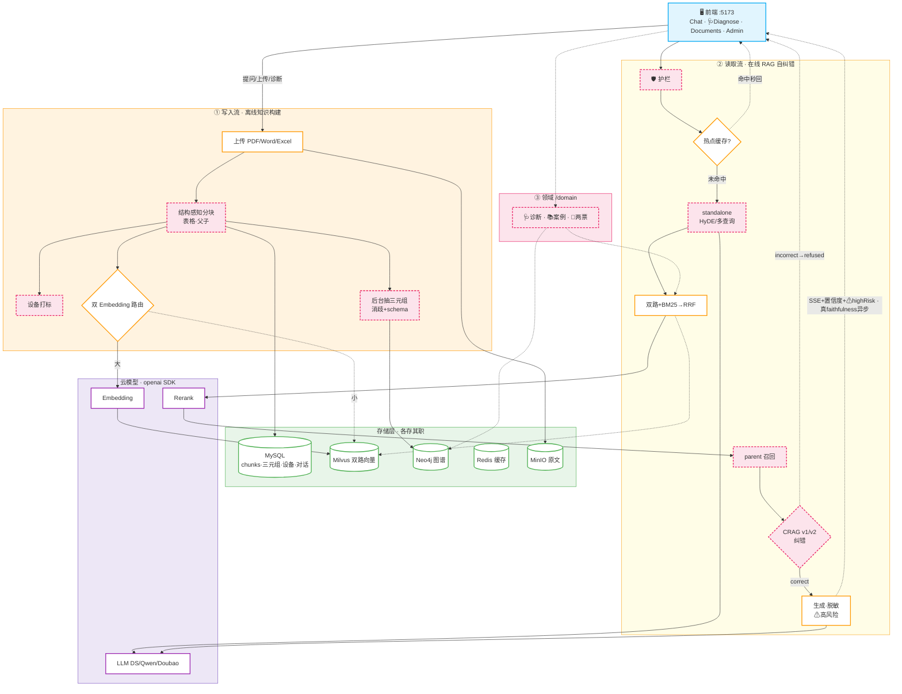
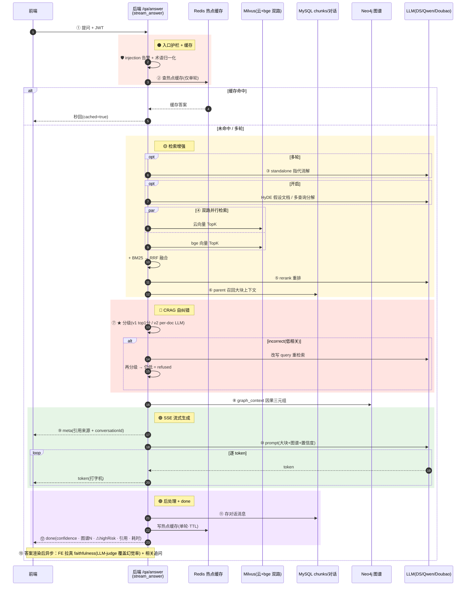
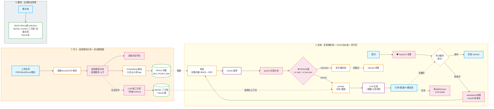

# 电网运维 RAG 智能问答系统

> 大模型 + RAG 的电网自主运维智能问答:**自然语言提问 → 多策略混合检索 → CRAG 自纠错 → 可信答案生成**,覆盖变电 / 配电 / 输电,为一线运维提供可直接落地的故障处理方案。

前端 Vue3(Dify/Linear 风)· 后端 FastAPI · 三家云大模型可切换(DeepSeek/通义/豆包)· 双 Embedding 路由 · GraphRAG(Neo4j)· Corrective RAG 自纠错 · 多租户 · Milvus + MinIO + MySQL + Redis + Nacos

---

## ✨ 功能全景

### 🤖 问答与检索
- **三家云大模型可切换**:DeepSeek / 通义千问 / 豆包,均兼容 OpenAI 协议,配置即切、按请求切
- **双 Embedding 路由**:文档大走云、小走本地 bge(双 collection 向量空间隔离),检索双查融合
- **混合检索**:HNSW 稠密 + BM25 稀疏 + RRF 融合 + gte-rerank 重排 + MMR 多样性
- **流式问答**:SSE / WebSocket 双协议(打字机效果)
- **多轮对话 + 指代消解**:历史持久化 + standalone 改写("它的处置步骤"→完整查询)
- **热点问答缓存**:高频问题 Redis 秒回

### 🛡️ 可信与自纠错(2026 RAG 趋势)
- **★ Corrective RAG 自纠错**:检索分级(correct/ambiguous/incorrect),低相关触发 query 改写重检索,仍无强相关则 **refused 保守拒答**(零幻觉)
  - v1:rerank top1 分数分级;**v2**:LLM 逐条评估证据相关性(per-doc grading)
- **真 faithfulness**:异步 LLM-judge 判定答案支撑率,前端拉取覆盖粗糙"幻觉率"展示;dislike 自动打 judge 分
- **Self-RAG**:LLM 路由判断 query 是否属运维范畴,非运维问题跳过检索直接拒答(省成本)
- **安全护栏**:prompt injection 告警 + 答案 PII 脱敏 + ⚠高风险操作标记(停电/接地/倒闸)
- **引用溯源**:[n] 可点击定位 + 置信度透传(high/medium/refused)

### 🔍 检索增强(2026 前沿)
- **结构感知分块 + Parent-Child(small-to-big)**:表格整体不切,正文父子两层;检索小块(精度)、召回同组大块(完整上下文)
- **HyDE**:LLM 生成假设答案再做向量检索,提升短/口语问题召回
- **多查询分解**:复杂问题拆子问题并行检索,跨查询 RRF 融合
- **表格/Excel 解析**:PDF/Word 表格转 markdown 保留结构;.xlsx 台账/定值单(openpyxl)
- **多模态 RAG**:VLM(Qwen-VL)理解图片(图纸/设备/曲线图)生成语义描述,与 OCR 合并入库

### 🧠 知识图谱(GraphRAG)
- **Neo4j 多跳推理**:设备-故障-处置 影响链 + 枢纽实体分析(MySQL 做不到的因果传播)
- **三元组抽取 + 实体消歧 + schema 约束**:`#1主变/主变`→统一`主变压器`;关系收敛白名单
- **GraphRAG**:问答融合图谱结构化上下文;读+写+删三链路打通,不再孤岛

### 🩺 电网领域深化(核心价值)
- **故障诊断 Agent**:症状 → 多查询分解 → 并行检索 + 图谱因果链 → 可能原因排序(高/中/低) + 处置 + 风险
- **相似历史案例检索**:限定故障案例库,"历史上类似故障怎么处理的"
- **两票辅助生成**:操作任务 → 结构化操作票(步骤/安全措施/风险点)
- **答案导出 Word**:问答转 .docx 运维报告(现场打印归档)
- **文档在线预览**:PDF/图片/文本原文流预览
- **设备台账关联**:文档自动打设备标签,检索可按设备精确过滤

### 🏢 企业级
- **多租户/多知识库隔离**:User/Document tenant_id,上传/列表/检索/问答/CRAG 全链路按租户过滤
- **知识库版本管理 + 回滚**:同名文档换版自动归档,一键回滚到任意版本
- **故障趋势看板**:反馈聚合(dislike 率/坏 case 设备聚类/高频问题/平均幻觉率),反哺优化
- **Nacos 配置中心**:可选启动拉取覆盖 .env(docker compose 一键起 Nacos)

### 📊 可观测与工程地基
- **Grafana 22 面板**:请求/延迟/LLM/Embedding/缓存/幻觉/反馈/CRAG/安全/领域/组件健康/静默降级…
- **降级可观测**:业务/IO 失败统一 `DEGRADED` 指标(盲降级不再被吞)+ Provider 健康探测(抓欠费/key 失效)
- **检索质量回归门禁**:golden 集(30 条)+ recall/MRR + faithfulness 门禁(CI 红绿)
- **69 单元测试** · Docker Compose 全栈(10 服务) · CI/CD · Alembic 迁移 · JWT 鉴权 · 9 接口限流

---

## 🏗️ 系统架构


> 粉色虚线节点 = v2 增量能力(结构分块/护栏/standalone/HyDE/多查询/parent/CRAG v2/领域诊断)。

---

## 🔄 单次问答数据流时序（CRAG 自纠错 + 真可信）



---

## 🔗 GraphRAG 数据链路（Neo4j 与系统打通，不再孤岛）



---

## 🛠️ 技术栈

| 层 | 选型 |
|---|---|
| 前端 | Vue 3 + Vite + Pinia + Vue Router + Axios + echarts · useDark 明暗双主题 · Dify/Linear 风 |
| 后端 | Python 3.11+ · FastAPI · Uvicorn · SQLAlchemy 2.0(async) · slowapi 限流 |
| LLM（云，可切换） | DeepSeek `deepseek-chat` / 百炼 `qwen-plus` / 火山豆包 |
| Embedding | 百炼 `text-embedding-v3`(1024维) / 火山豆包 / 本地 `bge-small-zh`(512维) |
| Rerank | 百炼 `gte-rerank-v2` |
| VLM（多模态） | 百炼 `qwen-vl-max` |
| 向量库 | Milvus 2.4（双 collection HNSW + COSINE） |
| 图库 | Neo4j 5（设备-故障-处置 多跳） |
| 缓存/配置 | Redis 7 · Nacos 2.4（可选配置中心） |
| 存储 | MySQL 8（元数据/chunks/三元组/对话/反馈/版本）· MinIO（原文） |
| 监控 | Prometheus + Grafana（22 面板） |
| 部署 | Docker Compose（10 服务）· gunicorn 多 worker · Alembic · GitHub Actions CI |

---

## 🚀 快速开始

### 前置
- Docker（基础设施全容器化）+ Node 18+（前端）+ Python 3.11+（后端）
- 三家云至少一家 API Key（DeepSeek / 阿里百炼 DashScope / 火山方舟 Ark）

### 1. 起基础设施
```bash
docker compose up -d mysql minio etcd milvus redis neo4j   # 核心 6 服务
docker compose up -d prometheus grafana                      # 可观测（可选）
docker compose up -d nacos                                   # 配置中心（可选）
```

### 2. 配置 `.env`
```bash
cp .env.example .env
# 填三家至少一家的 API Key：
#   DEEPSEEK_API_KEY=sk-...
#   DASHSCOPE_API_KEY=sk-...
#   ARK_API_KEY=...
# 选默认 provider：
#   LLM_PROVIDER=deepseek   EMB_PROVIDER=qwen
```

### 3. 启后端
```bash
pip install -r backend/requirements.txt
uvicorn app.main:app --reload --host 127.0.0.1 --port 8001 --app-dir backend
```
首次启动自动建表 + 创建默认管理员 `admin / admin123` + 双 Milvus collection。

### 4. 启前端
```bash
cd frontend && npm install && npm run dev   # http://localhost:5173
```

### 5. 灌种子数据（可选）
```bash
python scripts/seed_demo.py     # 建演示知识库（6 主题运维规程）
```

---

## ⚙️ 关键配置（`.env`）

| 配置 | 默认 | 说明 |
|---|---|---|
| `LLM_PROVIDER` / `EMB_PROVIDER` | deepseek / qwen | LLM/Embedding 厂商切换 |
| `SMALL_TO_BIG_ENABLE` | true | 父子分块召回大块上下文 |
| `CRAG_ENABLE` / `CRAG_PERDOC_ENABLE` | true / false | CRAG 自纠错 / v2 per-doc LLM 分级 |
| `STANDALONE_REWRITE_ENABLE` | true | 多轮指代消解 |
| `HYDE_ENABLE` / `MULTI_QUERY_ENABLE` | false | HyDE / 多查询分解（增延迟，按需开） |
| `SELF_RAG_ENABLE` | false | 非运维问题跳过检索拒答 |
| `ONLINE_FAITHFULNESS_ENABLE` | true | 线上异步真 faithfulness |
| `SAFETY_FILTER_ENABLE` / `PII_MASK_ENABLE` | true / false | injection 告警 / 答案脱敏 |
| `VLM_ENABLE` | false | 多模态图片理解 |
| `CONFIG_SOURCE` | env | env \| nacos（nacos 时启动拉取覆盖） |

> 完整字段见 `.env.example`（与 `config.py` 一一对应）。

---

## 📡 API 概览（前缀 `/api`）

| 模块 | 端点 |
|---|---|
| 系统 | `POST /system/login` `POST /system/register` `GET /system/logs` `GET /system/health/providers` `GET /system/config/nacos` |
| 文档 | `POST /document/upload` `GET /document/list` `POST /document/parse` `POST /document/vector/generate` `DELETE /document/delete` `GET /document/preview/{id}` `GET /document/{id}/versions` `POST /document/rollback` |
| 检索 | `POST /retrieval/mixed` |
| 问答 | `POST /qa/answer` `POST /qa/answer/stream`(SSE) `WS /qa/answer/ws` `POST /qa/faithfulness` `POST /qa/feedback` `POST /qa/related` `POST /qa/export` `GET /qa/feedbacks` `POST /qa/feedbacks/{id}/golden` `GET /qa/feedback-stats` |
| 知识图谱 | `POST /kg/extract` `GET /kg/graph` `GET /kg/path` `GET /kg/influence` `GET /kg/stats` |
| 领域增强 | `POST /domain/diagnose` `POST /domain/similar-case` `POST /domain/ticket` |
| 监控 | `GET /health` `GET /metrics` |

---

## 🧪 评测与可观测

**质量门禁**（CI）：
- `scripts/validate_golden.py` — golden 集（30 条）格式校验
- `pytest tests/` — 69 单元测试
- `scripts/eval_retrieval.py` — 检索 recall/MRR（recall<92% exit 1，需后端运行）
- `scripts/eval_generation.py` — 生成 faithfulness（<0.85 exit 1，需后端+LLM）

**Grafana**（http://localhost:3000，admin/admin）：22 面板，覆盖请求/延迟/LLM/Embedding/缓存/幻觉/反馈/CRAG 分级/安全事件/领域调用/组件健康/静默降级。dashboard 自动 provisioning。

---

## 📁 项目结构

```
backend/
  app/
    main.py              # FastAPI 入口 + lifespan(Nacos覆盖/健康循环)
    config.py            # pydantic-settings（env + Nacos）
    routers/             # system document retrieval qa kg domain
    services/            # qa retrieval document kg domain feedback
                         # chunk parse embedding rerank bm25 query_rewrite
                         # hyde multi_query standalone_query self_rag
                         # crag(v2) judge citation mmr rrf
                         # kg_normalize multimodal export feedback
    providers/           # llm/embedding（deepseek/qwen/doubao/bge）
    clients/             # milvus minio neo4j redis nacos
    core/                # safety metrics obs limiter logging security response
    models/              # user document document_version chunk kg_triple conversation feedback operation_log
  data/                  # golden_qa.json grid_terms.json
frontend/
  src/
    views/               # AppLayout Login Chat Documents Dashboard KgGraph Diagnose Admin
    api/ stores/ router/ style.css
scripts/                 # seed_demo seed_extra eval_retrieval eval_generation validate_golden benchmark gen_traffic
grafana/ prometheus.yml  # 监控 provisioning
tests/                   # 69 单元测试
```

---

## 🐛 已知平台备注（Windows）
- MySQL 映射 **3307**（避本机 3306）、后端 **8001**（避本机 8000）
- 容器访问外网（云 API + bge 下载）走宿主机代理 **7897**（`docker-compose.yml` 已配）
- OCR 用 **rapidocr-onnxruntime**（PaddleOCR 模型，规避 paddle 3.3 Win onednn bug）
- `pymilvus 2.4` + `setuptools<81`（pkg_resources 兼容）
- bge 模型首次经代理下载

---

## 📄 许可

本项目用于电网运维智能问答学习与内部部署。云模型 API 使用遵循各自服务条款。
