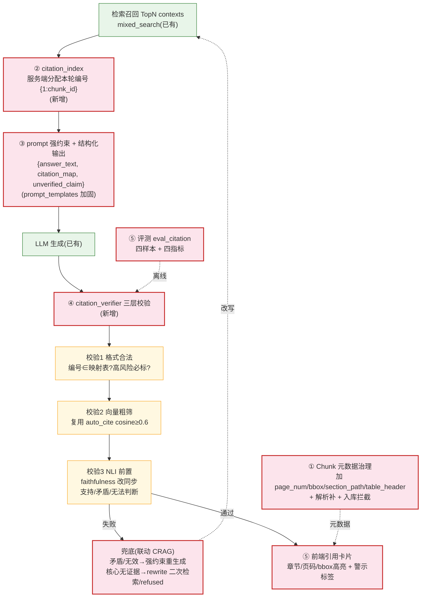

# 可核验 RAG 引用体系 — 设计文档

- **日期**:2026-07-18
- **状态**:Draft(待用户 review)
- **来源**:`RAG方法论.md`(五层闭环)+ codegraph 现状检索
- **范围**:全量五层(方案 C,设计完整;实现按 §8 顺序)

---

## 1. 背景与目标

方法论核心立意:**带 `[1]` 标记 ≠ 答案可信**。常规 RAG 四大缺陷——定位粗糙、虚假引用、引用不可控、无标准化核验链路。本设计落地端到端可核验引用,回答三个底层问题:

1. 支撑答案的原文**精确位置**在哪?(依赖入库元数据)
2. 引用编号是否来自**本轮真实检索片段**?(服务端受控编号)
3. 引用原文能否**逻辑支撑**答案事实句?(多层语义/NLI 校验)

### 现状(codegraph 实测)

| 方法论层 | 现有代码 | 缺口 |
|---|---|---|
| ① 入库元数据 | `Chunk` 有 `section`/`chunk_type`/`parent_idx`(父子块) | 缺 `page_num`/`bbox`/`table_header`;`section` 需规范层级路径 |
| ② 受控编号 | LLM 自由标 + `citation.auto_cite` 后处理补标 | 无服务端统一编号映射 |
| ③ 标准化生成 | 纯文本答案 + `evidence_trace` 句级溯源 | 无结构化 `citation_map`/`unverified_claim` |
| ④ 三层校验 | `auto_cite` cosine≥0.6(校验2 雏形);`faithfulness` **异步后置** | 无校验1 格式 / 校验3 NLI 前置 |
| ⑤ 前端+评测 | 引用点击定位;golden+recall/MRR | 无章节/页码/bbox 高亮/警示;无引用专有指标 |

---

## 2. 总体架构

把现有 `citation.auto_cite`(后处理补标)升级为「**可核验引用引擎**」,贯穿五层,最大复用 `evidence_trace` / `auto_cite` / `faithfulness` / CRAG。



---

## 3. 详细设计

### 3.1 第一层 · Chunk 元数据治理(源头)

- **新增字段**(Alembic 迁移 `chunks` 表):
  - `page_num INT`(页码/幻灯片号)
  - `bbox JSON`(文字页面矩形坐标 `[x0,y0,x1,y1]`,PDF 高亮)
  - `section_path VARCHAR(512)`(层级章节路径,如 `3.1 保险责任免除 > 第2条`)
  - `table_header TEXT`(表格类 chunk 绑定表头)
  - `metadata_complete BOOLEAN DEFAULT FALSE`(元数据是否齐全,前端降级依据)
- **规范化**:`section_path` 由现有 `section` 用 ` > ` 连接规范化(向后兼容,空则留空)。
- **解析层补元数据**(`parse_service`):PDF 用 pdfplumber 取页码 + 字符 bbox;Word 取章节路径;Excel(openpyxl)取表头行。补全后置 `metadata_complete=true`。
- **入库拦截**:`document_service.vectorize_document` 前校验核心字段(`doc_id/chunk_id/content` 必填);`page_num` 缺失仅 `degraded` 告警不阻塞,置 `metadata_complete=false`。
- **历史回填**(可选脚本 `scripts/backfill_chunk_meta.py`):对存量 chunk 重新解析补元数据;不回填者保持 `metadata_complete=false` 降级展示,不阻塞主链路。

### 3.2 第二层 · 受控编号(杜绝编造)

- **新增 `rag/citation_index.py`**:`build_index(contexts) -> {1: chunk_id, ..., N: chunk_id}`,在 `mixed_search` 召回后由服务端统一分配。
- **prompt context 格式**:`[1] {原文(含章节/页码)}\n[2] {...}`,编号服务端给定,LLM 只能引用 `[1..N]`。
- **结构化强制**:输出 `citation_map` 的 `ref_id` 必须 ∈ `[1..N]`,越界由校验1 剔除。
- 映射表随响应返回,前端据此渲染来源卡片。

### 3.3 第三层 · 标准化生成

- **prompt 强约束**(加进 `prompt_templates.SYSTEM_PROMPT`):方法论 5 条——禁编造编号、每独立结论标、单句多结论分标、无依据写「现有资料无法确认」、数字/否定/时限/金额等高风险要素必标。
- **结构化输出 schema**(`schemas/citation.py`):
  ```python
  class CitationItem(BaseModel):
      sentence: str
      ref_id: int
      chunk_id: str
      metadata: dict  # doc_title/section_path/page_num/original_text
  class CitationAnswer(BaseModel):
      answer_text: str
      citation_map: list[CitationItem]
      unverified_claim: list[str]  # 无证据句,前端标警示
  ```
- **降级兼容**:LLM 不支持结构化输出时,解析纯文本 + `citation_index` 反查 + 现有 `evidence_trace`(保底,不阻塞)。

### 3.4 第四层 · 三层校验引擎(核心防幻觉)

**新增 `rag/citation_verifier.py`**:`verify(answer_text, citation_map, citation_index, contexts) -> VerifyResult`。

- **校验1 格式合法性**(零算力):遍历 `citation_map.ref_id` 校验 ∈ `citation_index`;剔除越界/重复/乱标;高风险要素(数字/否定/时限/金额)必须绑定 `ref_id`,否则移入 `unverified_claim`。
- **校验2 向量相似度粗筛**:复用 `citation.auto_cite._cosine_mat`,事实句 vs 候选 chunk,保留 `cosine ≥ CITATION_SIM_THRESHOLD(0.6)`。
- **校验3 NLI 精准核验**(从 `judge.faithfulness` 抽核心):声明拆解 → 逐条对候选原文判定 **支持 / 矛盾 / 无法判断**;矛盾则剔除该引用并标句「无可靠证据支撑」。
- **VerifyResult**:每条 citation 标 `{valid: bool, nli_label: "support"|"contradict"|"unknown", action: "keep"|"drop"|"rewrite"}`。
- **前置 vs 异步并存**:
  - `citation_verifier` = **同步、全量、影响输出**(拦截/重写/拒答);
  - `judge.faithfulness` 保留 = **异步、采样、质量趋势**(不阻塞,`online_eval`)。
  - 两者共享重构出的 NLI 核心函数 `judge._verify_claims(claims, sources)`,避免逻辑重复。
- **超时**:校验3 NLI 带 `CITATION_NLI_TIMEOUT=5s`,超时降级(仅校验1+2),记 `degraded('citation_nli_timeout')`。

### 3.5 第五层 · 前端可视化 + 评测闭环

- **前端引用卡片**(Chat):`doc_title` / `section_path` / `page_num` / `original_text`(完整片段,非关键词截取);`bbox` 存在则经 `GET /document/preview/{docId}`(已有)加 bbox 参数做 PDF 高亮;`unverified_claim` 句加浅色警示标签;多证据分条展示,禁「综合资料」模糊合并。
- **评测**(`scripts/eval_citation.py`):
  - 四类样本(扩充 `golden_qa.json`):单句单证据 / 单句多证据 / 干扰样本(主题相似语义相反) / 高风险样本(数字/否定/时限/免责)。
  - 四大指标:引用覆盖、证据关联率(NLI support 占比)、证据完整度(多条件结论集齐率)、事实一致性。
  - CI 门禁:关联率 < 阈值退出码 1。

---

## 4. 数据流(编号流动)

```
mixed_search 召回 TopN
  → citation_index.build_index 分配 [1..N] → chunk_id 映射
  → prompt(带编号 context + 强约束)→ LLM 结构化输出 {answer_text, citation_map, unverified_claim}
  → citation_verifier 三层校验(格式 → 向量 → NLI)
  → 通过:返回 + citation_index(前端渲染卡片)
  → 失败:CRAG 联动兜底
```

---

## 5. 错误处理与兜底

| 场景 | 处理 |
|---|---|
| 校验1 大量越界编号 | 切强约束 prompt 重新生成一次(方法论兜底1) |
| 校验3 NLI 判矛盾 | 剔除该引用,句标「无可靠证据支撑」 |
| 核心事实无任何支撑 | 复用 CRAG `rewrite_query` 二次检索;仍无 → `refused` 拒答(零幻觉) |
| 元数据不全(`metadata_complete=false`) | 前端降级:仅文档名,无页码/bbox 高亮 |
| NLI 超时 | 降级仅校验1+2,`degraded('citation_nli_timeout')` |
| LLM 不支持结构化输出 | 纯文本 + citation_index 反查 + evidence_trace 保底 |

---

## 6. 配置开关(.env,全 opt-in,默认行为兼容现状)

| 开关 | 默认 | 说明 |
|---|---|---|
| `CITATION_VERIFIER_ENABLE` | false | 第四层校验引擎总开关 |
| `CITATION_NLI_ENABLE` | false | 校验3 NLI(最重,独立开关) |
| `CITATION_SIM_THRESHOLD` | 0.6 | 校验2 向量粗筛阈值 |
| `CITATION_NLI_TIMEOUT` | 5 | 校验3 超时秒 |
| `CITATION_STRUCTURED_OUTPUT` | false | 第三层结构化输出 |
| `CITATION_REWRITE_ON_FAIL` | true | 校验-CRAG 联动兜底 |

---

## 7. 测试策略

- **单元**:`citation_index.build_index` 编号映射;`citation_verifier` 三层(格式合法/向量阈值/NLI mock 三类标签);`CitationAnswer` schema 解析与降级路径。
- **集成**:端到端一次问答,断言编号从分配 → 结构化输出 → 校验 → 卡片字段完整。
- **评测**:`eval_citation.py` 四样本四指标 + CI 门禁(关联率 < 阈值退出码 1)。

---

## 8. 落地顺序(转 writing-plans 细化为步骤)

1. **第一层**:Chunk 迁移(4 字段)+ `parse_service` 补元数据 + 入库拦截 + 回填脚本
2. **第二层**:`citation_index.py` 服务端编号 + prompt context 改造
3. **第三层**:prompt 强约束 + `CitationAnswer` schema + 降级解析
4. **第四层**:`citation_verifier.py` 三层引擎 + 从 `faithfulness` 抽 `judge._verify_claims` 共享 NLI
5. **校验-CRAG 联动**:校验失败复用 `rewrite`/`refused` 兜底
6. **第五层前端**:引用卡片 + bbox 高亮 + 警示标签
7. **第五层评测**:`eval_citation.py` + golden 扩充四样本 + CI 门禁

---

## 9. 风险与取舍

- **NLI 前置增加单次延迟**(约 `CRAG_TIMEOUT` 量级),换可信度;`CITATION_NLI_ENABLE` 可关。
- **结构化输出依赖 LLM 能力**:弱模型降级纯文本 + 反查,不阻塞。
- **历史 chunk 元数据回填成本**:可选脚本,`metadata_complete=false` 降级,不阻塞主链路。
- **NLI 专业领域误判**:保留方法论第五层「人工抽检」(高合规场景流转人工)。
- **与现有 `auto_cite` 关系**:`auto_cite` 的 cosine 逻辑被校验2 复用;`auto_cite` 本身保留(作为"补标"兜底,校验引擎关闭时仍可用)。

---

## 10. 不做(YAGNI)

- 不做实时 PDF 原文重渲染引擎(复用现有 `/document/preview` + bbox 高亮即可)。
- 不做独立 NLI 模型微调(用 LLM judge,与现有 faithfulness 同源)。
- 不做多轮会话的引用累积核验(本期聚焦单轮可核验,多轮留后续)。
