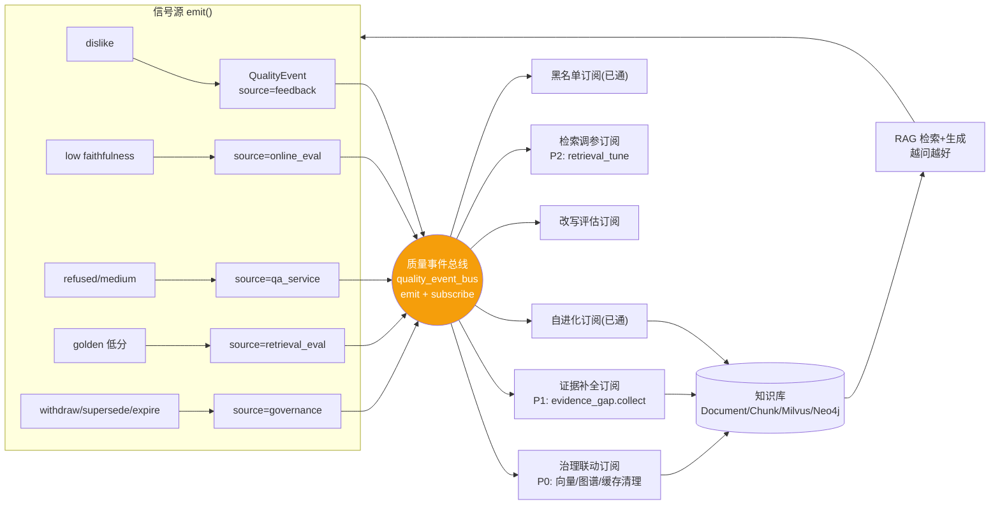

# 数据飞轮 · 知识治理上下游打通与 RAG 自演进闭环方案

- **日期**：2026-07-20
- **状态**：Draft（待评审 → 分批实施）
- **背景**：问答全链路优化 16 项（`980d463`）完成后，调研发现"让 RAG 越变越好"的 8 个子系统（治理/反馈/证据缺口/自进化/改写评估/检索评测/在线评测/故障预测）**各自半闭环、未打通**；数据治理只做"检索时过滤"，状态变更不联动存储层。
- **硬约束**：全 opt-in（新开关默认关，关=现状）；前端最小改动；每批独立可测 commit；显式 git add；main 分支；复用现有 `domain_event`/`persistent_task`/`evidence_gap`/`knowledge_governance` 范式，**零新底座**。

---

## 一、目标（量化）

| 指标 | 现状 | 目标 |
|---|---|---|
| 治理状态变更后旧数据残留 | 向量/图谱/缓存不清理（只过滤） | 联动清理率 100%（`grid_governance_propagated_total` 可验证） |
| dislike 坏 case 修复率 | 0（只屏蔽） | ≥30% 进补全链路（`grid_feedback_fix_rate`） |
| 评测低分 case 回流 | 0（只观测） | 100% 进 evidence_gap/调参 |
| 上传文档治理元数据完整率 | 低（靠扫描补录） | ≥80%（上传即填） |
| `grid_faithfulness_trend` | 无周环比 | 周环比可观测，下降即告警 |

---

## 二、现状盘点（8 个"越变越好"子系统）

| 闭环 | 代码落点 | 实现 | 回流知识库 |
|---|---|---|---|
| 知识治理 | `knowledge_governance_service.blocked_document_ids/is_retrievable` | 元数据+检索过滤 | ❌ 只过滤 |
| 反馈 | `routers/qa.py::feedback`+`feedback_optimizer_service` | dislike→失效+黑名单 | ❌ 屏蔽 |
| 证据缺口 | `evidence_gap_service.collect` | medium/refused→草稿→入库 | ✅ |
| 自进化 | `knowledge_evolution_service` | dislike 聚类→草稿→回流降权 | ✅ |
| 改写评估 | `rewrite_evaluator` | 采纳/否决 metrics | ❌ |
| 检索评测 | `retrieval_eval_service`+golden | 离线+建议 | ❌ |
| 在线评测 | `online_eval_service` | 采样 judge→trends | ❌ |
| 故障预测 | `fault_prediction_service` | 告警聚合 | ➖ 旁路 |

---

## 三、断点识别（代码位置）

| 断点 | 代码事实 | 后果 |
|---|---|---|
| **A. 治理状态不联动存储** ⭐ | `mixed_search:7.5` 仅 `blocked_document_ids` 过滤；withdraw/supersede/expire 后 Milvus 向量/Neo4j 三元组/qa_cache 旧数据仍在 | 占空间；L1.5 semantic_cache 不查治理仍命中旧答案；cv=`V/S/N` 不含治理→旧缓存不失效 |
| **B. dislike 不进补全链** | `feedback` 仅触发 `invalidate_cache_on_dislike`+`maybe_blacklist_on_dislike`；`retrieval_quality=poor` 存而不用 | 坏 case 被屏蔽非修复 |
| **C. 评测不驱动改进** | `online_eval/retrieval_eval` 算分不回流 | 低分 case 不自动进 gap/调参 |
| **D. 治理元数据上游缺失** | `document.py::upload` 不收 `effective_at/expires_at/version_of` | 大量 `metadata_incomplete`，扫描补录滞后 |
| **E. 跨闭环无事件总线** | feedback/gap/eval 各写各表，一次 dislike 只触发一处 | 坏信号不复用不放大 |

---

## 四、顶层设计：数据飞轮



**底层逻辑**：一次坏信号 → 总线 → 多订阅者并行（清理旧 + 补全新 + 评估改进）→ 知识库更新 → 下次更好。飞轮转速 = `feedback_fix_rate`。

---

## 五、详细方案（P0-P2，6 个抓手）

### P0-1 · 治理状态联动存储（断点 A，最高 ROI）

- **现状**：`knowledge_governance_service.is_retrievable` 判定 withdrawn/superseded/expired，但只被 `mixed_search:7.5` 过滤；存储层不感知。
- **改**：治理状态变更（审核 withdraw / 新版本 supersede / 扫描 expire）→ 调 `quality_event_bus.emit(source="governance", type="doc_blocked", payload={doc_id, reason})` → 订阅者 `governance_propagate_handler`：
  1. **Milvus 软删**：`milvus_client.delete_by_filter(collection, expr=f"doc_id == '{doc_id}'")`（双 collection：grid_chunks + grid_chunks_bge；无 delete_by_filter 则标记 status 或重建该 doc 向量时跳过）
  2. **Neo4j 清**：复用 `delete_document` 清 `kg_triples`+Neo4j 边逻辑（按 doc_id）
  3. **qa_cache 反向失效**：按 doc_id 扫 `qa_cache` 表 `data->retrievalSource` 含 docId 的行删 + Redis L1 同 key 失效
  4. **semantic_cache 失效**：cv 加治理版本（见 P0-2）自动失效
- **文件**：`services/quality_event_bus.py`（新）+ `services/governance_propagate_service.py`（新，订阅 handler）+ `routers/knowledge_governance.py`（withdraw/supersede 端点 emit）+ `clients/milvus_client.py`（补 delete_by_filter，缺则加）
- **开关**：`GOVERNANCE_PROPAGATE_ENABLE`（默认关；关=仅过滤现状，开=联动清理）
- **测试**：withdraw 一个 doc → 断言 Milvus 该 doc 向量数为 0 + qa_cache 含该 doc 的行被删 + Neo4j 该 doc 边清。

### P0-2 · semantic_cache 查治理 + cv 治理版本（断点 A）

- **现状**：`semantic_cache.semantic_cache_get` 命中后不查治理，过期文档答案可能被语义命中返回；`citation_cache_version()=cv{V}{S}{N}` 不含治理态。
- **改**：
  1. `semantic_cache_get` 命中后，对候选 `retrievalSource` 的 doc_id 过 `blocked_document_ids`，命中 blocked 则降级 miss（opt-in）
  2. `citation_cache_version()` 加治理版本段：`cv{V}{S}{N}{G}`，G = 治理代际（每次 withdraw/supersede/expire `GOVERNANCE_CACHE_BUMP` 计数器 +1，Redis `qa:gov_gen`）→ 治理态变 → G 变 → 所有 qa 缓存 key 变 → 自动失效
- **文件**：`rag/semantic_cache.py` + `config.py::citation_cache_version` + `quality_event_bus`（治理事件 bump G）
- **开关**：`SEMANTIC_CACHE_GOV_FILTER_ENABLE`（默认关）
- **测试**：withdraw doc 后，同 query 命中 semantic 的旧答案被过滤；cv G 段变化导致旧 key miss。

### P1-1 · 质量事件总线（断点 E）

- **现状**：无统一事件层，各闭环硬编码触发。
- **改**：新建 `quality_event` 表 + `quality_event_bus` 服务（`emit(source,type,payload)` 同步入库 + `_bg_tasks` 派发订阅者）。订阅注册：`subscribe(source_pattern, handler)`。订阅者独立 session、异常 degraded 不阻塞。
- **数据模型**：
  ```
  QualityEvent:
    id PK / source(feedback|online_eval|qa_service|retrieval_eval|governance)
    / type(dislike|low_faith|refused|eval_low|doc_blocked|...)
    / payload(json) / status(pending|handled|failed)
    / created_at / handled_at
  ```
- **文件**：`models/quality_event.py`（新）+ `services/quality_event_bus.py`（新）+ Alembic + init_db
- **开关**：`QUALITY_BUS_ENABLE`（默认关；关=各闭环现状硬编码，开=统一总线派发）
- **测试**：emit 一条 → 断言所有匹配订阅者被调用（mock handler 计数）。

### P1-2 · dislike→证据补全（断点 B）

- **现状**：`feedback` dislike 只屏蔽。
- **改**：`feedback` 记录后，若 `feedback==dislike` 且（`retrieval_quality in (poor,None)` 或 `judge_halluc` 高）→ `quality_event_bus.emit(source="feedback", type="dislike", payload={query,answer,retrieval_quality})` → evidence_gap 订阅者调 `evidence_gap.collect`。
- **文件**：`routers/qa.py::feedback`（emit）+ `services/evidence_gap_service.py`（订阅 handler 注册）
- **开关**：`DISLIKE_TO_GAP_ENABLE`（默认关）
- **测试**：dislike + poor → 断言 evidence_gap 新增一行。

### P2-1 · 评测驱动改进（断点 C）

- **现状**：`online_eval/retrieval_eval` 算分不回流。
- **改**：
  1. `online_eval_service.eval_quality` 若 faithfulness < `FAITHFULNESS_GATE` → `emit(source="online_eval", type="low_faith", payload)` → evidence_gap 订阅 + retrieval_tune 订阅
  2. `retrieval_eval_service` golden 回归 recall < 92% → `emit(source="retrieval_eval", type="eval_low")` → retrieval_tune 扫描（建议模式，不自动改参，YAGNI）
- **文件**：`services/online_eval_service.py` + `services/retrieval_eval_service.py`（emit）+ `services/retrieval_tune_service.py`（订阅）
- **开关**：`EVAL_TO_GAP_ENABLE` / `EVAL_TO_TUNE_ENABLE`（默认关）
- **测试**：mock 低分 → 断言 emit + 订阅者触发。

### P2-2 · 上传强制治理元数据（断点 D）

- **现状**：`upload` 不收治理字段。
- **改**：`document.py::upload` + `document_service.upload_documents` 加 Form 字段 `effectiveAt/expiresAt/isPermanent/versionOf` → 上传即建 `KnowledgeDocumentMetadata`（status=draft→active 审核流）。前端 Documents.vue 上传卡加可选治理字段（opt-in，不强制阻断）。
- **文件**：`routers/document.py::upload` + `services/document_service.py` + `models/knowledge_governance.py`（已有 meta 表）+ `frontend/.../Documents.vue`（上传卡加字段）
- **开关**：`GOVERNANCE_UPLOAD_REQUIRE`（默认关=现状；开=引导填，不阻断）
- **测试**：upload 带治理字段 → 断言 KnowledgeDocumentMetadata 建行。

---

## 六、数据模型新增

| 表/字段 | 说明 | 落地 |
|---|---|---|
| `quality_event`（新表） | 质量事件总线 | Alembic + init_db |
| `KnowledgeDocumentMetadata`（已有） | 复用，上传时建 | P2-2 |
| `Document` 加 `version_of`（可选） | supersede 链 | Alembic（可选，YAGNI 评估） |
| Redis `qa:gov_gen` | 治理代际计数器（cv G 段） | P0-2 |
| Prometheus 指标 ×5 | 飞轮度量 | P0/P2 |

---

## 七、度量指标（`core/metrics.py` + Grafana 面板）

| 指标 | 类型 | 验证 |
|---|---|---|
| `grid_governance_propagated_total{action}` | Counter | A 断点修复（向量/图谱/缓存清理次数） |
| `grid_quality_event_total{source,type}` | Counter | E 总线吞吐 |
| `grid_feedback_fix_rate` | Gauge | 飞轮转速（dislike→补全→同 query 再 like 比例） |
| `grid_faithfulness_trend` | Gauge | 周环比 faithfulness |
| `grid_kb_freshness` | Gauge | active 文档占比（治理覆盖率） |

Grafana 新增"数据飞轮"面板（4-5 图）。

---

## 八、落地路线（3 批，opt-in 渐进）

| 批 | 范围 | 风险 | 依赖 |
|---|---|---|---|
| **Batch A（P0）** | P0-1 治理联动 + P0-2 semantic 查治理 + cv G 段 | 中（动存储层，需 Milvus delete_by_filter） | 无 |
| **Batch B（P1）** | P1-1 质量事件总线 + P1-2 dislike→补全 | 中（新表 + 总线） | 无（P1-2 可先用硬编码，总线后切） |
| **Batch C（P2）** | P2-1 评测驱动 + P2-2 上传元数据 + 度量 + Grafana | 低（观测+引导） | 无 |

每批：失败测试 → 实现 → 回归 → 显式 git add + commit。全 opt-in 默认关。

**建议顺序**：Batch A（最高 ROI，治理闭环补全）→ Batch B（总线打通）→ Batch C（评测驱动 + 度量收口）。

---

## 九、风险与回滚

| 风险 | 缓解 |
|---|---|
| 治理联动误删向量（withdraw 误操作） | 软删优先（Milvus 标记 status 字段过滤，不物理删）；物理删需二次确认；全 opt-in |
| cv G 段频繁 bump 致缓存雪崩 | G 段设最小间隔（批量 withdraw 合并 bump 一次） |
| 质量事件总线消息堆积 | 复用 persistent_task 范式 + status 跟踪 + degraded 兜底；订阅者异常不阻塞 emit |
| semantic_cache 查治理增延迟 | 仅对命中候选查（少量 doc_id），主键索引；opt-in |
| 上传强制元数据阻断业务 | opt-in 引导不阻断；默认关 |

**回滚**：全开关默认关，任一批出问题 `GOVERNANCE_PROPAGATE_ENABLE=False` 等即回现状。

---

## 十、YAGNI 边界（不做）

- 不自动改检索参数（retrieval_tune 保持只建议模式，人工确认）
- 不引入 Kafka/RabbitMQ（复用 MySQL 表 + asyncio _bg_tasks/persistent_task）
- 不做全量知识库重评分（采样评测足够）
- 不强制上传元数据（引导 opt-in，不阻断业务）
- 不做跨租户事件（事件总线租户隔离）

---

## 十一、与现有架构对齐

- **复用** `domain_event`/`persistent_task`/`evidence_gap`/`knowledge_governance`/`feedback_optimizer`/`_bg_tasks` 范式，零新底座。
- **opt-in**：所有新开关默认关，关时逐字节等于现状。
- **前端最小改动**：仅 Documents.vue 上传卡加可选治理字段（P2-2），其余全后端 + Grafana。
- **可观测**：5 个新指标 + Grafana 面板，飞轮可量化。
