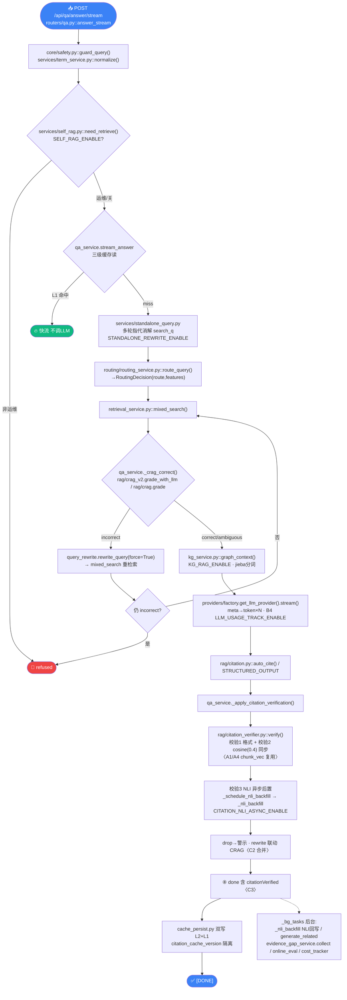
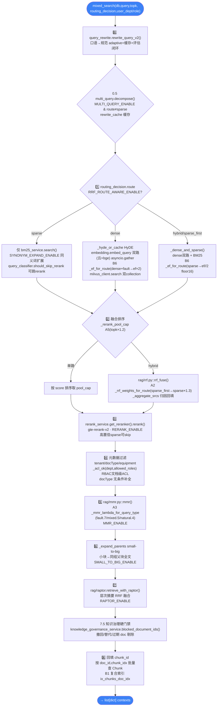
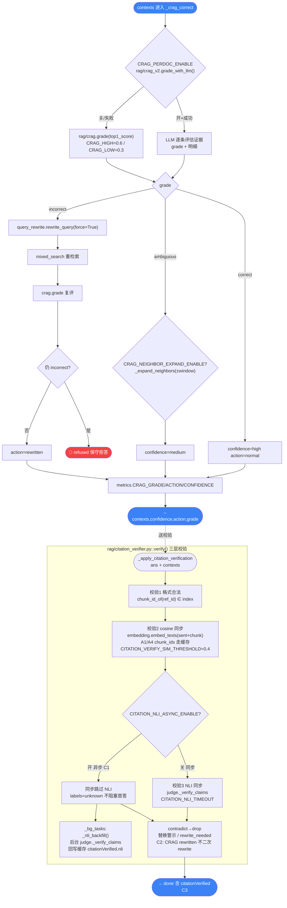
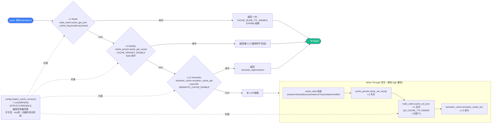
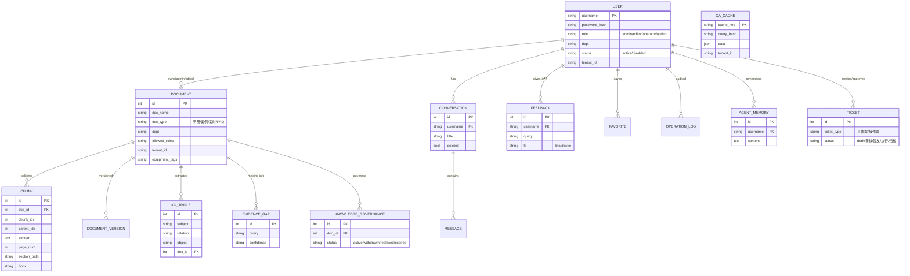
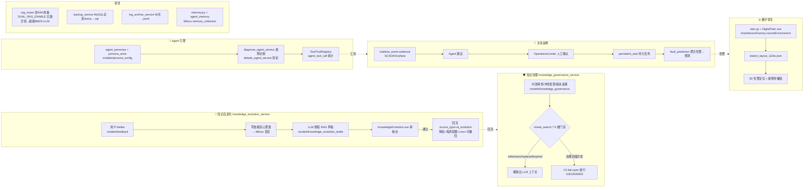

# 电网运维 RAG 智能问答系统 · 架构总览（代码级 mermaid）

> **版本**：`980d463` 后重构 mermaid，2026-07-20 ｜ **仓库**：github.com/zhyese/grid-qa
> **技术栈**：Vue3 + FastAPI + MySQL + Redis + Milvus 2.4(双collection) + Neo4j + MinIO + 三家云模型 + Docker Compose(12容器)
> 节点命名约定：`文件.py::函数()` / `表名` / `开关名`

---

## 图 1 · 系统总览（分层 + 主数据流）

```mermaid
flowchart TB
subgraph FE["🖥️ frontend/src/views · 17 视图"]
    Chat["Chat.vue /chat<br/>streamAnswer SSE"]
    Diag["Diagnose.vue<br/>故障诊断"]
    Ops["OperationsCenter.vue<br/>主动运维"]
    Twin["DigitalTwin.vue + three/<br/>3D变电站"]
    DocV["Documents.vue"]
    KG["KgGraph.vue / KgGraph3D.vue"]
    Ticket["TicketLifecycle.vue"]
    KEvo["KnowledgeEvolution.vue<br/>KnowledgeGovernance.vue"]
    Pred["FaultPrediction.vue"]
    Adm["Admin.vue 13Tab"]
end

subgraph GW["🌐 routers/ · 14 · core/ 横切"]
    RQA["routers/qa.py"]
    RSYS["routers/system.py<br/>routers/document.py"]
    RKG["routers/kg.py"]
    REVO["routers/knowledge_evolution.py<br/>routers/knowledge_governance.py"]
    ROPS["routers/twin.py /task_center.py<br/>/realtime_event.py /memory.py<br/>/domain.py /mcp_router"]
    Perm["core/permissions.py::require_perm()<br/>core/security.py::JWT"]
    Safe["core/safety.py::guard_query/safe_answer"]
    Lim["core/limiter.py slowapi"]
    Plug["services/plugin_registry.py 3hook"]
end

subgraph BIZ["⚙️ services/ 编排"]
    QA["qa_service.py::answer/stream_answer<br/>_apply_citation_verification<br/>_schedule_nli_backfill/_nli_backfill"]
    Ret["retrieval_service.py::mixed_search"]
    Crag["rag/crag.py + rag/crag_v2.py<br/>qa_service._crag_correct"]
    Doc["document_service.py"]
    KgS["kg_service.py::graph_context"]
    Agent["agent_personas/persona_store<br/>diagnose_agent_service<br/>debate_agent_service"]
    Evo["knowledge_evolution_service<br/>fault_prediction_service<br/>backup_service/log_archive_service"]
    Dual["rag_router.py 双RAG热备"]
end

subgraph RAGG["🧠 rag/ + routing/ 算法"]
    Cite["rag/citation.py::auto_cite<br/>rag/citation_verifier.py::verify<br/>rag/citation_index.py::build_index"]
    Algo["rag/rrf.py::rrf_fuse<br/>rag/mmr.py::mmr<br/>rag/raptor.py<br/>rag/semantic_cache.py"]
    Strat["hyde.py / multi_query.py<br/>standalone_query.py / self_rag.py<br/>query_rewrite.py::rewrite_query_v2"]
    Rt["routing/routing_service.py::route_query<br/>routing/query_classifier.py"]
end

subgraph DATA["💾 models/ 24表 + clients/"]
    DB[("MySQL · models/*.py")]
    RC[("Redis · clients/redis_client.py<br/>cache_get/set_json")]
    ML[("Milvus · grid_chunks / grid_chunks_bge<br/>/ memory_collection")]
    N4[("Neo4j :Entity/:REL")]
    MN[("MinIO clients/minio_client.py")]
end

subgraph MODEL["☁️ providers/"]
    Fac["providers/factory.py<br/>get_llm/embedding_provider<br/>check_*_health"]
    DS["llm/deepseek<br/>LLM+NLI+Agent"]
    BL["embedding/qwen+bge+doubao<br/>+ rerank + VLM"]
end

subgraph OPS["📊 横切"]
    Prom[("core/metrics.py<br/>Prometheus")]
    Graf["Grafana 18面板"]
    Nac["clients/nacos_client.py"]
    Otel["OTEL→Langfuse"]
end

FE --> GW --> BIZ --> RAGG --> DATA
BIZ -.providers.-> MODEL
BIZ -.metrics.-> OPS
RAGG -.embed/LLM.-> MODEL
```

---

## 图 2 · 问答链路（流式，函数级 + 文件路径）

---

## 图 3 · 检索引擎 mixed_search（8 步代码级 + 路由分支 + 策略矩阵）

---

## 图 4 · CRAG 自纠错 + 可核验引用校验（代码级）

---

## 图 5 · 三级缓存（代码路径 + cv 版本隔离）

---

## 图 6 · 数据模型 ER（核心 14 表）

> 其余 10 表：rewrite_event / agent_tool_call / persona_config / operation_log / permission(role_permission) / favorite / alert_disposal / domain_event / realtime_event / persistent_task / document_version / knowledge_evolution_drafts。

---

## 图 7 · 高级能力闭环（自进化 / 治理 / Agent / 主动运维 / 孪生 / 双RAG / 备份）

---

## 附 A · 配置开关速查（config.py 100+，按域）

| 域 | 关键开关（默认） |
|---|---|
| 模型 | LLM_PROVIDER=deepseek · EMB_PROVIDER=qwen · EMBEDDING_DIM=1024 · LLM_USAGE_TRACK_ENABLE(B4) |
| 缓存 | CACHE_PERSIST_ENABLE=T · CACHE_TIERED_TTL_ENABLE=T · CACHE_SLIDE_TTL_ENABLE(B2) · EMBED_CACHE_SLIDE_TTL_ENABLE(B3) · EMBED_CHUNK_CACHE_ENABLE(A1/A4) · SEMANTIC_CACHE_ENABLE |
| GraphRAG | KG_RAG_ENABLE=T · KG_TOKENIZE_CACHE_ENABLE(B5) |
| 检索 | RERANK_ENABLE · MMR_ENABLE/λ=0.5 · RRF_K=60 · RRF_ROUTE_AWARE_ENABLE(A2/A3/A5/B6) |
| 双embed | BGE_DIM=512 · DOC_SIZE_THRESHOLD=5000 · MILVUS_COLLECTION_BGE |
| 分块 | CHUNK_SIZE=500 · SMALL_TO_BIG_ENABLE=T · PARENT_SIZE=2000 |
| CRAG | CRAG_ENABLE=T · CRAG_HIGH=0.6/LOW=0.3 · CRAG_PERDOC_ENABLE(v2) · CRAG_NEIGHBOR_EXPAND_ENABLE |
| 策略 | HYDE/MULTI_QUERY/SELF_RAG/RAPTOR_ENABLE(关) · STANDALONE_REWRITE_ENABLE=T · ROUTING_ENABLE=T |
| 改写 | QUERY_REWRITE_ENABLE · REWRITE_ADAPTIVE_ENABLE=T · REWRITE_EVAL_ENABLE=T |
| 安全 | SAFETY_FILTER_ENABLE=T · PII_MASK_ENABLE · HIGH_RISK_KEYWORDS |
| 治理 | EVIDENCE_GAP_AUTO_COLLECT=T · KNOWLEDGE_GOVERNANCE_FAIL_OPEN(C5) · MULTI_TURN_CACHE_ENABLE(C4) |
| 引用 | CITATION_VERIFIER_ENABLE · CITATION_NLI_ENABLE · **CITATION_NLI_ASYNC_ENABLE(C1)** · CITATION_STRUCTURED_OUTPUT · CITATION_REWRITE_ON_FAIL=T · CITATION_VERIFY_SIM_THRESHOLD=0.4 |
| 高级 | VLM_ENABLE · MEMORY_CAPACITY=500 · MCP_SERVER_PORT=9100 · TWIN_LAYOUT_PATH |
| 运维 | CONFIG_SOURCE=env/nacos · OTEL_SAMPLE_RATE · ALERT_WEBHOOK_TOKEN |

---

## 附 B · 端口与部署

| 项 | 值 |
|---|---|
| 后端 | 8001（改源码 `docker compose build backend && up -d`） · 前端 5173 |
| MySQL 3307 · Milvus 19530 · Neo4j 7474/7687 · MCP 9100 · 代理 7897 |
| 默认 admin/admin123 · Docker Compose 12 容器 |

---

## 附 C · 闭环总览

> **🛡️ 防幻觉四闸**：self_rag（拦非运维）→ crag v1/v2（分级纠错/拒答）→ citation_verifier 三层校验（格式/cosine/NLI）→ drop 警示 + rewrite 联动（C2 合并）。
> **🔄 自进化**：dislike → 聚类盲区 → AI 草稿 → 审核 → 回流降权。
> **🚨 主动运维**：realtime_event → Agent 建议 → 人工确认 → persistent_task → fault_prediction。
> **🛡️ 韧性**：双 RAG 热备 + 治理 fail-open + degraded 可观测 + backup。

**顶层设计**：网关（core/）管**安全**，RAG 引擎（rag/+routing/）管**质量**，高级能力（services/）管**业务**，横切（metrics/obs/nacos/otel）管**韧性**。
