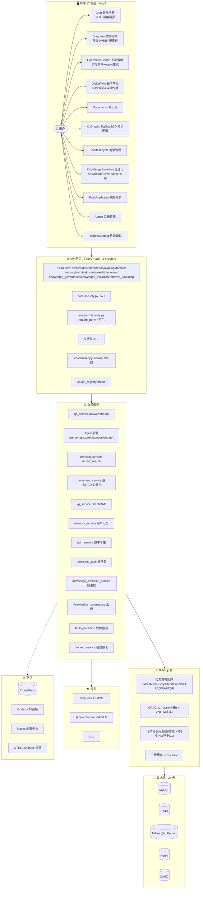
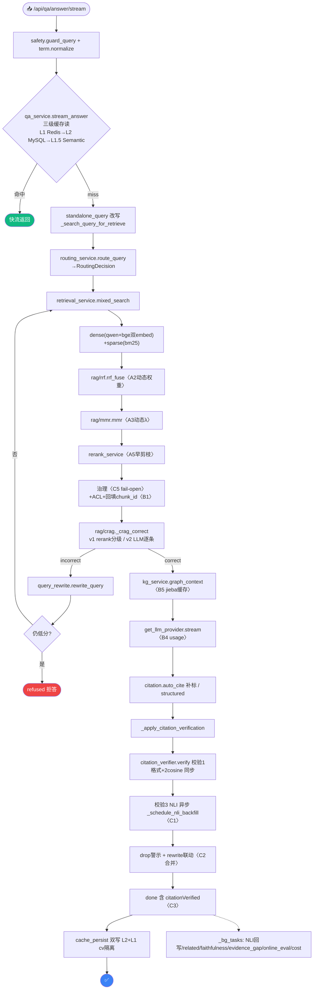

# 电网运维 RAG 智能问答系统 · 架构总览（代码级）

> **版本**：`cbf1963`，2026-07-20 ｜ **仓库**：github.com/zhyese/grid-qa ｜ **分支**：main
> **技术栈**：Vue3 + FastAPI + MySQL + Redis + Milvus 2.4（双 collection）+ Neo4j + MinIO + 三家云模型 + Docker Compose（12 容器）
> **规模**：backend 183 文件 / 14 routers / 24 表 / 100+ 配置开关；frontend 17 视图

---

## 一、系统全貌

---

## 二、Backend 模块代码地图

### 2.1 routers/（14 个端点群）

| 文件 | 前缀 | 核心端点 |
|---|---|---|
| `system.py` | `/api/system` | `/login` `/me` 用户CRUD/改密 `/users` `/roles` `/config` `/health` `/health/providers` |
| `qa.py` | `/api/qa` | `/answer` `/answer/stream` `/faithfulness` `/related` `/feedbacks` `/conversations` `/history` |
| `document.py` | `/api/document` | 上传/解析/向量化/删除/预览/统计 `/documents` |
| `retrieval.py` | `/api/retrieval` | `/mixed` 混合检索 |
| `retrieval_tune_router.py` | `/api/system/retrieval` | 检索参数调参/评测 |
| `kg.py` | `/api/kg` | `/extract` 抽三元组 `/graph` `/path` `/influence` `/stats` |
| `domain.py` | `/api/domain` | 领域事件 / 两票 webhook |
| `memory.py` | `/api/memory` | 用户长期记忆 CRUD |
| `twin.py` | `/api/twin` | 数字孪生布局 / 告警定位 |
| `task_center.py` | `/api/system/task-center` | 持久任务队列 / 事件中心 |
| `realtime_event.py` | `/api/realtime-event` | 实时事件 webhook（Grafana/SCADA） |
| `knowledge_governance.py` | `/api/.../governance` | 时效审查 / 冲突发现 / 版本追溯 |
| `knowledge_evolution.py` | `/api/.../evolution` | 盲区聚类 / AI 草稿 / 审核回流 / 撤回 |
| `mcp_router` | `/api/mcp` | MCP server（外部工具协议） |

### 2.2 services/（按职责分组）

| 组 | 文件 | 职责 |
|---|---|---|
| **问答编排** | `qa_service.py` | answer/stream/多轮/三级缓存/CRAG联动/citation校验(C1/C3) |
| **检索** | `retrieval_service.py` | mixed_search(dense+sparse→RRF→MMR→rerank→治理→ACL) |
| | `bm25_service.py` | 稀疏检索 BM25 |
| | `rerank_service.py` | gte-rerank-v2 重排 |
| **检索策略** | `hyde.py` | HyDE 假设答案检索（HYDE_ENABLE） |
| | `multi_query.py` | 多查询分解（MULTI_QUERY_ENABLE） |
| | `standalone_query.py` | 多轮指代消解（STANDALONE_REWRITE_ENABLE） |
| | `self_rag.py` | Self-RAG 拒非运维（SELF_RAG_ENABLE） |
| **改写闭环** | `query_rewrite.py` | rewrite_query LLM 改写 |
| | `rewrite_strategy.py` | Classifier 判是否需改写 |
| | `rewrite_evaluator.py` | 改写效果评估 |
| | `rewrite_cache.py` | 改写结果缓存 |
| | `rewrite_event_service.py` | 改写事件落库 |
| **CRAG** | `rag/crag.py` | v1 rerank 分级 |
| | `rag/crag_v2.py` | v2 LLM 逐条评估（CRAG_PERDOC_ENABLE） |
| **引用** | `rag/citation.py` | auto_cite 补标 + evidence_trace |
| | `rag/citation_verifier.py` | 三层校验 verify |
| | `rag/citation_index.py` | build_index 受控编号 |
| **算法** | `rag/rrf.py` | RRF 融合 |
| | `rag/mmr.py` | MMR 多样性去重 |
| | `rag/raptor.py` | RAPTOR 层次化摘要（RAPTOR_ENABLE） |
| | `rag/semantic_cache.py` | L1.5 语义缓存 |
| **知识图谱** | `kg_service.py` | 三元组抽取 + GraphRAG + jieba |
| | `kg_normalize.py` | 实体归一 |
| | `term_service.py` | 电网术语词表 normalize |
| **文档** | `document_service.py` | 上传/解析/OCR/向量化/KG抽取 |
| | `multimodal_service.py` | VLM 图片理解（VLM_ENABLE） |
| | `export_service.py` | 导出 Word |
| **Agent** | `agent_personas.py` / `persona_store.py` | Persona 配置 |
| | `diagnose_agent_service.py` | 故障诊断 Agent |
| | `debate_agent_service.py` | 辩论 Agent |
| | `agent_tool_audit_service.py` | 工具调用审计 |
| **运维/治理** | `knowledge_evolution_service.py` | 自进化闭环编排 |
| | `knowledge_quality_service.py` | 知识质量评估 |
| | `semantic_rule_service.py` | 语义规则 |
| | `fault_prediction_service.py` | 故障预测聚合 |
| | `log_archive_service.py` | 日志归档（90天→jsonl） |
| | `backup_service.py` | MySQL 全表备份恢复 |
| | `log_service.py` | operation_log |
| **评测/调优** | `retrieval_eval_service.py` | 检索召回评测 |
| | `retrieval_tune_service.py` | 参数调优建议 |
| | `online_eval_service.py` | 在线质量采样 |
| | `feedback_optimizer_service.py` | dislike 优化器 |
| **辅助** | `conversation_service.py` / `conversation_summary.py` | 会话+摘要 |
| | `config_service.py` | 运行时配置(rt_temperature/rt_ef) + Prompt 模板热读 |
| | `cost_tracker_service.py` | 成本追踪 |
| | `favorite_service.py` | 收藏 |
| | `auth_service.py` | 认证 |
| | `ticket_audit_service.py` | 两票审核 |
| | `rag_router.py` | 双 RAG 热备 |
| | `plugin_registry.py` | 插件框架 |
| | `evidence_gap_service.py` | 证据缺口收集 |
| | `cache_persist.py` | L2 MySQL 缓存持久化 |

### 2.3 providers/ · clients/ · core/ · routing/

| 目录 | 文件 | 职责 |
|---|---|---|
| `providers/llm/` | deepseek/qwen/doubao provider | LLM 统一 OpenAI 兼容 |
| `providers/embedding/` | `qwen_embedding.py`/`bge_embedding.py`/`doubao_embedding.py` | 三种 embed |
| | `providers/factory.py` | get_llm_provider/get_embedding_provider/check_*_health |
| `clients/` | `redis_client.py` | cache_get/set_json + 三级缓存 |
| | `minio_client.py` | 对象存储 |
| | `nacos_client.py` | 配置中心拉取（CONFIG_SOURCE=nacos） |
| `core/` | `security.py` | JWT + 密码哈希 |
| | `permissions.py` | ROLE_PERMISSIONS + require_perm + has_perm |
| | `safety.py` | guard_query(prompt injection) + safe_answer(PII脱敏) |
| | `obs.py` | degraded(tag,e) 降级可观测 |
| | `metrics.py` | Prometheus 指标注册 |
| | `limiter.py` | slowapi 限流 |
| | `logging.py` / `response.py` | loguru / 统一响应 |
| `routing/` | `query_classifier.py` | 查询特征分类 |
| | `routing_service.py` | route_query → RoutingDecision |
| | `config.py` | 路由规则配置 |

---

## 三、数据层（24 表 + 向量 + 图谱 + 对象）

### 3.1 MySQL 表（`models/`）

| 模型文件 | 表 | 用途 |
|---|---|---|
| `user.py` | users | 用户(status/dept/role) |
| `document.py` | documents | 文档(dept/allowed_roles/doc_type) |
| `document_version.py` | document_versions | 版本追溯 |
| `chunk.py` | chunks | 分块(5字段+复合索引 B1) |
| `conversation.py` | conversations / messages | 会话+消息 |
| `qa_cache.py` | qa_cache | L2 缓存(hash 命中) |
| `feedback.py` | feedbacks | 👍/👎 |
| `favorite.py` | favorites | 收藏 |
| `kg_triple.py` | kg_triples | 三元组(subject/relation/object) |
| `permission.py` | role_permission | RBAC 角色权限覆盖 |
| `operation_log.py` | operation_logs | 操作审计 |
| `ticket.py` | tickets | 两票 |
| `alert_disposal.py` | alert_disposals | 告警处置 |
| `domain_event.py` | domain_events | 领域事件 |
| `realtime_event.py` | realtime_events | 实时事件 |
| `persistent_task.py` | persistent_tasks | 长任务队列 |
| `evidence_gap.py` | evidence_gaps | 证据缺口 |
| `knowledge_governance.py` | knowledge_governance | 时效/冲突审查 |
| `knowledge_evolution.py` | knowledge_evolution_drafts | AI 草稿(source_type=ai_evolution) |
| `rewrite_event.py` | rewrite_events | 改写事件 |
| `agent_tool_call.py` | agent_tool_calls | Agent 工具调用审计 |
| `agent_memory.py` | agent_memory | 用户记忆 |
| `persona_config.py` | persona_configs | Persona 配置 |

### 3.2 向量 / 图谱 / 对象

| 存储 | collection/库 | 说明 |
|---|---|---|
| **Milvus** | `grid_chunks` | 云 1024 维（DOC_SIZE_THRESHOLD 以上文档） |
| | `grid_chunks_bge` | 本地 bge 512 维（小文档） |
| | `memory_collection` | 用户记忆向量 |
| **Neo4j** | `:Entity` / `:REL{type,doc_id}` | 知识图谱，多跳路径查询 |
| **Redis** | `qa:*` L1 / `semantic:*` L1.5 / 配置 / 限流 / `embed:*`/`jieba:*`/`chunk_embed:*` 向量缓存 | — |
| **MinIO** | `grid-documents` | 文档原文/图片 |

---

## 四、问答链路（流式，函数级）

---

## 五、检索策略矩阵（何时触发）

| 策略 | 文件 | 开关 | 触发场景 |
|---|---|---|---|
| Standalone 改写 | `standalone_query.py` | `STANDALONE_REWRITE_ENABLE=True` | 多轮追问指代消解 |
| 智能路由 | `routing/routing_service.py` | `ROUTING_ENABLE=True` | sparse/dense/hybrid 路径选择 |
| HyDE | `hyde.py` | `HYDE_ENABLE` | 短/口语问题生成假设答案检索 |
| Multi-Query | `multi_query.py` | `MULTI_QUERY_ENABLE` | 复杂问题拆子问题并行检索 |
| RAPTOR | `rag/raptor.py` | `RAPTOR_ENABLE` | 层次化摘要多粒度融合 |
| Self-RAG | `self_rag.py` | `SELF_RAG_ENABLE` | 非运维拒答 / 证据不足判断 |
| CRAG v1 | `rag/crag.py` | `CRAG_ENABLE=True` | rerank 分级纠错 |
| CRAG v2 | `rag/crag_v2.py` | `CRAG_PERDOC_ENABLE` | LLM 逐条评估证据 |
| Small-to-Big | retrieval | `SMALL_TO_BIG_ENABLE=True` | 子块命中扩父块上下文 |
| Query Rewrite | `query_rewrite.py` | `QUERY_REWRITE_ENABLE` + Classifier | 低召回改写重检索 |

---

## 六、三级缓存（代码路径）

| 层 | 代码 | 命中 | 开关 |
|---|---|---|---|
| L1 Redis | `redis_client.cache_get_json(_cache_key)` | 精确 key（含 cv） | — |
| L1.5 Semantic | `semantic_cache.semantic_cache_get` | cos≥0.85 截胡 L2 | `SEMANTIC_CACHE_ENABLE` |
| L2 MySQL | `cache_persist.cache_get_mysql` | hash 命中 | `CACHE_PERSIST_ENABLE=True` |
| 滑动续期 | `cache_get_json` 命中后 EXPIRE | — | `CACHE_SLIDE_TTL_ENABLE`(B2)/`EMBED_CACHE_SLIDE_TTL_ENABLE`(B3) |
| 分层 TTL | 手册7d/案例3d/实时5min | — | `CACHE_TIERED_TTL_ENABLE=True` |
| 版本隔离 | `config.citation_cache_version()=cv{V}{S}{N}` | 开关变→key 变→旧缓存失效 | — |

---

## 七、可核验引用五层 + 三层校验

| 层 | 代码 | 说明 |
|---|---|---|
| ① Chunk 元数据 | `models/chunk.py`（5字段）+ Alembic + `init_db._COLUMN_MIGRATIONS` | page_num/bbox/section_path/table_header |
| ② 受控编号 | `rag/citation_index.build_index` | `{1:chunk_id}` 对齐 prompt `[i+1]` |
| ③ 结构化输出 | `schemas/citation.CitationAnswer` + `parse_citation_answer` | LLM JSON 直出 / 纯文本降级 |
| ④ 三层校验 | `rag/citation_verifier.verify` | 1格式 + 2cosine(0.4) 同步 + 3NLI 异步(C1) |
| ⑤ 评测门禁 | `scripts/eval_citation.py` | 关联率<0.8 exit1 |

**C1 异步后置**：`_apply_citation_verification` → `verify(nli_enable=False)` 同步 → `_schedule_nli_backfill` → `_nli_backfill` 后台跑 `judge._verify_claims` 回写缓存。
**C3 stream 接校验**：`stream_answer` done 前调 `_apply_citation_verification`，done 含 `citationVerified`。

---

## 八、高级能力闭环

### 8.1 知识自进化（`knowledge_evolution_service.py` + `routers/knowledge_evolution.py`）
dislike 聚类 → Milvus 盲区 → LLM 规程 RAG 草稿 → 审核台（Vue）→ 回流 `source_type=ai_evolution` 降权 + 每周配额 + 定时 cron + 可撤回。复用 `PersistentTask`/治理范式。

### 8.2 知识治理（`routers/knowledge_governance.py` + `models/knowledge_governance.py`）
时效审查 / 冲突发现 / 版本追溯；检索 fail-open 兜底（`KNOWLEDGE_GOVERNANCE_FAIL_OPEN`）。

### 8.3 故障预测（`fault_prediction_service.py` + `views/FaultPrediction.vue`）
告警频次/趋势/风险分级 + 建议。

### 8.4 Agent 引擎（`agent_personas`/`persona_store`/`diagnose_agent_service`/`debate_agent_service`）
通用 Agent（Tool/ToolRegistry/Persona/run_agent），diagnose persona 故障诊断，debate 辩论；工具调用审计 `agent_tool_call`。

### 8.5 主动运维（`routers/task_center.py` + `realtime_event.py` + `views/OperationsCenter.vue`）
实时事件 webhook → Agent 建议 → 人工确认 → `persistent_task` 持久任务。

### 8.6 数字孪生（`routers/twin.py` + `views/DigitalTwin.vue` + `three/`）
3D 变电站（Three.js）+ 告警定位 + 故障传播链；布局模板 `station_layout_110kv.json`。

### 8.7 记忆（`routers/memory.py` + `models/agent_memory.py` + Milvus `memory_collection`）
单用户长期记忆，`MEMORY_CAPACITY=500` / 软删 30 天。

### 8.8 MCP（`mcp_router` + config `MCP_*`）
对外 MCP server（9100），外部工具协议接入。

### 8.9 双 RAG 热备（`rag_router.py`）
主路 qa_service 异常 → 副路 BM25+LLM（`DUAL_RAG_ENABLE`）。

### 8.10 备份恢复（`backup_service.py`）
MySQL 全表 dump → .sql，backend 持久卷。

---

## 九、配置开关全集（按域，`config.py` 100+）

| 域 | 开关（默认） |
|---|---|
| **基础** | APP_VERSION/BACKEND_PORT=8001/API_PREFIX=/api/DATABASE/MINIO/JWT/ADMIN |
| **模型** | LLM_PROVIDER=deepseek · EMB_PROVIDER=qwen · EMBEDDING_DIM=1024 · LLM_USAGE_TRACK_ENABLE(B4) |
| **云Key** | DEEPSEEK/DASHSCOPE(qwen LLM+emb)/ARK(doubao) |
| **Milvus/Redis** | MILVUS_COLLECTION=grid_chunks · REDIS_MAXMEMORY=300mb · QA_CACHE_TTL=259200 |
| **缓存** | CACHE_PERSIST_ENABLE=True · CACHE_TIERED_TTL_ENABLE=True · CACHE_SLIDE_TTL_ENABLE(B2) · EMBED_CACHE_SLIDE_TTL_ENABLE(B3) · EMBED_CHUNK_CACHE_ENABLE(A1/A4) |
| **GraphRAG** | KG_RAG_ENABLE=True · KG_TOKENIZE_CACHE_ENABLE(B5) |
| **检索** | RERANK_ENABLE · MMR_ENABLE/LAMBDA=0.5 · RRF_K=60 · RRF_ROUTE_AWARE_ENABLE(A2) · SEMANTIC_CACHE_ENABLE · QUERY_REWRITE_ENABLE |
| **双embed** | BGE_MODEL/BGE_DIM=512 · DOC_SIZE_THRESHOLD=5000 · MILVUS_COLLECTION_BGE |
| **分块** | CHUNK_SIZE=500/OVERLAP=80 · SMALL_TO_BIG_ENABLE/PARENT_SIZE=2000 |
| **CRAG** | CRAG_ENABLE=True · CRAG_HIGH=0.6/LOW=0.3 · CRAG_PERDOC_ENABLE(v2) · CRAG_NEIGHBOR_EXPAND_ENABLE |
| **策略** | HYDE/MULTI_QUERY/SELF_RAG/RAPTOR_ENABLE(均默认关) · STANDALONE_REWRITE_ENABLE=True · ROUTING_ENABLE=True |
| **改写** | REWRITE_CACHE_TTL=604800 · REWRITE_EVAL_ENABLE · REWRITE_ADAPTIVE_ENABLE · REWRITE_EVENT_SAMPLE_RATE |
| **安全** | SAFETY_FILTER_ENABLE=True · PII_MASK_ENABLE · HIGH_RISK_KEYWORDS |
| **证据/治理** | EVIDENCE_GAP_AUTO_COLLECT=True · KNOWLEDGE_GOVERNANCE_FAIL_OPEN(C5) · MULTI_TURN_CACHE_ENABLE(C4) |
| **引用** | CITATION_AUTO_ENABLE=True · CITATION_SIM_THRESHOLD=0.6 · CITATION_VERIFIER_ENABLE · CITATION_NLI_ENABLE · CITATION_NLI_TIMEOUT=5 · **CITATION_NLI_ASYNC_ENABLE(C1)** · CITATION_STRUCTURED_OUTPUT · CITATION_REWRITE_ON_FAIL · CITATION_VERIFY_SIM_THRESHOLD=0.4 |
| **VLM** | VLM_ENABLE · QWEN_VLM_MODEL=qwen-vl-max |
| **配置中心** | CONFIG_SOURCE=env · NACOS_* |
| **可观测** | OTEL_SAMPLE_RATE/ENDPOINT/SERVICE_NAME（Langfuse） |
| **记忆** | MEMORY_CAPACITY=500 · MEMORY_COLLECTION |
| **MCP** | MCP_SERVERS/TOKEN/PORT=9100/IP_WHITELIST |
| **告警/事件** | ALERT_WEBHOOK_TOKEN/TENANT · REALTIME_EVENT_* |
| **调优** | TUNE_*/OPTIMIZER_* |
| **孪生** | TWIN_LAYOUT_PATH |

---

## 十、前端代码地图（17 视图）

| 视图 | 路由 | 职责 |
|---|---|---|
| `Chat.vue` | /chat | 智能问答（流式+引用溯源+faithfulness异步） |
| `Diagnose.vue` | /diagnose | 故障诊断（多查询分解+因果链+原因排序） |
| `OperationsCenter.vue` | /operations | 主动运维（实时事件+Agent建议+持久任务） |
| `DigitalTwin.vue` | /twin | 数字孪生（3D变电站+告警定位） |
| `Documents.vue` | /documents | 知识库管理 |
| `KgGraph.vue` | /kg | 知识图谱（力导向+多跳） |
| `KgGraph3D.vue` | /kg-3d | 3D 知识图谱（Three.js） |
| `TicketLifecycle.vue` | /ticket | 两票管理（创建/审核/签发/执行/归档） |
| `KnowledgeGovernance.vue` | /knowledge-governance | 知识治理（admin/editor） |
| `KnowledgeEvolution.vue` | /knowledge-evolution | 知识自进化审核台 |
| `FaultPrediction.vue` | /prediction | 故障预测（admin/auditor） |
| `Dashboard.vue` | /dashboard | 统计看板 |
| `Admin.vue` | /admin | 系统管理 13Tab（admin/auditor） |
| `RetrievalDebug.vue` | /retrieval-debug | 检索调试全链路 trace（admin） |
| `Profile.vue` | /profile | 个人资料/改密/改部门 |
| `Login.vue` | /login | 登录 |
| `AppLayout.vue` | layout | 布局壳 |

**支撑**：`api/index.js`（API 封装）/ `api/request.js`（axios+403拦截）/ `stores/auth.js`（Pinia 鉴权）/ `utils/perm.js`（操作级 RBAC 显隐）/ `components/AgentTrace.vue`（Agent 推理链）/ `three/*`（3D 场景）。

**路由守卫**（`router/index.js`）：`meta.auth` 登录校验 / `meta.admin` admin 校验 / `meta.roles` 角色白名单（如 /admin 允许 admin+auditor）。

---

## 十一、可观测与运维

| 维度 | 实现 |
|---|---|
| **指标** | `core/metrics.py` Prometheus（QA_TOTAL/LLM_CALLS/LLM_LATENCY/CRAG_GRADE/CRAG_ACTION/DEGRADED/cache_hit/UNGROUND_RATIO/KG_*） |
| **面板** | Grafana 18 面板（含 DEGRADED 静默降级、缓存分层命中、检索来源归因） |
| **降级** | `core/obs.degraded(tag,e)` → loguru warning + DEGRADED Counter |
| **追踪** | OTEL → Langfuse（OTEL_SAMPLE_RATE/ENDPOINT） |
| **配置中心** | Nacos（CONFIG_SOURCE=nacos 启动拉取覆盖 .env，降级安全） |
| **健康** | `/api/system/health` 探 4 依赖 + `/health/providers` 主动探测百炼欠费/key 失效 |
| **日志归档** | `log_archive_service` 90 天 → jsonl 再删 |
| **备份** | `backup_service` MySQL 全表 dump |

---

## 十二、部署与端口（Windows 开发机 / Docker）

| 项 | 值 |
|---|---|
| 后端 | 8001（源码 bake 进镜像，改源码 `docker compose build backend && up -d`） |
| 前端 | 5173 |
| MySQL | 3307（宿主 3306 被占） |
| Milvus | 19530 |
| Neo4j | 7474/7687 |
| 代理 | git push 7897 |
| MCP | 9100 |
| 默认账号 | admin/admin123 |
| 全栈 | Docker Compose 12 容器（backend/frontend/mysql/redis/milvus/neo4j/grafana/prometheus/minio/etcd/nacos） |

---

## 十三、端到端验证证据（C1/C3 生产验证 2026-07-20）

| 层 | 验证点 | 证据 |
|---|---|---|
| 层1 部署 | 开关+代码+cv | `NLI=True ASYNC=True cv=cv111 C1_funcs_present=True True` |
| 层2 HTTP 流式 | C3 done 接校验 + C1 同步不阻塞 | `sources=5, done 含 citationVerified, labels=['low_sim','low_sim','unknown'×6]` |
| 层3 真环境回写 | C1 后台 NLI 跑+回写 | `nli_async_done=True, labels=['support']`（真 deepseek） |

---

## 十四、闭环总览（系统的魂）

> **🛡️ 防幻觉四闸**：Self-RAG（拦非运维）→ CRAG v1/v2（分级纠错/拒答）→ 可核验引用三层校验（格式/cosine/NLI）→ drop 警示 + rewrite 联动。
>
> **🔄 知识自进化**：dislike → 盲区聚类 → AI 草稿 → 审核 → 回流降权，越用越准。
>
> **🚨 主动运维**：实时事件 → Agent 建议 → 人工确认 → 持久任务 → 故障预测。
>
> **🛡️ 韧性三板斧**：双 RAG 热备（主路异常切副路）+ fail-open 兜底（治理异常放行+告警）+ degraded 可观测（静默降级全显形）。

**顶层设计**：网关管**安全**（RBAC/ACL/限流/插件），RAG 引擎管**质量**（防幻觉+三级缓存），高级能力管**业务**（诊断/孪生/两票/治理/自进化），横切管**韧性**（热备/fail-open/降级/备份）。四抓手撑起整个电网运维智能问答平台。
