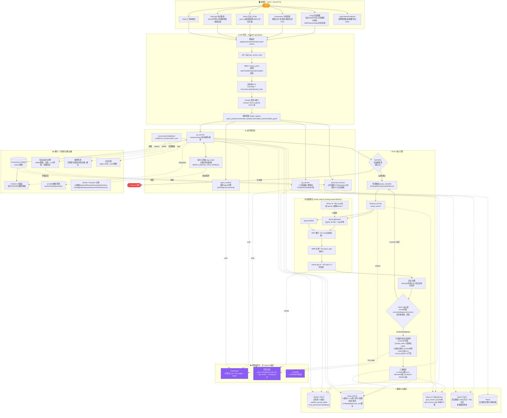
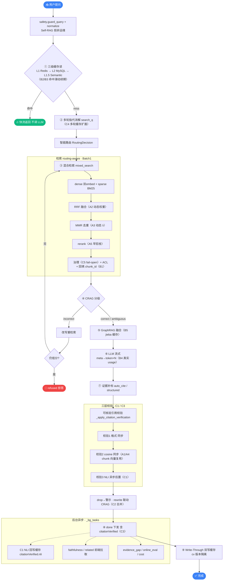

# 电网运维 RAG 智能问答系统 · 架构总览

> **版本状态**：截至 `ba58b8b`（问答全链路优化 16 项全闭环 + 生产端到端验证通过），2026-07-20
> **技术栈**：Vue3 + FastAPI + MySQL + Redis + Milvus 2.4（双 collection）+ Neo4j + MinIO + 三家云模型（DeepSeek / 阿里百炼 / 火山方舟，全 OpenAI 兼容）+ Docker Compose 全栈
> **仓库**：github.com/zhyese/grid-qa ｜ **分支**：main

---

## 一、系统全貌



---

## 二、七层架构

| 层 | 角色 | 关键组件 |
|---|---|---|
| **🖥️ 前端** | 用户交互 | Chat 流式问答 / Documents / Admin 13Tab / KgGraph / Ticket / Prediction |
| **🌐 网关** | 入口管控 | JWT → RBAC(`require_perm`) → ACL → 限流(slowapi) → 插件(3 hook) |
| **⚙️ 业务** | 编排 | qa_service / agent_runtime / document / kg / 双RAG热备 |
| **🧠 RAG 引擎** | 智能 | Self-RAG → 路由 → 检索 → CRAG → 可核验引用五层 → 三级缓存 → 治理 |
| **🔍 检索** | 召回 | dense+sparse → RRF → MMR → rerank（routing-aware 4 项动态调参） |
| **💾 数据向量** | 持久 | MySQL / Redis(三级缓存) / Milvus 双 collection / Neo4j / MinIO |
| **☁️ 模型** | 外部 | DeepSeek(LLM+NLI) / 百炼(embed+rerank+VLM) / 火山 |
| **📊 横切** | 运维 | Prometheus+Grafana / 知识自进化 / 故障预测 / 日志归档 / 健康探测 |

---

## 三、三条主干数据流

1. **问答主链**（蓝实线）：前端 → 网关(认证/权限/限流/插件) → `qa_service` → Self-RAG → 路由 → 检索 → CRAG → 引用校验 → done → 缓存双写。
2. **模型调用**（紫点线）：检索 embed/rerank → 百炼；问答/NLI/Agent → DeepSeek；文档 VLM → 百炼。
3. **横切闭环**（点线）：metrics → Prometheus → Grafana；dislike → 知识自进化 → 草稿回流；告警 → 故障预测；日志 → 归档。

---

## 四、两大闭环（系统的"魂"）

> **🛡️ 防幻觉闭环**：Self-RAG 拦非运维 → CRAG rerank 分级纠错（incorrect 改写 / refused 拒答）→ 可核验引用三层校验（格式 / cosine / NLI）→ drop 警示 + rewrite 联动。四道闸口层层兜底。
>
> **🔄 自进化闭环**：用户 dislike → 聚类盲区 → LLM 生成规程草稿 → 审核 → 回流知识库（降权 + 配额 + 可撤回）。问答质量反哺检索源，越用越准。

**顶层设计三板斧**：网关管**安全**（RBAC/ACL/限流），RAG 引擎管**质量**（防幻觉四闸 + 三级缓存），横切管**韧性**（双RAG热备 / fail-open / 降级可观测 / 自进化）。

---

## 五、问答链路详图（流式 `/api/qa/answer/stream`）



> 非流式 `/answer` 链路同构，差异：LLM 一次性 `chat`（非 stream）、rewrite 联动块在返回前同步、C4 多轮缓存查询点。`agent_mode` 走通用 Agent 引擎（`QA_PERSONA`，meta → tool_step×N → token → done）。

---

## 六、三级缓存机制

| 层 | 介质 | 命中条件 | 标签 |
|---|---|---|---|
| **L1** | Redis | 精确 key（含 `citation_cache_version` 版本号） | 🟠 橙热点 |
| **L1.5** | Semantic(Milvus 向量) | query 相似 cos ≥ 0.85，**截胡 L2** | 🟣 紫语义 |
| **L2** | MySQL | 精确持久（hash 命中） | 🔵 蓝历史 |
| L3 | LLM | 兜底直算 | — |

- **命中滑动续期**：`CACHE_SLIDE_TTL_ENABLE`（L1）/ `EMBED_CACHE_SLIDE_TTL_ENABLE`（embed）—— opt-in，防热 query evict。
- **版本隔离**：`citation_cache_version() = cv{VERIFIER}{STRUCTURED}{NLI}` 编进所有缓存键 → 开关变 → key 变 → 旧缓存自动失效。

---

## 七、可核验引用体系（五层闭环）

| 层 | 实现 | 说明 |
|---|---|---|
| ① Chunk 元数据 | `Chunk` 加 5 字段 + 双路径迁移（init_db + Alembic） | page_num/bbox/section_path/table_header/metadata_complete |
| ② 受控编号 | `citation_index.build_index` | 服务端 `{1: chunk_id}`，与 prompt `[i+1]` 天然对齐 |
| ③ 结构化输出 | `schemas/citation.py` CitationAnswer | LLM 直出 JSON，纯文本降级反查 |
| ④ 三层校验 | `citation_verifier.verify` | 校验1 格式 + 校验2 cosine（同步）+ 校验3 NLI（**C1 异步后置**） |
| ⑤ 评测门禁 | `scripts/eval_citation.py` | 四样本四指标 + CI 关联率 < 0.8 exit1 |

**C1/C3（本轮收口）**：
- **C1 NLI 异步后置**：`CITATION_NLI_ASYNC_ENABLE` 开 → verify 同步只跑校验1+2（不阻塞首答/done），校验3 NLI 由 `_schedule_nli_backfill` 后台 task（`_bg_tasks` 持引用）跑完回写缓存 `citationVerified.nli`。
- **C3 stream done 接校验**：`stream_answer` 在 annotated 后接 `_apply_citation_verification`，`CITATION_VERIFIER_ENABLE` 开时 done 随发 `citationVerified`（关时不带该字段 = 现状）。前端零改动。

---

## 八、问答全链路 16 项优化（全闭环）

| 批 | 项 | 落点节点 | 开关 | 默认 |
|---|---|---|---|---|
| 3 | B1 | 检索回填 chunk_id 复合索引 | — | 索引已建 |
| 3 | B2/B3 | 缓存/embed 命中滑动续期 | `CACHE_SLIDE_TTL_ENABLE` / `EMBED_CACHE_SLIDE_TTL_ENABLE` | 关 |
| 3 | B4 | LLM 真实 token usage | `LLM_USAGE_TRACK_ENABLE` | 关 |
| 3 | B5 | GraphRAG jieba 分词缓存 | `KG_TOKENIZE_CACHE_ENABLE` | 关 |
| 1 | A2/A3/A5/B6 | 检索 routing-aware 调参 | `RRF_ROUTE_AWARE_ENABLE` | 关 |
| 2 | A1/A4 | 校验 chunk 向量复用 | `EMBED_CHUNK_CACHE_ENABLE` | 关 |
| 4 | C2 | CRAG-citation rewrite 合并 | — | 已合 |
| 4 | C4 | 多轮 standalone 缓存扩面 | `MULTI_TURN_CACHE_ENABLE` | 关 |
| 4 | C5 | 治理 fail-open 兜底 | `KNOWLEDGE_GOVERNANCE_FAIL_OPEN` | 关 |
| 4 | **C1** | 校验3 NLI 异步后置 | `CITATION_NLI_ASYNC_ENABLE` | 关（生产已开验证） |
| 4 | **C3** | stream done 接校验 | 复用 `CITATION_VERIFIER_ENABLE` | 已接 |

**设计原则**：全 opt-in、默认关时逐字节等于现状、前端零改动。YAGNI 边界：不改 RRF/MMR 算法本体、不微调 NLI 模型、query_classifier 不上可学习模型。

---

## 九、关键开关速查（生产当前态）

```
CITATION_VERIFIER_ENABLE=True   STRUCTURED_OUTPUT=True   REWRITE_ON_FAIL=True
CITATION_NLI_ENABLE=True        CITATION_NLI_ASYNC_ENABLE=True   cv=cv111
KG_RAG_ENABLE=True              ROUTING_ENABLE=True
```

其余优化开关默认关（opt-in，关 = 现状）。容器内确认：

```bash
docker compose exec backend python -c "from app.config import settings; print(settings.CITATION_*)"
```

---

## 十、端到端验证证据（C1/C3 生产验证）

| 层 | 验证点 | 证据 | 结论 |
|---|---|---|---|
| **层1** 部署生效 | 容器内开关 + 代码 + cv | `NLI=True ASYNC=True cv=cv111 C1_funcs_present=True True` | ✅ 部署生效 |
| **层2** HTTP 流式真请求 | C3 done 接校验 + C1 同步不阻塞 | `sources=5, done_keys 含 citationVerified, cv_items=8, dropped=[1,2], labels=['low_sim','low_sim','unknown'×6]` | ✅ C3 done 含校验；C1 同步路径 NLI 未跑（全 unknown，首答未被阻塞） |
| **层3** 真环境回写 | C1 后台 NLI 跑 + 回写缓存 | `preset_key=...:cv111 → nli_async_done=True, labels=['support']`（容器内真 deepseek NLI） | ✅ C1 后台 task 跑真 NLI 并回写 `citationVerified.nli` |

**核心价值**：C1 异步后置解除了"NLI 同步阻塞首答"的历史顾虑，`CITATION_NLI_ENABLE` 现在可以生产开启。

---

## 十一、技术栈一览

| 域 | 选型 |
|---|---|
| 前端 | Vue3 + Vite + Pinia + Vue Router + markdown-it + highlight.js + echarts |
| 后端 | FastAPI + SQLAlchemy(async) + Alembic + Pydantic + loguru + slowapi + prometheus-client |
| 向量 | Milvus 2.4（双 collection：云 1024 维 / bge 512 维）+ HNSW |
| 图谱 | Neo4j 5（async driver，`:Entity`/`:REL`，多跳路径） |
| 缓存 | Redis（三级缓存 + 配置热读 + 限流 + embed/jieba 向量缓存） |
| 关系库 | MySQL 8（业务 + L2 缓存 + golden + kg_triples + role_permission） |
| 对象存储 | MinIO（文档原文/图片） |
| 模型 | DeepSeek（LLM+NLI）+ 阿里百炼（qwen embed + gte rerank + VLM）+ 火山方舟，全 OpenAI 兼容 |
| OCR | rapidocr-onnxruntime（Windows onednn bug 规避） |
| 编排 | Docker Compose（12 容器全栈） |
| 监控 | Prometheus + Grafana 18 面板（含 DEGRADED 静默降级） |
| CI/CD | GitHub Actions（ci-cd 分支，golden 校验 + 单测门禁） |

---

## 十二、端口与环境约束（Windows 开发机）

| 项 | 值 |
|---|---|
| 后端 | 宿主 **8001**（8000 被 Manager.exe 占） |
| 前端 | **5173** |
| MySQL | 宿主 **3307**（3306 被宿主自带占） |
| Neo4j | 7474 browser / 7687 bolt |
| 代理 | git push 走 **7897** |
| 默认账号 | admin / admin123 |

> 后端启动必须用 `venv/Scripts/python.exe`，从项目根跑 `--app-dir backend` 让 `.env` 能加载。改源码需 `docker compose build backend && up -d`（源码 bake 进镜像无 bind mount）；改 `.env` 需 `up -d` 重建容器。
